###  简单动态字符串（SDS）

当Redis需要的不仅仅是一个字符串字面量，而是一个可以被修改的字符串值时，Redis就会使用SDS来表示字符串值，比如在Redis的数据库里面，包含字符串值的键值对在底层都是由SDS实现的。

除了用来保存数据库中的字符串值之外，SDS还被用作缓冲区(buffer)：AOF模块中的AOF缓冲区，以及客户端状态中的输入缓冲区，都是由SDS实现的。

**SDS的定义**
```
struct sdshdr {
    //记录buf数组中已使用字节的数量
    unsigned int len;
    //记录buf数组中未使用字节的数量
    unsigned int free;
    //字节数组，用于保存字符串
    char buf[];
};
```
SDS遵循C字符串以空字符串结尾的惯例，保存空字符串的1字节空间不计算在SDS的len属性里面，并且为空字符分配额外的1字节空间，以及添加空字符到字符串末尾等操作，都是由SDS函数自动完成的，所以这个空字符对于SDS的使用者来说是完全透明的。遵循空字符结尾这一惯例的好处是，SDS可以直接重用一部分C字符串函数库里面的函数。

**SDS与C字符串的区别**

1. 常数复杂度获取字符串长度

和C字符串不同，因为SDS在len属性中记录了SDS本身的长度，所以获取一个SDS长度的复杂度即为O(1)。

设置和更新SDS长度的工作是由SDS的API在执行时自动完成的，使用SDS无须进行任何手动修改长度的工作。

通过使用SDS而不是C字符串，Redis将获取字符串长度所需的复杂度从O(N)降低到O(1)，这确保了获取字符串长度的工作不会成为Redis的性能瓶颈


2. 杜绝缓冲区溢出

与C字符串不同，SDS的空间分配策略完全杜绝了发生缓冲区溢出的可能性：当SDS API需要对SDS进行修改时，API会先检查SDS的空间是否满足修改所需的要求，如果不满足的话，API会自动将SDS的空间扩展到执行修改所需的大小，然后才执行实际的修改操作，所以使用SDS既不需要手动修改SDS的空间大小，也不会出现前面所说的缓冲区溢出问题。

3. 减少修改字符串时所带来的内存分配次数

SDS通过未使用空间解除了字符串长度和底层数组长度之间的关联：在SDS中，buf数组的长度不一定是字符数量加一，数组里面可以包含未使用的字节，而这些字节的数量就由SDS的free属性记录。

通过未使用空间，SDS实现了空间分配和惰性空间释放两种优化策略。

（1）空间预分配

空间预分配用于优化SDS的字符串增长操作：当SDS的API对一个SDS进行修改，并且需要对SDS进行空间扩展的时候，程序不仅会为SDS分配修改所必须要的空间，还会为SDS分配额外的未使用空间。

（2）惰性释放

惰性空间释放用于优化SDS的字符串缩短操作：当SDS的API需要缩短SDS保存的字符串时，程序并不立即使用内存重分配来回收缩短后多出来的字节，而是使用free属性将这些字节的数量记录起来，并等待将来使用。

### Redis链表为双向链表

 链表是一种非常常见的数据结构，在Redis中使用非常广泛，列表对象的底层实现之一就是链表。其它如慢查询，发布订阅，监视器等功能也用到了链表。

 **双向无环链表**

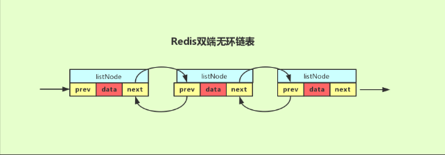

Redis使用一个listNode结构来表示：
```
typedef struct listNode
{
    // 前置节点
    struct listNode *prev;
    // 后置节点
    struct listNode *next;
    // 节点的值
    void *value;
} listNode;
```
 **list结构**

 同时Redis为了方便的操作链表，提供了一个list结构来持有链表

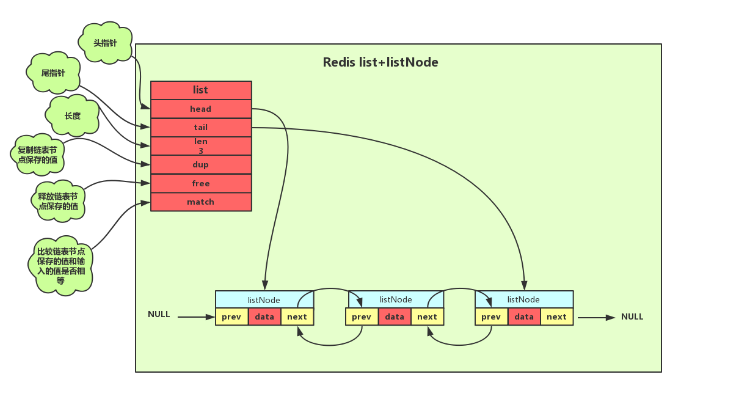

```
typedef struct list{
    //表头节点
    listNode *head;
    //表尾节点
    listNode *tail;
    //链表所包含的节点数量
    unsigned long len;
    //节点值复制函数
    void *(*dup)(void *ptr);
    //节点值释放函数
    void *(*free)(void *ptr);
    //节点值对比函数
    int (*match)(void *ptr,void *key);
}list;
```
**Redis链表结构其主要特性如下:**

双向：链表节点带有前驱、后继指针获取某个节点的前驱、后继节点的时间复杂度为0(1)。

无环: 链表为非循环链表表头节点的前驱指针和表尾节点的后继指针都指向NULL，对链表的访问以NULL为终点。

带表头指针和表尾指针：通过list结构中的head和tail指针，获取表头和表尾节点的时间复杂度都为O(1)。

带链表长度计数器:通过list结构的len属性获取节点数量的时间复杂度为O(1)。

多态：链表节点使用void*指针保存节点的值，并且可以通过list结构的dup、free、match三个属性为节点值设置类型特定函数，所以链表可以用来保存各种不同类型的值。

**双向无环链表在Redis中的使用**

链表在Redis中的应用非常广泛，列表对象的底层实现之一就是链表。此外如发布订阅、慢查询、监视器等功能也用到了链表。我们现在简单想一想Redis为什么要使用双向无环链表这种数据结构，而不是使用数组、单向链表等。既然列表对象的底层实现之一是链表，那么我们通过一个表格来分析列表对象的常用操作命令。如果分别使用数组、单链表和双向链表实现列表对象的时间复杂度对照如下:

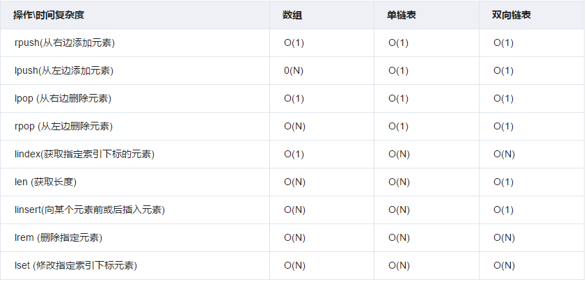

我们可以看到在列表对象常用的操作中双向链表的优势所在。但双向链表因为使用两个额外的空间存储前驱和后继指针，因此在数据量较小的情况下会造成空间上的浪费(因为数据量小的时候速度上的差别不大，但空间上的差别很大)。这是一个时间换空间还是空间换时间的思想问题，Redis在列表对象中小数据量的时候使用压缩列表作为底层实现，而大数据量的时候才会使用双向无环链表

### Redis字典

**Redis字典的实现**

Redis字典使用散列表最为底层实现，一个散列表里面有多个散列表节点，每个散列表节点就保存了字典中的一个键值对。

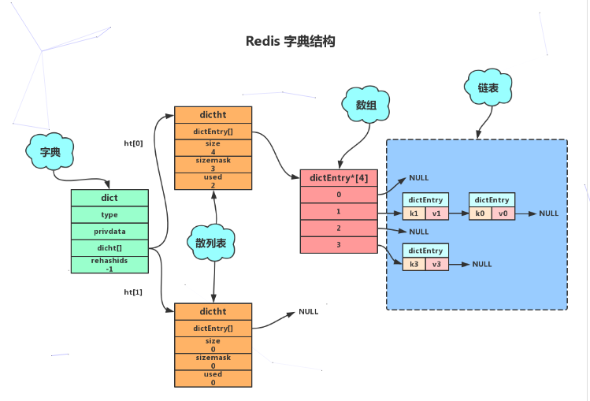

**字典**

```
typedef struct dict{
         //类型特定函数
         void *type;
         //私有数据
         void *privdata;
         //哈希表-见2.1.2
         dictht ht[2];
         //rehash 索引 当rehash不在进行时 值为-1
         int trehashidx;
}dict;
```
type属性和privdata属性是针对不同类型的键值对，为创建多态字典而设置的。

1.type属性是一个指向dictType结构的指针，每个dictType用于操作特定类型键值对的函数，Redis会为用途不同的字典设置不同的类型特定函数。


2.privdata属性则保存了需要传给给那些类型特定函数的可选参数

```
typedef struct dictType
{
         //计算哈希值的函数
         unsigned int  (*hashFunction) (const void *key);
         //复制键的函数
         void *(*keyDup) (void *privdata,const void *key);
         //复制值的函数
         void *(*keyDup) (void *privdata,const void *obj);
          //复制值的函数
         void *(*keyCompare) (void *privdata,const void *key1, const void *key2);
         //销毁键的函数
         void (*keyDestructor) (void *privdata, void *key);
         //销毁值的函数
         void (*keyDestructor) (void *privdata, void *obj);
}dictType;
```
3.ht属性是一个包含两个项的数组，数组中的每个项都是一个dictht哈希表， 一般情况下，字典只使用ht[0] 哈希表, ht[1]哈希表只会对ht[0]哈希表进行rehash时使用。

4.rehashidx记录了rehash目前的进度，如果目前没有进行rehash，值为-1。

**散列表**
```
typedef struct dictht
{
         //哈希表数组，C语言中，*号是为了表明该变量为指针，有几个* 号就相当于是几级指针，这里是二级指针，理解为指向指针的指针
         dictEntry **table;
         //哈希表大小
         unsigned long size;
         //哈希表大小掩码，用于计算索引值
         unsigned long sizemask;
         //该哈希已有节点的数量
         unsigned long used;
}dictht;
```
1.table属性是一个数组，数组中的每个元素都是一个指向dict.h/dictEntry结构的指针，每个dictEntry结构保存着一个键值对

2.size属性记录了哈希表的大小，也是table数组的大小

3.used属性则记录哈希表目前已有节点（键值对）的数量

4.sizemask属性的值总是等于size-1（从0开始），这个属性值和哈希表一起决定键应该被放到table数组的哪个索引上面（索引下标值）

**散列表节点**
```
//哈希表节点定义dictEntry结构表示，每个dictEntry结构都保存着一个键值对。
typedef struct dictEntry
{
         //键
         void *key;
         //值
         union{
           void *val;
            uint64_tu64;
            int64_ts64;
            }v;
         // 指向下个哈希表节点，形成链表
         struct dictEntry *next;
}dictEntry;
```
可以属性保存着键值中的键，而v属性则保存着键值对中的值，其中键值（v属性）可以是一个指针，或unit64_t整数，或int64_t整数。next属性是指向另一个哈希表节点的指针，这个指针可以将多个哈希值相同的键值对连接在一起，解决冲突问题。

**Redis rehash**

随着操作的进行，散列表中保存的键值对也会不断地增加或减少，为了保证负载因子维持在一个合理的范围内，当散列表内的键值对过多或过少时，需要定期进行rehash，以提升性能或节省内存。redis的rehash的步骤如下：
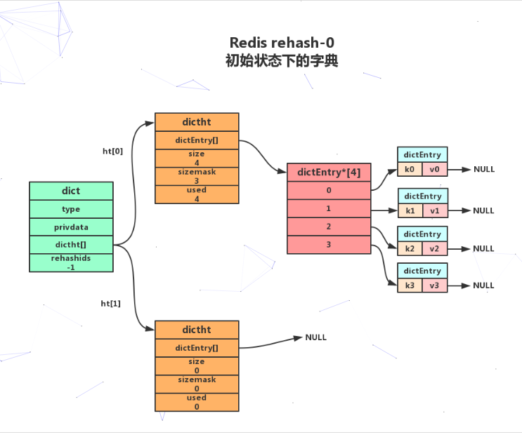

1.为字典的ht[1]散列表分配空间，这个空间的大小取决于要执行的操作以及ht[0]当前包含的键值对数量

        （1）扩展操作：ht[1]的大小为第一个大于等于ht[0].used*2的2的n次方幂。
        (2)收缩操作：ht[1]的大小为第一个大于等于ht[0].used的2的n次方幂

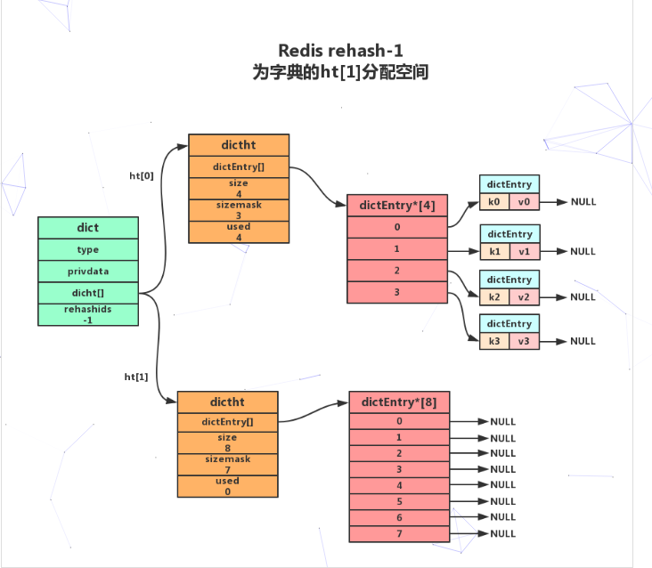

2.将保存在ht[0]中的键值对重新计算对重新计算键值的散列值和索引值，然后放大ht[1]指定的位置上。
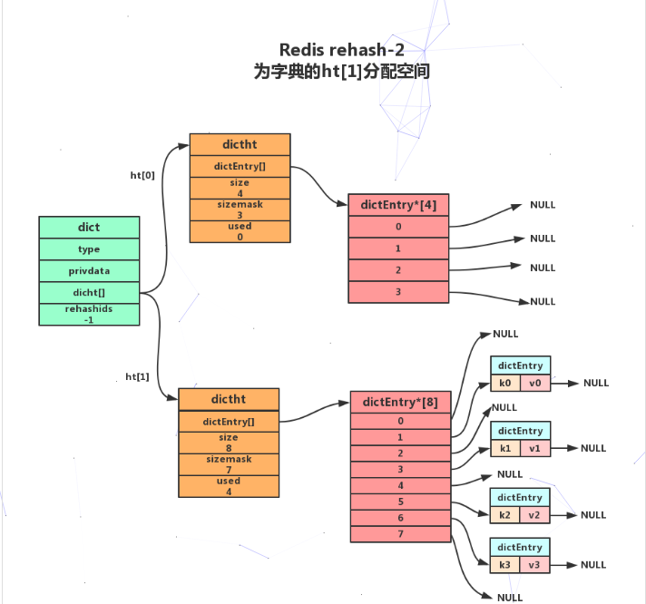

3.将ht[0]包含的所有键值对都迁移到ht[1]之后，释放ht[0]，将ht[1]设置为ht[0]，并创建一个新的ht[1]，哈希表为下一次rehash做准备

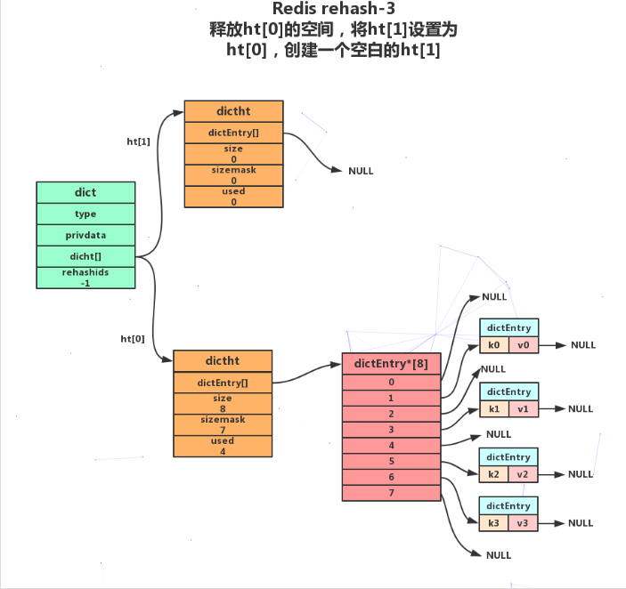

**rehash操作需要满足一下条件：**

1.服务器目前没有执行BGSAVE(rdb持久化)命令或者BGREWRITEAOF(AOF文件重写)命令，并且散列表的负载因子大于等于1。

2.服务器目前正在执行BGSAVE命令或者BGREWRITEAOF命令，并且负载因子大于等于5。

3.当负载因子小于0.1时，程序自动开始执行收缩操作。

Redis这么做的目的是基于操作系统创建子进程后写时复制技术，避免不必要的写入操作

**渐进式rehash**

对于rehash我们思考一个问题如果散列表当前大小为 1GB，要想扩容为原来的两倍大小，那就需要对 1GB 的数据重新计算哈希值，并且从原来的散列表搬移到新的散列表。这种情况听着就很耗时，而生产环境中甚至会更大。为了解决一次性扩容耗时过多的情况，可以将扩容操作穿插在插入操作的过程中，分批完成。当负载因子触达阈值之后，只申请新空间，但并不将老的数据搬移到新散列表中。当有新数据要插入时，将新数据插入新散列表中，并且从老的散列表中拿出一个数据放入到新散列表。每次插入一个数据到散列表，都重复上面的过程。经过多次插入操作之后，老的散列表中的数据就一点一点全部搬移到新散列表中了。这样没有了集中的一次一次性数据搬移，插入操作就都变得很快了。

 Redis为了解决这个问题采用渐进式rehash方式。以下是Redis渐进式rehash的详细步骤:

    1. 为 ht[1] 分配空间， 让字典同时持有 ht[0] 和 ht[1] 两个哈希表。

    2.在字典中维持一个索引计数器变量 rehashidx ， 并将它的值设置为 0 ，表示 rehash 工作正式开始。

    3.在 rehash 进行期间， 每次对字典执行添加、删除、查找或者更新操作时， 程序除了执行指定的操作以外， 还会顺带将 ht[0] 哈希表在 rehashidx 索引上的所有键值对 rehash 到 ht[1] ， 当 rehash 工作完成之后， 程序将 rehashidx 属性的值增一。

    4.随着字典操作的不断执行， 最终在某个时间点上， ht[0] 的所有键值对都会被 rehash 至 ht[1] ， 这时程序将 rehashidx 属性的值设为 -1 ， 表示 rehash 操作已完成。

**说明：**

1.因为在进行渐进式 rehash 的过程中，字典会同时使用 ht[0] 和 ht[1] 两个哈希表，所以在渐进式 rehash 进行期间，字典的删除（delete）、查找（find）、更新（update）等操作会在两个哈希表上进行。

2. 在渐进式 rehash 执行期间，新添加到字典的键值对一律会被保存到 ht[1] 里面，而 ht[0] 则不再进行任何添加操作：这一措施保证了 ht[0] 包含的键值对数量会只减不增，并随着 rehash 操作的执行而最终变成空表。


###  跳跃表

跳跃表(skiplist)是一种有序数据结构，它通过在每个节点中维持多个指向其他节点的指针，从而达到快速访问节点的目的。

跳跃表支持平均O(logN)、最坏O(N)复杂度的节点查找，还可以通过顺序性操作来批量处理节点。

在大部分情况下，跳跃表的效率可以和平衡树相媲美，并且因为跳跃表的实现比平衡树要来得更为简单，所以有不少程序都使用跳跃表来代替平衡树

Redis使用跳跃表作为有序集合键的底层实现之一，如果一个有序集合包含的元素数量比较多，又或者有序集合中元素的成员(member)是比较长的字符串时，Redis就会使用跳跃表来作为有序集合键的底层实现

和链表、字典等数据结构被广泛地应用在Redis内部不同，Redis只在两个地方用到了跳跃表，一个是实现有序集合键，另一个是在集群节点中用作内部数据结构，除此之外，跳跃表在Redis里面没有其他用途

**跳跃表的实现**

Redis的跳跃表由redis.h/zskiplistNode和redis.h/zskiplist两个结构定义，其中zskiplistNode结构用于表示跳跃表节点，而zskiplist结构则用于保存跳跃表节点的相关信息，比如节点的数量，以及指向表头节点和表尾节点的指针等等：

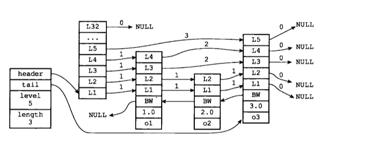

上图展示了一个跳跃表示例，位于图片最左边的是zskiplist结构，该结构包含一下属性：

1. header：指向跳跃表的表头节点
2. tail：指向跳跃表的表尾节点
3. level：记录目前跳跃表内，层数最大的那个节点的层数(表头节点的层数不计算在内)
4. length：记录跳跃表的长度，也即是，跳跃表目前包含节点的数量(表头节点不计算在内)

位于zskiplist结构右方的是四个zskiplistNode结构，该结构包含以下属性：

1. 层(level)：节点中用L1、L2、L3等字样标记节点的各个层，L1代表第一层，L2代表第二层，依次类推。每个层都带有两个属性：前进指针和跨度。前进指针用于访问位于表尾方向的其他节点，而跨度则记录了前进指针所指向节点和当前节点的距离。在上面的图片中，连线上带有数字的箭头就代表前进指针，而那个数字就是跨度。当程序从表头向表尾进行遍历时，访问会沿着层的前进指针进行。
2. 后退(backward)指针：节点中用BW字样标记节点的后退指针，它指向位于当前节点的前一个节点。后退指针在程序从表尾向表头遍历时使用。
3. 分值(score)：各个节点中的1.0、2.0和3.0是节点所保存的分值。在跳跃表中，节点按各自所保存的分值从小到大排列。
4. 成员对象(obj)：各个节点中的o1、o2和o3是节点所保存的成员对象。

**跳跃表节点：**
```
/* ZSETs use a specialized version of Skiplists */
typedef struct zskiplistNode {
    robj *obj;  /*成员对象*/
    double score;   /*分值*/
    struct zskiplistNode *backward; /*后退指针*/
    struct zskiplistLevel { /*层*/
        struct zskiplistNode *forward;  /*前进指针*/
        unsigned int span;  /*跨度*/
    } level[];
} zskiplistNode;
```
1.分值和成员

节点的分值(score属性)是一个double类型的浮点数，跳跃表中的所有节点都按分值从小到大来排序。

节点的成员对象(obj属性)是一个指针，它指向一个字符串对象，而字符串对象则保存着一个SDS值。

在同一个跳跃表中，各个节点保存的成员对象必须是唯一的，但是多个节点保存的分值却可以是相同的：分至相同的节点将按照成员对象在字典中的大小来进行排序，成员对象较小的节点会排在前面(靠近表头的方向)，而成员对象较大的节点则会排在后面(靠近表尾的方向)。

2.后退指针

节点的后退指针(backward属性)用于从表尾向表头方向访问节点：跟可以一次跳过多个节点的前进指针不同，因为每个节点只有一个后退指针，所以每次只能后退至前一个节点。

程序首先通过跳跃表的tail指针访问表尾节点，然后通过后退指针访问倒数第二个节点，之后再沿着后退指针访问倒数第三个节点，再之后遇到指向NULL的后退指针，于是访问结束。

3.层

跳跃表节点的level数组可以包含多个元素，每个元素都包含一个指向其他节点的指针，程序可以通过这些层来加快访问其他节点的速度，一般来说，层的数量越多，访问其他节点的速度就越快。

  每次创建一个新跳跃表节点的时候，程序根据幂次定律(power law，越大的数出现的概率越小)随机生成一个介于1和32之间的值作为level数组的大小，这个大小就是层的“高度”。

4.前进指针

每个层都有一个指向表尾方向的前进指针(level[i].forward属性)，用于从表头向表尾方向访问节点。
下图用虚线表示出了程序从表头向表尾方向，遍历跳跃表中所有节点的路径：
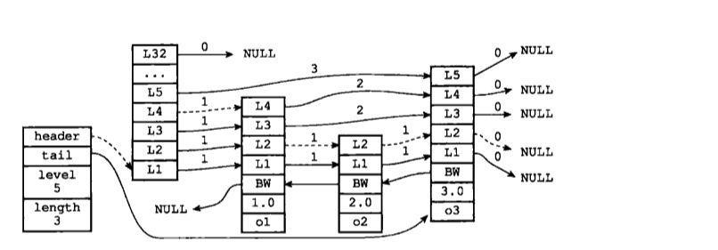

  1) 迭代程序首先访问跳跃表的第一个节点(表头)，然后从第四层的前进指针移动到表中的第二个节点。

  2) 在第二个节点时，程序沿着第二层的前进指针移动到表中的第三个节点。

  3) 在第三个节点时，程序同样沿着第二层的前进指针移动到表中的第四个节点。
  
  4) 当程序再次沿着第四个节点的前进指针移动时，它碰到一个NULL，程序知道这时已经到达了跳跃表的表尾，于是结束这次遍历

5.跨度

层的跨度(level[i].span属性)用于记录两个节点之间的距离：

1.两个节点之间的跨度越大，它们相距得就越远。

2.指向NULL的所有前进指针的跨度都为0，因为它们没有连向任何节点

初看上去，很容易以为跨度和遍历操作有关，但实际上并不是这样的，遍历操作只使用前进指针就可以完成了，跨度实际上是用来计算排位(rank)的：在查找某个节点的过程中，将沿途访问过的所有层的跨度累计起来，得到的结果就是目标节点在跳跃表中的排位。

##  对象

Redis底层使用到的主要数据结构有：简单动态字符串，双端链表，字典，压缩列表，整数集合

Redis并没有直接使用这些数据结构来实现K-value数据库，而是基于这些数据结构创建了一个对象系统。

**Redis对象的数据结构**

Redis的每一个对象都是由redisObject结构表示，其定义如下：
```
/**
 * redisObject Redis对象
 */
typedef struct redisObject {

    unsigned type : 4; // 类型

    unsigned encoding : 4; // 编码

    int refcount; // 引用计数

    void *ptr; // 指向底层实现数据结构的指针（实际值）
} robj;
```
1.对象的type属性记录了对象的类型，这个属性的值可以：字符串对象，列表对象，哈希对象，集合对象，有序集合对象。

对象的type属性记录了对象的类型，我们可以使用type key指令来查看当前对象的类型：string list  hash  set zset

键值对的键类型一直都是字符串对象。

2.ecoding属性记录了对象所使用的编码，即该对象使用了什么数据结构做为底层实现。

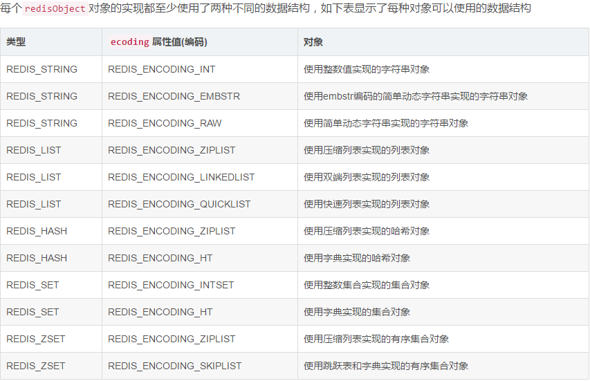

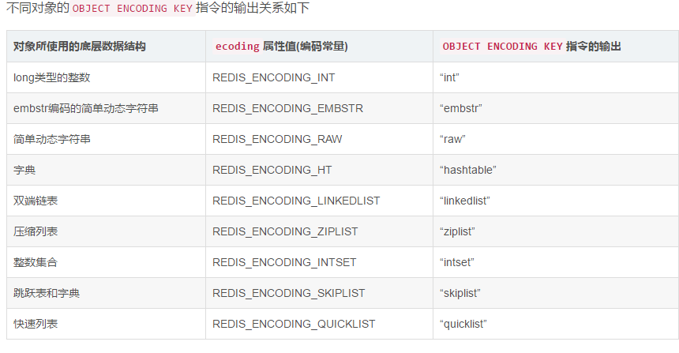

**字符串对象**

redis中字符串对象针对不同的数据可能有三种编码方式：int，raw，embstr。

如果一个字符串对象保存的是整数值，并且这个整数值可以用龙类型来表示

对于长度小于等于39的字符串（3.0之后长度小于等于44），采用embstr编码方式存储。

除以上两种情况外的字符串采用raw编码方式。

**列表对象**

列表对象的编码可以是ziplist或则linkedlist

ziplist编码的列表对象使用压缩列表作为底层实现

linkedlist编码的列表对象使用双端列表作为底层实现

当列表对象可以同时满足以下两个条件时，列表对象使用ziplist编码：

1.列表对象保存的所有字符串元素的长度都小于64字节

2.列表对象保存的元素数量小于512个；不能满足这两个条件的列表对象需要使用linkedlist编码

对于使用ziplist编码的列表来说，当使用ziplist编码所需的两个条件的任意一个不能被满足时，对象的编码转换操作就会被执行，原本保存在压缩列表里的所有列表元素都会被转移并保存到双端列表里面，对象编码也会从ziplist变为linkedlist

**哈希对象**

哈希对象的编码可以是ziplist或则hashtable

ziplist编码的哈希对象使用压缩列表作为底层实现，每当有新的键值对要加入到好戏对象时，程序会先将保存了键的压缩列表节点推入到压缩列表表尾，然后再将保存了值的压缩列表节点推入到压缩列表表尾：

同一键值对总是仅仅的挨在一起。先压入的键值对在列表前面，后压入的键值对在列表的后面

hashtable编码的哈希对象使用字典作为底层实现，哈希对象中的每个键值对都是用一个字典键值来保存：

1.字典的每个键都是一个字符串对象，对象中保存了键值对的键

2.字典的每一个值都是一个字符串对象，对象中保存了键值对的值

满足一下条件时，哈希对象适应ziplist编码：

1.哈希对象保存的所有键值对的键和值的字符串长度都小于64

2.哈希对象保存的键值对数量小于512个；不能满足这两个条件的哈希对象需要使用话说她病了编码

**集合对象**

集合对象的编码可以使intset或者hashtable

intset编码的集合对象使用整数集合作为底层实现，集合对象包含的所有元素都被保存在整数集合里面

hashtable编码的集合对象使用字典作为底层实现，字典的每个键都是一个字符串对象，每个字符串对象包含了一个集合元素，而字典的值全部设置为NULL

**编码转换**

当集合对象可以同时满足以下两个条件时，对象使用intset编码：

1.集合对象保存的所有元素都是整数值

2.集合对象保存的元素不操过512

不能满足这两个条件的集合对象需要使用hashtable编码

**有序集合对象：**

有序集合对象的编码可以使ziplist或者skiplist

ziplist编码的有序集合对象底层使用压缩列表实现，每个集合元素使用两个紧挨在一起压缩列表节点来保存，第一个节点保存元素的成员，而第二个节点保存元素的分值（score）

压缩列表内的集合元素按分值的大小进行排序，分值较小的元素被放置在靠近表头的位置，而分值较大的元素则被放置在靠近表尾的位置。

skiplist编码的有序集合使用zset结构作为底层实现，一个zset结构同时包含一个字典和一个跳跃表：
```
typedef struct zset{
  zskiplist *zsl;
  dict *dict;
}zset;
```

zset结构中的zsl跳跃表按分值从小到大保存了所有集合的元素，每个跳跃表节点都保存了一个集合元素：跳跃表节点的object属性保存了元素的成员，而跳跃表节点的score属性则保存了元素的分值。通过这个跳跃表，程序可以对有序集合进行范围操作。

zset结构中的dict字典为有序集合创建了一个从成员到分值的映射，字典中的每个键值对都保存了一个集合元素:字典的键保存了元素的成员，而字典中的值保存了元素的分值。通过这个字典，程序可以用O(1)复杂度查找给定成员的分值。

**为什么有序集合需要同时使用字典和跳跃表来实现？**

在理论上，有序集合可以单独使用字典或则跳跃表的其中一种数据结构的实现，无论单独使用字典还是跳跃表，在性能上对比起来同时使用字典和跳跃表都会有所降低

例如只是用字典实现有序集合，虽然已O(1)复杂度查找数据的分值这一特性会被保留，因为字典是无序方式来保存集合元素的，所以在每次执行范围操作时，程序需要多字典保存的元素排序，需要至少O(NlogN)时间复杂度，以及额外的O(N)内存空间为要创建一个数组来保存排序后的元素。

若只用跳跃表实现有序集合，那么执行范围操作时所有有点都会保留，但是没有字典，所以根据成员分值这已操作的复杂度将从O(1)上升为O(logN)

**编码转化**

当有序集合对象可以同时满足一下两个条件时，对象使用ziplist编码：

1.有序集合保存的元素小于128

2.有序集合保存的所有元素的长度都小于64

不能瞒住以上两个条件的有序集合对象将使用skiplist编码

为了确保只有指定类型的键可以执行某些特定的命令，在执行一个类型特定的命令之前，Redis会先检查输入键的类型是否正确，然后再决定是否执行给定命令。

**内存回收**

因为C语言不具备内存回收功能，所以Redis在自己的对象系统中构建了一个引用计数技术实现内存回收机制，通过这一机制，程序可以通过跟踪对象的引用计数信息，在适当的时候自动释放对象并进行内存回收

**对象共享**

除了用于实现引用计数内存回收机制之外，对象的引用计数属性还带有对象共享的作用，例如：A与B 两个键同时指向一个对象，则对象的引用计数器从之前的1变成2，其他属性没有变化。

###  数据库

**服务器中的数据库**

Redis服务器将所有数据库都保存在服务器状态redis将所有数据库都保存在服务器状态redis.h/redisServer结构的db数组中：
db数组中的每一项都是一个redis.h/redisDb结构，每个redisDb结构代表一个数据库：
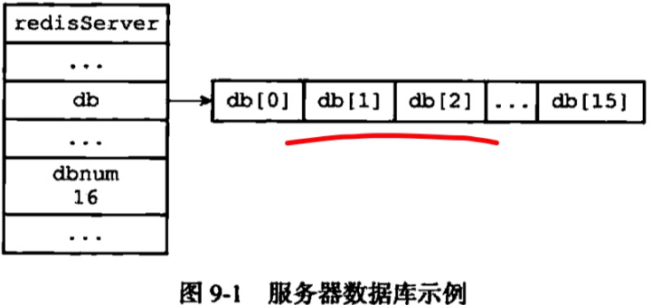

程序会根据服务器状态dbnum属性来决定应该创建多少个数据库，dbnum属性的值由服务器配置的database选项决定，默认情况下该值为16

**数据库切换**

每个redis客户端都有自己的目标数据库，每个redis客户端默认情况下目标数据库为0号数据库，但是客户端可以通过执行select命令来切换目标数据库

在服务器内部，客户端状态RedisClient结构的db属性记录了客户端当前的目标数据库，这个属性是一个执行redisDB结构的指针：redisClient.db指向redisServer.db数组的其中一个元素，而被指向的元素就是客户端的目标数据库
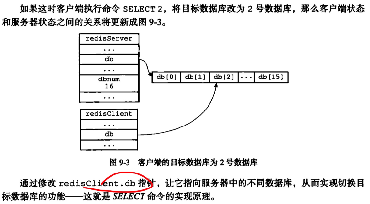

**数据库空间**

Redis是一个键值对数据库服务器，服务器中的每个数据库都由一个redis.h/redisDb,其中redisDb中的dictionary字典保存了数据库中的所有键值对，我们将这个字典称为键空间
键空间和用户的数据库是直接对应的：

键空间的键也就是数据库的键，每个键都是一个字符串对象

键空间的值也就是数据库的值，，每个值可以使字符串对象，列表对象，哈希对象，集合对象和有序集合对象中的任一种redis对象
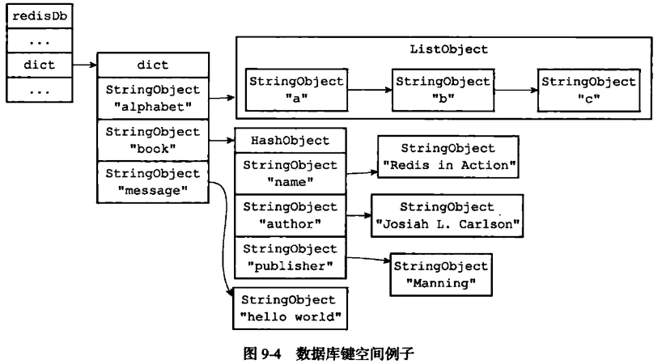

**增删更新查**

添加一个新键值对到数据库，实际上就是将一个新键值对添加到键空间字典里面，其中键为字符串对象，而值为任意一种类型的redis对象

删除数据库中的一个键，实际上就是在键空间里面删除键所对应的键值对对象

对一个数据库键进行更新，实际上就是对键空间里面键所对应的值对象进行更新，根据值对象的类型不同，更新的具体方法也会有所不同。

对一个数据库键进行取值，实际上就是对键空间中取出键所对应的值对象，根据值对象的类型不同，具体的取值方法也会有所不同

**读写键空间时的维护**

1. 读取一个键（读和写都要），服务器会根据键是否来存在更新服务器的键空间命中次数和不命中次数，可以看keysapce_hists和keyspace_misses属性查看。
2. 读取一个键之后，会更新LRU，用于计算键的闲置时间。
3. 如果读取一个键时发现过期，就会先删除这个过期键。
4. 如果客户端watch命令监视了某个键，那么服务器在堆被监视的键进行修改后，会将这个键标记为脏。
5. 服务器每次修改一个键后，都会对脏键技器值增以，会触发误区七的持久化以及复制操作。
6. 如果服务器开启了数据控通知功能，会触发相应数据库通知。

**设置键的生存时间或过期时间**

通过EXPIRE命令或则PEXPIRE命令，客户端可以以秒或则毫秒精度为数据库中的某个键设置生存时间（TTL），经过指定的秒数或则毫秒数之后，服务器就会自动删除生存时间为0的键

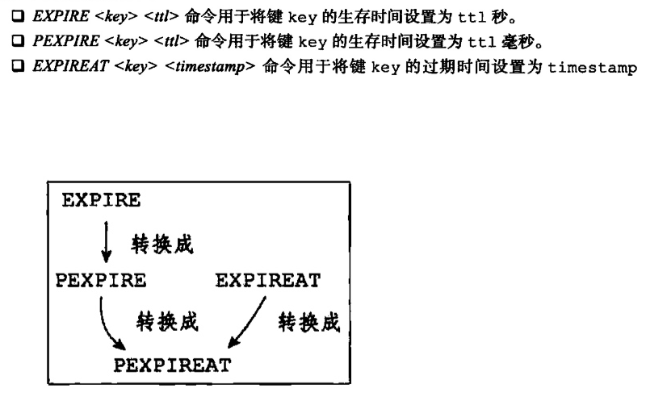

无论执行哪个命令最终执行效果都和PEXPIRE命令一样

**保存过期时间**

redisDb结构的expires字典保存了数据库中所有键的过期时间，我们称这个字典为过期字典

1.过期字典的键是一个指针，这个指针指向键空间中某个键对象(也即是某个数据库键)

2.过期字典的值是一个long long类型的整数，这个整数保存了键所指向的数据库键的过期时间——一个毫秒精度UNIX时间戳

**移除过期时间**

PEXPIREAT命令可以移除一个键的过期时间。

PERSIST命令在过期字典中查找给定的键，并解除键和值（过期时间）在过期字典中的关联

TTL命令以秒为单位返回键的剩余生存时间，而PTTL命令则以毫秒为单位返回键的剩余生存时间。

#####  过期键的删除策略

1、定时删除，在设置过期时间时创建一个timer，让定时器在键过期时间来临时，立即执行删除

定是删除策略是最好的，能保证尽快删除，并释放内存。但是对cpu时间是不友好额，如果过期键过多的时候，删除就会影响相应时间。

2、惰性删除，过期后不管，在读取键 检查是否过期的时候再删除

惰性删除对cpu来说是友好的，但是这样会让其所占用内存不释放，如果有些键过期了又永远不删除可以认为是内存泄漏。

3、定期删除：每隔一端时间就进行一次检查，删除里面的过期键。

定期删除的话可以减少时长和频率，以及自定义时间可以在夜晚的时候执行。

**Redis的过期键删除策略**

**惰性删除**

过期键的惰性删除策略由db.c/expireIfNeeded函数实现，所有读写数据库的redis命令在执行之前都会调用expireIfNeeded函数对输入键进行检查

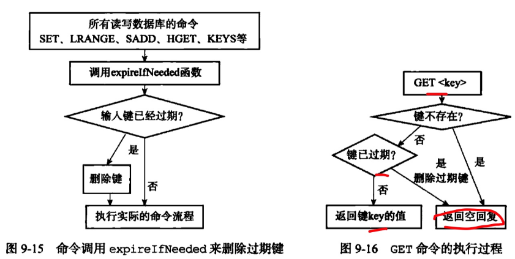

**定期删除策略**

过期键的定期删除策略由redis.c/activeExpireCycle函数实现，每当redis的服务器周期性操作redis.c/serverCron函数执行时，activeExpireCycle就会被调用，它在规定的时间内，分多次遍历服务器中的各个数据库，从数据库的expires字典中随机检查一部分键的过期时间，并且删除其中的过期键。

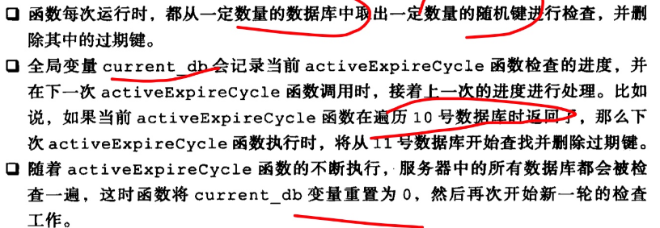

**AOF，RDB和复制功能对过期键的处理**

**1.生成RDB文件**

在执行SAVE命令或者BGSAVE命令创建一个新的RDB文件时，程序会对数据库键进行检查，过期的键不会保存到新创建的RDB文件中。

在启动redis服务器时，如果服务器开启了RDB功能，那么服务器将对RDB文件进行载入：

1、如果服务器以主服务器模式运行，那么载入的时候就会检查是否过期。

2、如果以服务器模式运行，那么所有键都会被载入。

因为主从服务器在进行数据同步的时候，从服务器的数据库就会被清空，所以一般来讲，过期键对载入RDB文件的从服务器也不会造成影响。

**AOF文件写入**

当服务器以AOF持久化模式运行时，如果数据库中的某个键已经过期，但它还没有被惰性删除或定期删除，那么AOF文件不会因为这个过期键而产生影响。

当过期键被被惰性删除或者定期删除之后，程序会向AOF文件追加一条DEL命令来显式记录该键已经删除

在执行AOF重写的过程中，程序会对数据库中的键进行检查，已过期的键不会被保存到重写后的AOF文件中。

**复制**

当服务器运行在复制模式下时，从服务器过期键删除动作由主服务器控制。

1、主服务器会删除一个过期键之后会向slave发送一个DEL命令。

2、从服务器在执行客户端发送命令时，即使碰到过期键也不会将过期键删除

3、从服务器只有接到DEL命令之后才会删除过期键。

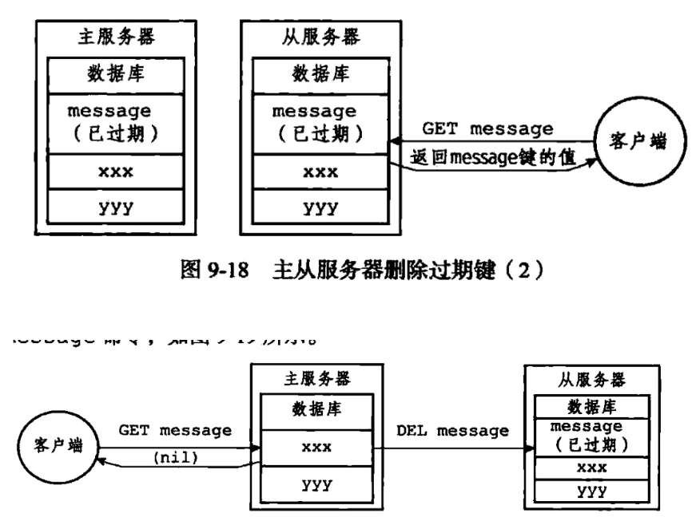

**数据库通知**

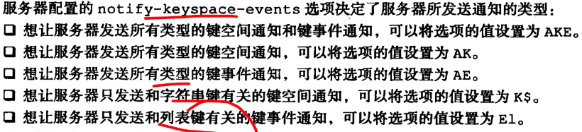

###  RDB持久化

redis持久化即可以手动执行，也可以根据服务器配置选项定期执行，该功能可以将某个时间点上的数据库状态保存到一个RDB文件中。

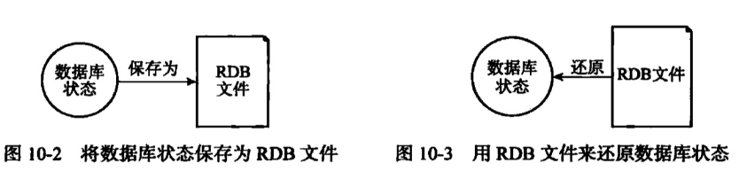

**RDB文件的创建与载入**

有两个redis命令可以用于生成RDB文件，一个是save，另一个BGSAVE。SAVE命令会阻塞Redis服务器进程，直到RDB文件创建完毕为止，在服务器进程阻塞期间，服务器不能处理任何命令，和SAVE命令直接阻塞不同，BGSAVE命令会派生出一个子进程，然后由子进程负责创建RDB文件，服务器进程（父进程）继续处理命令请求。

RDB文件的载入工作是服务器启动时自动执行的，所以Redis并没有专门载入RDB文件的命令，只要服务器启动时检测到RDB文件存在，它就会自动载入RDB文件

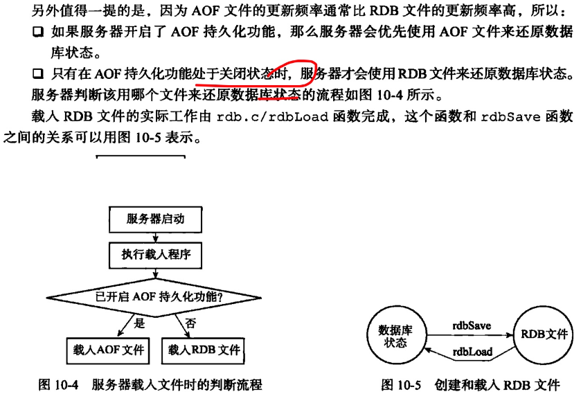

**BGSAVE命令执行时服务器状态**

BGSAVE命令执行期间，客户端发送的BGSAVE命令和SAVE命令都会被服务器拒绝，避免同时调用rdbSave，产生竟态条件。

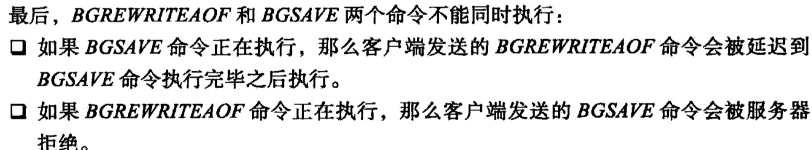

**服务器在载入RDB文件期间，会一直处于阻塞状态，直到载入工作完成为止**

**自动间隔性保存**

redis允许用户可以设置服务器配置的save选项，让服务器每隔一段时间执行一次BGSAVE名利，用户可以通过设置save选项设置多个保存条件，但只要其中任意一个条件被满足，服务器就会执行BGSAVE命令。

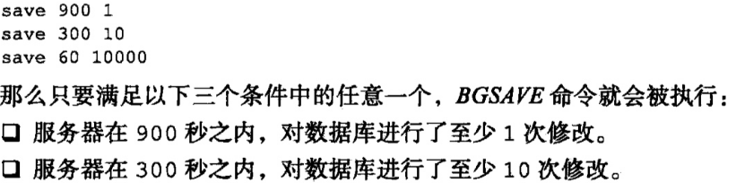

服务器程序会根据save选项设置的保存条件，设置服务器状态redisServer结构的saveparams属性：
saveparams属性是一个数组，数组中的每个元素都是一个saveparam结构，每个saveparam结构都保存了一个save选项设置的保存条件：
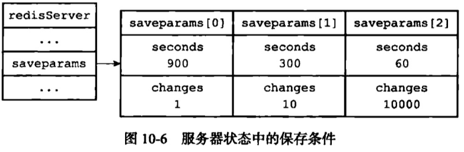

除了saveparams数组外，服务器还维持着一个dirty计数器，以及一个lastsave属性：

dirty计数器记录了距离上一次成功执行save命令或者bgsave命令之后，服务器对数据库状态进行了多少次修改（写入、删除、更新等操作）。
lastSave属性是一个unix时间戳记录上次成功执行RDB持久化的时间。

**redis的服务器周期性操作函数serverCron默认每隔100毫秒就会执行一次，该函数用于对正在运行的服务器进行维护，它的其中一项工作就是检查save选项所设置的保存条件是否满足，满足的话就执行BGSAVE命令**

**RDB文件结构**

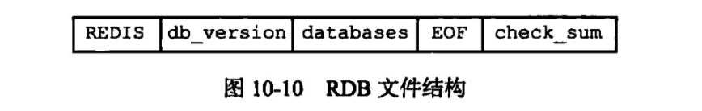

REDIS部分长度为5个字节，通过这五个字节可以快速检查所载入的文件是否是RDB文件

db_version长度为4字节，记录了RDB文件的版本号

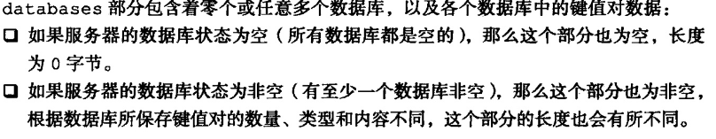

###  AOF持久化
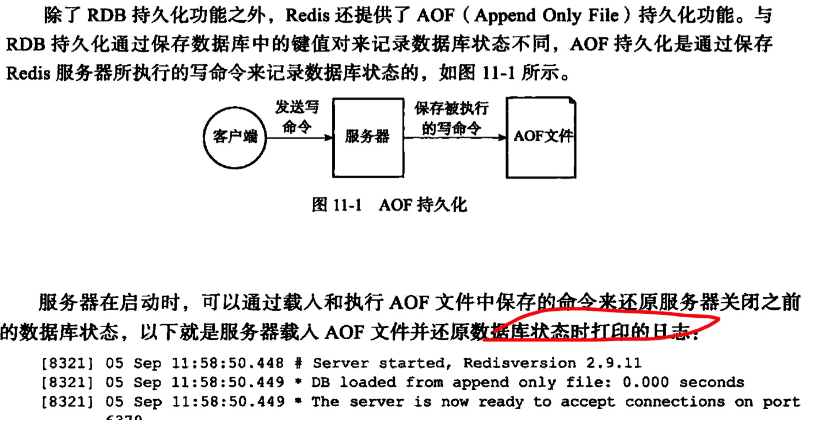

AOF保存的是服务器执行的写命令

**AOF持久化的实现**

AOF持久化功能的实现可以分为命令追加，文件写入，文件同步三个步骤：

**命令追加**

当AOF持久化功能出于打开状态时，服务器执行完一个写命令之后，会以被执行的写命令追加到服务器的aof_buf缓冲区的末尾

**AOF文件的写入与同步**

Redis的服务器进程就是一个事件循环，这个循环中的文件事件负责接收客户端的命令请求以及向客户端发送命令回复。

每次结束一个事件循环之前，都会调用flushAppendOnlyFile函数，考虑是否将缓冲区的内容写入和保存到AOF文件里面。

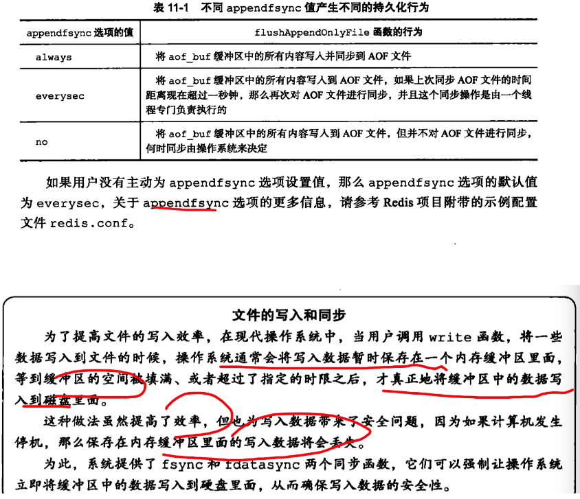

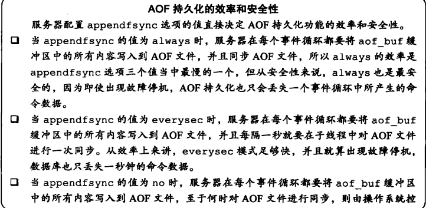
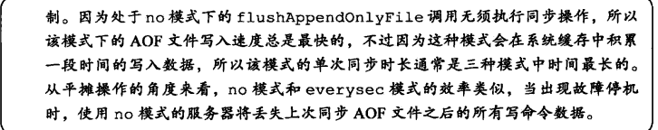   

**AOF文件的载入与数据的还原**

因为AOF文件里面包含了重建数据库状态所需的所有写命令，所以服务器只要读入并重新执行一遍AOF文件里面保存的写命令。就可以还原服务器关闭之前的数据库状态。

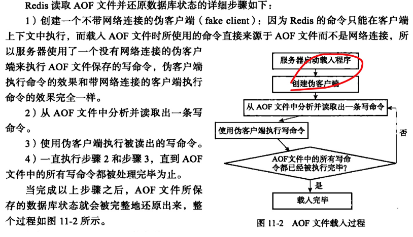

**AOF重写**

AOF文件中的内容越多，文件的体积也会越大，如果不加以控制的话，体积过大的AOF文件很可能对Redis服务器，甚至整个计算机造成影响，并且AOF文件的体积越大，使用AOF文件来进行数据还原所需的时间就越多。

为了解决AOF文件体积膨胀的问题，Redis提供了AOF文件重写功能。通过该功能，redis服务器可以创建一个新的AOF文件来代替现有的AOF文件，新旧两个AOF文件保存的数据库状态相同，但新的AOF文件不会包含任何浪费空间的冗余命令，所以新AOF文件所能保存的体积通常会比旧AOF文件的体积要小的多。

**AOF文件重写的实现**

AOF文件重写并不需要对现有的AOF文件进行任何读取，分析或写入操作，这个功能是通过读取服务器当前的数据库状态来实现的

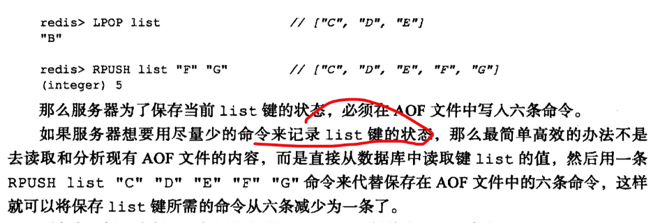

其他所有类型的键都可以以同样的方式去减少AOF文件中命令的数量

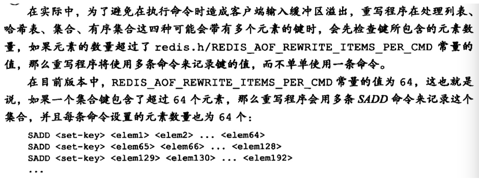

**AOF后台重写**

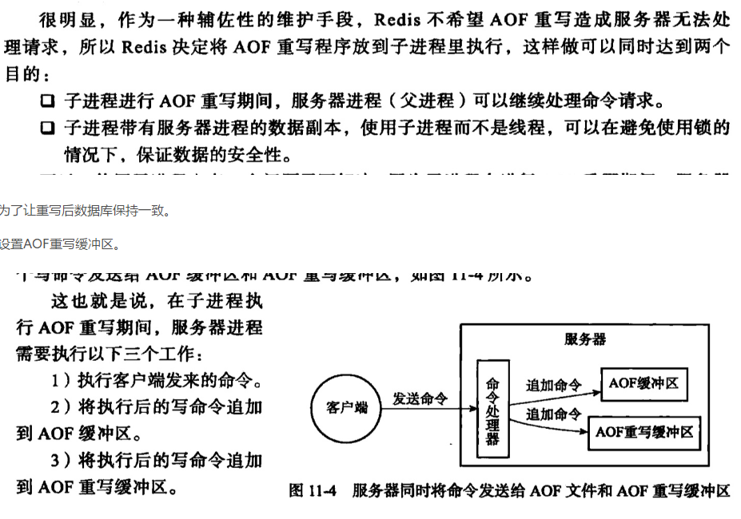

这样一来：
（1）AOF缓冲区的内容会定期被写入和同步到AOF文件，对现有AOF文件的处理工作会如常进行

（2）从创建子进程开始，服务器执行的所有写命令都会被记录到AOF重写的缓冲区里面

当子进程完成AOF重写后，它会向父进程发送一个信号，父进程在接到该信号之后，会调用一个信号处理函数，并执行以下工作：
（1）将AOF重写缓冲区中的所有内容写入到新的AOF文件中，这时新的AOF文件所保存的数据库状态将和服务器当前的数据库状态一致。

（2）对新的AOF文件进行改名，原子地覆盖现有的AOF文件，完成新旧两个AOF文件的替换。

整个AOF后台重写过程中，只有信号处理函数执行时会对服务器进程（父进程）造成阻塞，在其他时候，AOF后台重写都不会阻塞父进程，这将AOF重写对服务器性能造成的影响降到最低。

###  事件

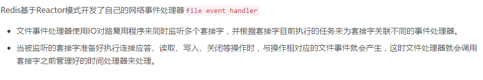
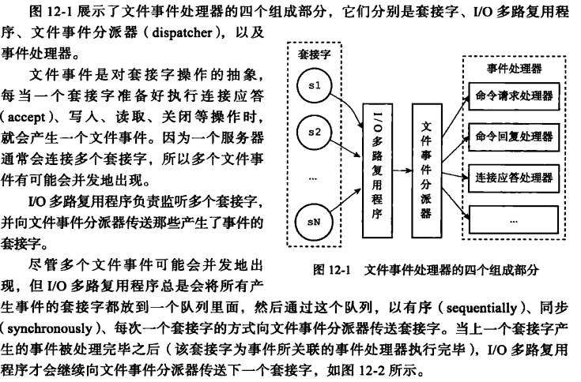

**文件事件处理器**

Redis为文件事件编写多个处理器，这些事件处理器分别用于实现不同的网络通信需求

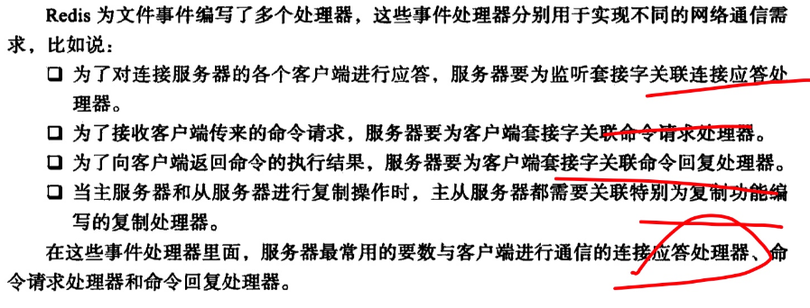

**时间事件**

定时时间：指定时间后执行一次

周期性时间：每个指定时间就执行一次

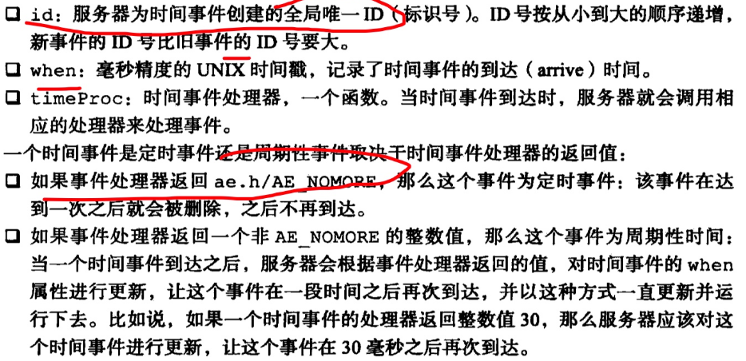

服务器将所有时间事件都放在一个无序链表中，每当时间事件执行器运行时，它就遍历整个链表，查找所有已到达的时间事件，并调用相应的事件处理器。

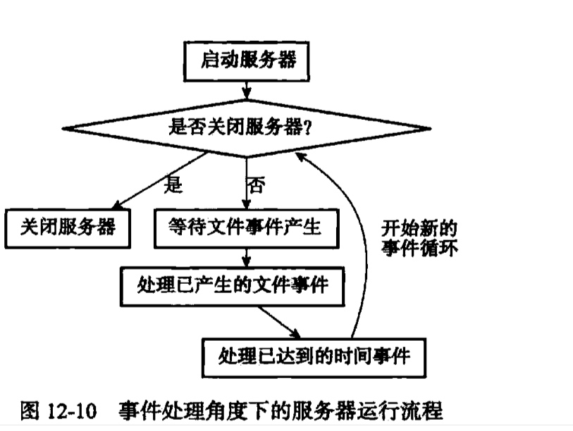

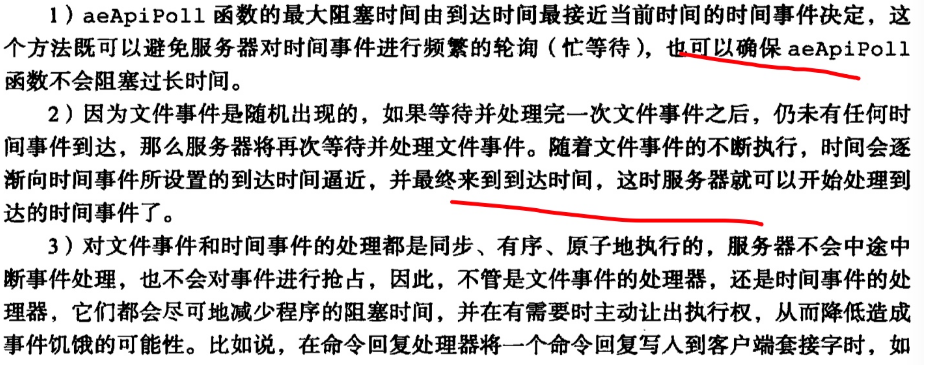

因为时间事件在文件事件之后执行，并且时间之间不会出现抢占，所以时间事件的实际处理时间，通常会比时间事件设定的到达时间少晚一些。

###  客户端
redis服务器是典型的一对多服务器程序：一个服务器可以与多个客户端建立网络连接，每个客户端可以向服务器发送命令请求，而服务器则接收并处理客户端发送的命令请求，并向每个客户端返回命令回复。

通过使用IO多路复用技术实现的文件事件处理器，redis服务器使用单线程单进程的方式来处理命令请求，并与多个客户端进行网络通信

redis服务器状态结构的clients属性是一个链表，这个链表保存了所有与服务器连接的额客户端的状态结构。
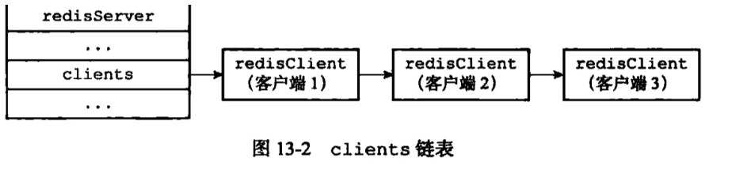

###  15 复制
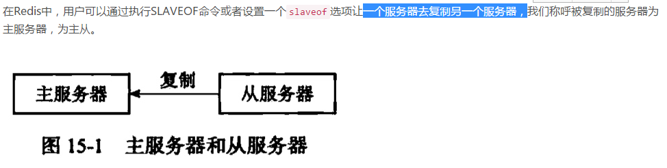

进行主从复制的服务器双方保存相同的数据库，向主服务器中插入数据，可以在从服务器中查找到

**旧版复制功能的实现**

Redis的复制功能分为sync同步和command propagate命令传播两个操作。
同步：同步操作用于将从服务器的数据库状态更新至主服务器当前所处的数据库状态。
命令传播操作：用于在主服务器的数据库状态被修改，导致主从服务器的数据库状态出现不一致时，让主从服务器的数据库重新回到一致状态。

**同步**

1、发送sync
2、接受sync并开启bgsvae命令，缓冲区记录所有写命令
3、bgsave完成后发送rdb文件，接受rdb后倒入并执行缓冲区命令。

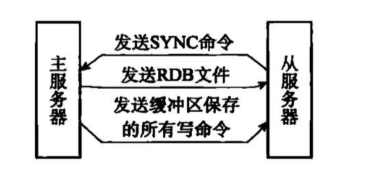

命令传播：

主服务器将自己的执行的命令，发送给从服务器，让主从服务器再一次回到一致状态

**旧版复制的缺点**

在Redis中，从服务器对主服务器的复制可以分为以下几种情况：
1、初次复制
2、断线后复制（效率极低）

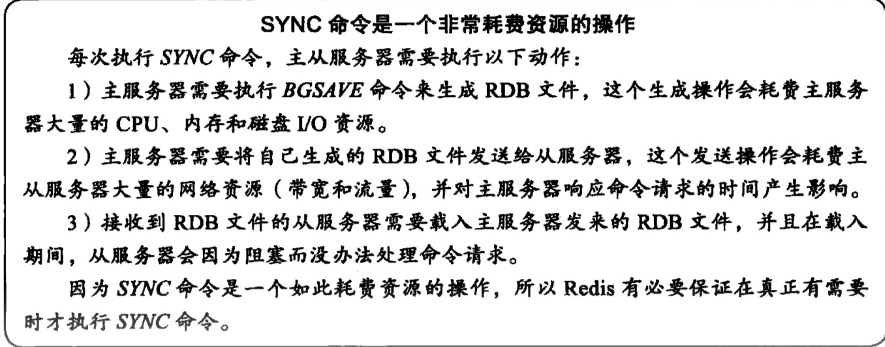

**新版复制功能的实现**

PSYNC命令代替SYNC命令，新命令有完整同步和部分重同步

完整同步用于处理  初次复制

部分同步用于处理  断线后同步   如果条件允许只将断线后的写命令发送给从服务器，保持主从一致。

**部分同步的实现**

主要由三个部分构成：
1、主服务器的复制偏移量和从服务器的复制偏移量（replication offset）
2、主服务器的复制积压缓冲区
3、服务器的运行

**复制偏移量**
执行的复制双方会维护一个复制偏移量，主发送N个字节，就加上N，从接送就接受N

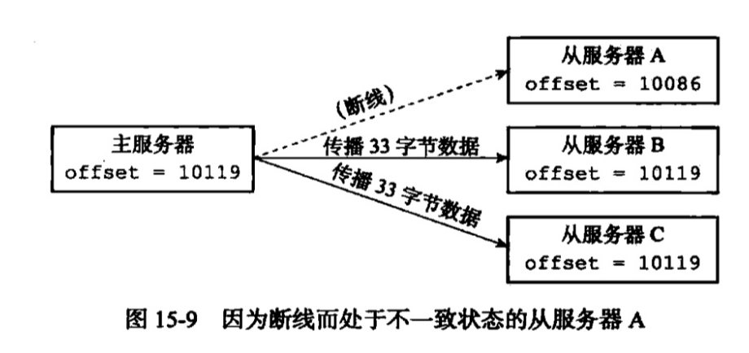

此时就执行部分同步

**复制积压缓冲区**

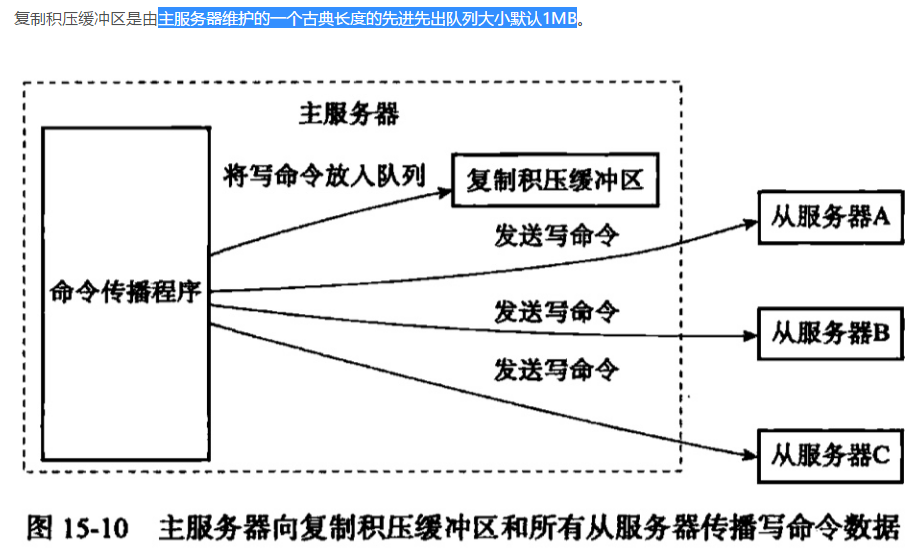

**服务器ID**

每个服务都有自己的ID，保证断线丛连后，所连接到的主服务器与原来一致。

###  16 Sentinel
Sentinel（哨兵）是redis的高可用性的解决方案：Sentinel 组成的sentinel系统可以监视任意多个主服务器以及主服务器属下的所有从服务器，并在被监视的主服务器进入下线状态时，自动将下线主服务器属下的某个从服务器升级为新的主服务器，继续处理请求。

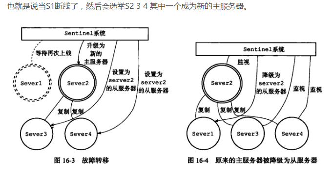

**启动初始化服务器**

启动一个Sentinel时，需要执行以下步骤：
1、初始化服务器
2、将普通Redis服务器使用的状态代码换成Sentinel专用代码
3、初始化Sentinel状态
4、根据给定的配置文件，初始化Sentinel的监视主服务器列表
5、创建连接主服务器的网络连接
