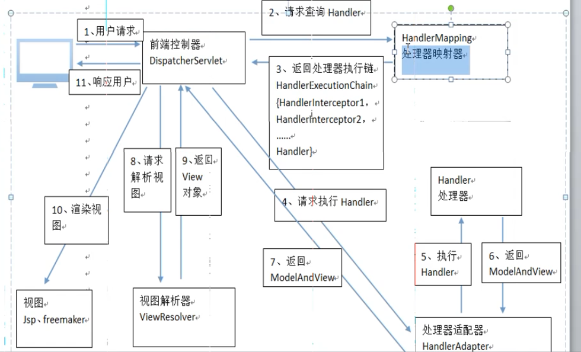

##  SpringMVC  架构

####  SpringMVC架构图

####  SpringMVC  架构说明

1. 用户发送请求至前端控制器DispatcherServlet
2. DispatcherServlet收到请求调用HandlerMapping处理器映射器
3. 处理器映射器根据请求url找到具体的处理器，生成处理器对象及处理器拦截器（如果有则生成）一并返回DispatcherServlet
4. DispatcherServlet通过处理器适配器（HandlerAdapter）调用处理器
5. 执行处理器（Controller）
6. Controller执行完成返回ModelAndView
7. 处理器适配器将Controller执行结果ModelAndView返回给dispatcherServlet
8. DispatcherServlet将controller执行结果ModelAndView返回给DispatcherServlet
9. DispatcherServlet将ModelAndView传给视图解析器
10. ViewReslover解析后返回具体View
11. DispatcherServlet对view进行渲染视图（将模型数据填充至视图）
12. DispatcherServlet响应用户

#### 组件说明
**	DispatcherServlet：前端控制器**

用户请求到达前端控制器，它就相当于mvc模式中的c，dispatcherServlet是整个流程控制的中心，由它调用其它组件处理用户的请求，dispatcherServlet的存在降低了组件之间的耦合性。

**HandlerMapping：处理器映射器**

HandlerMapping负责根据用户请求找到Handler即处理器，springmvc提供了不同的映射器实现不同的映射方式，例如：配置文件方式，实现接口方式，注解方式等。

**HandlAdapter：处理器适配器**

通过HandlerAdapter对处理器进行执行，这是适配器模式的应用，通过扩展适配器可以对更多类型的处理器进行执行。

**	Handler：处理器**

Handler 是继DispatcherServlet前端控制器的后端控制器，在DispatcherServlet的控制下Handler对具体的用户请求进行处理。

**View Resolver：视图解析器**

View Resolver负责将处理结果生成View视图，View Resolver首先根据逻辑视图名解析成物理视图名即具体的页面地址，再生成View视图对象，最后对View进行渲染将处理结果通过页面展示给用户。

**View：视图**

springmvc框架提供了很多的View视图类型的支持，包括：jstlView、freemarkerView、pdfView等。我们最常用的视图就是jsp。

**如果在springMvc中没有显示的配置处理器映射器和处理器适配器，那么springMvc会默认的去DispatcherServlet.properties中查找，对应的处理器映射器和适配器去使用，这样每个请求都要去烧苗一次他的默认配置文件，效率非常低，会降低访问速度，所以要显示的配置处理器映射器和处理器适配器**

#### 注解式处理器映射器和注解式处理器适配器

注解式处理器映射器，对类中标记@ResquestMapping的方法进行映射，根据ResquestMapping定义的url匹配ResquestMapping标记的方法，匹配成功返回HandlerMethod对象给前端控制器，HandlerMethod对象中封装url对应的方法Method。

          <!--注解映射器 -->
          <beanclass="org.springframework.web.servlet.mvc.method.annotation.RequestMappingHandlerMapping"/>

**4.5.4	<mvc:annotation-driven>**

springmvc使用<mvc:annotation-driven>自动加载RequestMappingHandlerMapping和RequestMappingHandlerAdapter，可用在springmvc.xml配置文件中使用<mvc:annotation-driven>替代注解处理器和适配器的配置。自动配置最新版的适配器和映射器

**7	springmvc与struts2不同**

1、	springmvc的入口是一个servlet即前端控制器，而struts2入口是一个filter过虑器。

2、	springmvc是基于方法开发(一个url对应一个方法)，请求参数传递到方法的形参，可以设计为单例或多例(建议单例)，struts2是基于类开发，传递参数是通过类的属性，只能设计为多例。

3、	Struts采用值栈存储请求和响应的数据，通过OGNL存取数据， springmvc通过参数解析器是将request请求内容解析，并给方法形参赋值，将数据和视图封装成ModelAndView对象，最后又将ModelAndView中的模型数据通过reques域传输到页面。Jsp视图解析器默认使用jstl。
