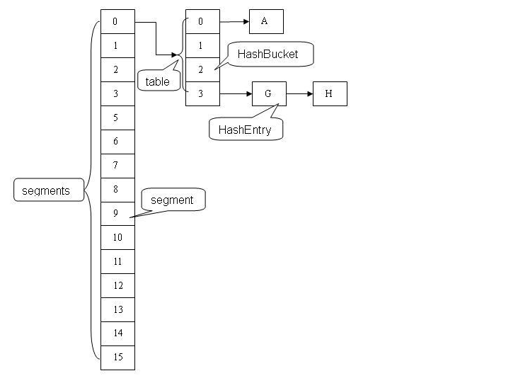
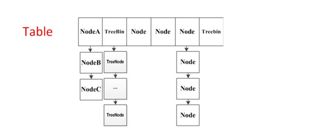
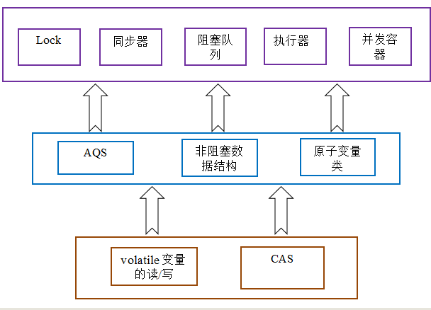
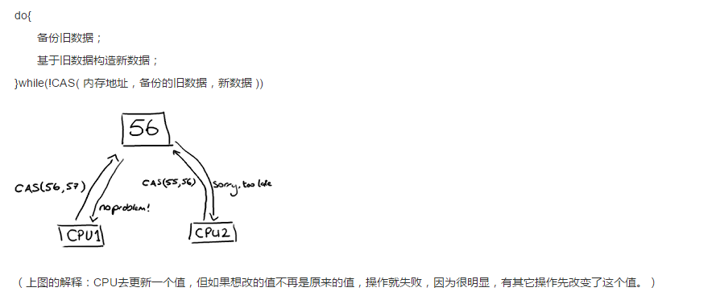

# 深入理解ConcurrentHashMap
## 前言
### JDK1.6分析
ConcurrentHashMap采用分段锁的机制，实现并发的更新操作，底层采用数组+链表+红黑树的存储结构。

其包含两个核心静态内部类Segment和HashEntry。
1. Segment继承ReentrantLock用来充当锁的角色，每个Segment对象守护每个散列映射表的若干个桶。
2. HashEntry用来封装映射表的键值对
3. 每个桶位是由若干个HashEntry对象链接起来的链表
一个ConcurrentHashMap实例中包含由若干个Segment对象组成的数组。



### JDK1.8分析

JDK1.8的实现已经抛弃了Segment分段锁机制，利用CAS+Synchronized来保证并发更新的安全，底层依然采用数组+链表+红黑树的存储结构。



**基础概念**
1. table:默认为null，初始化发生在第一次插入操作，默认大小为16的数组，用来存储Node节点数据，扩容时默认总是2的幂次方。
2. nextTable：默认为null，扩容时新生成的数组，其大小为原数组的两倍。
3. sizeCtl：默认为0，用来控制table的初始化和扩容操作
         -1：代表table正在初始化；
         -N：表示有N-1个线程正在进行扩容操作
         其余情况：
               如果table未初始化，表示table需要初始化的大小。
               如果table初始化完成，表示table的容量，默认是table大小的0.75倍
4. Node：保存key，value及key的hash值的数据结构
```
class Node<K,V> implements Map.Entry<K,V> {  
  final int hash;  
  final K key;  
  volatile V val;  
  volatile Node<K,V> next;  
  ... 省略部分代码  
}  
```
其中value和next都用volatile修饰，保证并发的可见性。
5. ForwardingNode：一个特殊的Node节点，hash值为-1，其中存储nextTable的引用
```
final class ForwardingNode<K,V> extends Node<K,V> {  
  final Node<K,V>[] nextTable;  
  ForwardingNode(Node<K,V>[] tab) {  
      super(MOVED, null, null, null);  
      this.nextTable = tab;  
  }  
}
```
6. 只有table发生扩容的时候，ForwardingNode才会发挥作用，作为一个占位符放在table中表示当前节点为null或则已经被移动。

**实例初始化**
实例化ConcurrentHashMap时带参数，会根据参数调整table的大小，假设参数为100，最终会调整成256，确保table的大小是2的幂次方，算法如下：
```
ConcurrentHashMap<String, String> hashMap = new ConcurrentHashMap<>(100);  
private static final int tableSizeFor(int c) {  
    int n = c - 1;  
    n |= n >>> 1;  
    n |= n >>> 2;  
    n |= n >>> 4;  
    n |= n >>> 8;  
    n |= n >>> 16;  
    return (n < 0) ? 1 : (n >= MAXIMUM_CAPACITY) ? MAXIMUM_CAPACITY : n + 1;  
}  
```
前面所有过程，都是保证造成一个所有位1的数据。并且通过最后的+1.变成2的N次方格式的数据
**注意**
ConcurrentHashMap在构造函数中只会初始化sizeCtl值，并不会初始化table，而是延缓到第一次put操作。

**table初始化**
table初始化操作会延缓到第一次put行为。但是put是可以并发执行的，如何做到只初始化一次呢？
```
private final Node<K,V>[] initTable() {  
    Node<K,V>[] tab; int sc;  
    while ((tab = table) == null || tab.length == 0) {  
//如果一个线程发现sizeCtl<0，意味着另外的线程执行CAS操作成功，当前线程只需要让出cpu时间片  
        if ((sc = sizeCtl) < 0)   
            Thread.yield(); // lost initialization race; just spin  
        else if (U.compareAndSwapInt(this, SIZECTL, sc, -1)) {  
            try {  
                if ((tab = table) == null || tab.length == 0) {  
                    int n = (sc > 0) ? sc : DEFAULT_CAPACITY;  
                    @SuppressWarnings("unchecked")  
                    Node<K,V>[] nt = (Node<K,V>[])new Node<?,?>[n];  
                    table = tab = nt;  
                    sc = n - (n >>> 2);  
                }  
            } finally {  
                sizeCtl = sc;  
            }  
            break;  
        }  
    }  
    return tab;  
}  
```
sizeCtl默认为0，如果ConcurrentHashMap实例化时有传参数，sizeCtl会是一个2的幂次方的值。所以执行第一次put操作的线程会执行Unsafe.compareAndSwaplnt方法修改sizeCtl为-1，有且只有一个线程能够修改成功，其他线程通过Thread.yield()让出CPU时间片等待table初始化完成

**put操作**
假设table已经初始化完成，put操作采用CAS+synchronized实现并发插入或更新操作，具体实现如下：
```
final V putVal(K key, V value, boolean onlyIfAbsent) {  
    if (key == null || value == null) throw new NullPointerException();  
    int hash = spread(key.hashCode());  
    int binCount = 0;  
    for (Node<K,V>[] tab = table;;) {  
        Node<K,V> f; int n, i, fh;  
        if (tab == null || (n = tab.length) == 0)  
            tab = initTable();  
        else if ((f = tabAt(tab, i = (n - 1) & hash)) == null) {  
            if (casTabAt(tab, i, null, new Node<K,V>(hash, key, value, null)))  
                break;                   // no lock when adding to empty bin  
        }  
        else if ((fh = f.hash) == MOVED)  
            tab = helpTransfer(tab, f);  
        ...省略部分代码  
    }  
    addCount(1L, binCount);  
    return null;  
}  
```
1. 获取table中对应索引的元素f
tabAt采用的是Unsafe.getObjectVolatile来获取，为什么不直接用table[index]呢？

在java线程内存模型中，每个线程都有一个工作内存，里面存储着table的副本，虽然table是volatile修饰的，但是不能保证table每次拿到的数据都是最新的。，Unsafe.getObjectVolatile可以直接获取指定内存的数据，保证了每次拿到的数据都是最新的。
2. 如果f为null，说明table中这个位置第一次插入元素，利用Unsafe.compareAndSwapObject方法插入Node节点
          1.如果CAS成功，说明Node节点已经插入，随后addCOUNT（1L,binCount）方法会检查当前容量是否需要扩容。
          2.如果CAS失败，说明有其他线程提前插入了节点，自旋重新尝试在这个位置插入节点。
3. 如果f的hash值为-1，说明当前f是ForwardingNode节点，意味有其他线程正在扩容，则一起进行扩容操作
4. 其余情况把新的Node节点按链表或则红黑树的方式插入到合适的位置，这个过程采用了同步内置锁实现并发：
```
synchronized (f) {  
 if (tabAt(tab, i) == f) {  
     if (fh >= 0) {  
         binCount = 1;  
         for (Node<K,V> e = f;; ++binCount) {  
             K ek;  
             if (e.hash == hash &&  
                 ((ek = e.key) == key ||  
                  (ek != null && key.equals(ek)))) {  
                 oldVal = e.val;  
                 if (!onlyIfAbsent)  
                     e.val = value;  
                 break;  
             }  
             Node<K,V> pred = e;  
             if ((e = e.next) == null) {  
                 pred.next = new Node<K,V>(hash, key,  
                                           value, null);  
                 break;  
             }  
         }  
     }  
     else if (f instanceof TreeBin) {  
         Node<K,V> p;  
         binCount = 2;  
         if ((p = ((TreeBin<K,V>)f).putTreeVal(hash, key,  
                                        value)) != null) {  
             oldVal = p.val;  
             if (!onlyIfAbsent)  
                 p.val = value;  
         }  
     }  
 }  
}  
```
在节点f上进行同步，节点插入之前，再次利用tabAt（tab，i）==f 判断，防止被其他线程修改。
1. 如果f.hash>=0,说明f是链表结构的头结点，遍历链表，如果找到对应的node节点，则修改value，否则在链表尾部加入节点。
2. 如果f是TreeBin类型节点，说明f是红黑树根节点，则在树结构上遍历元素，更新或增加节点。
3. 如果链表中节点数binCount>=THRESHOLD(默认是8)，则把链表转化为红黑树结构。

**table扩容**

当table容量不足的时候，即table的元素数量达到容量阈值sizeCtl，需要对table进行扩容。
整个扩容分为两部分：

1. 构建一个nextTable，大小为table的两倍
2. 把table的数据复制到nextTable中。
这两个过程在单线程下实现很简单，但是ConcurrentHashMap是支持并发插入的，扩容操作自然也会有并发的出现，这种情况下，第二步可以支持节点的并发复制，这样性能提升不好，但实现的复杂度上也上升了一个台阶。

遍历到ForwardingNode节点((fh = f.hash) == MOVED)，说明此节点被处理过了，直接跳过。这是控制并发扩容的核心 。由于给节点上了锁，只允许当前线程完成此节点的操作，处理完毕后，将对应值设为ForwardingNode（fwd），其他线程看到forward，直接向后遍历。如此便完成了多线程的复制工作，也解决了线程安全问题

先看第一步，构建nextTable，这个过程只能有单个线程进行nexttable 的初始化，具体实现如下：
```
private final void addCount(long x, int check) {  
    ... 省略部分代码  
    if (check >= 0) {  
        Node<K,V>[] tab, nt; int n, sc;  
        while (s >= (long)(sc = sizeCtl) && (tab = table) != null &&  
               (n = tab.length) < MAXIMUM_CAPACITY) {  
            int rs = resizeStamp(n);  
            if (sc < 0) {  
                if ((sc >>> RESIZE_STAMP_SHIFT) != rs || sc == rs + 1 ||  
                    sc == rs + MAX_RESIZERS || (nt = nextTable) == null ||  
                    transferIndex <= 0)  
                    break;  
                if (U.compareAndSwapInt(this, SIZECTL, sc, sc + 1))  
                    transfer(tab, nt);  
            }  
            else if (U.compareAndSwapInt(this, SIZECTL, sc,  
                                         (rs << RESIZE_STAMP_SHIFT) + 2))  
                transfer(tab, null);  
            s = sumCount();  
        }  
    }  
}
```
通过unsafe.compareAndSwapInt修改sizeCtl值，保证只有一个线程能够初始化nextTable，扩容后的数组为原来的两倍，但是容量是原来的1.5倍。

节点从table移动到nextTable，答题思想是遍历，复制的过程。

1. 首先根据运算得到需要遍历的次数i，然后利用tabAt方法获得i位置的元素f，初始化一个forwardNode实例fwd。
2. 如果f==null ，则在table中的i位置放入fwd，这个过程是采用Unsafe.compareAndSwapObject方法实现的，很巧妙的实现了节点的并发移动。
3. 如果f是链表的头结点，就构造一个反序链表，把他们分别放在nextTable的i和i+n的位置上，移动完成，采用Unsafe.putObjectVolatile方法给table原位置赋值fwd。如果f是TreeBin节点，也做一个反序处理，并判断是否需要untreeify，把处理的结果分别放在nextTable的i和i+n的位置上，移动完成，同样采用Unsafe.putObjectVolatile方法给table原位置赋fwd。
遍历过所有的节点以后就完成了赋值工作，把table指向nextTable,并更新sizeCtl为数组大小的0.75倍，扩容完成。

#  CAS
### CAS应用
CAS有3个操作数，内存值V，就的预期值A，要修改的新值B。当且晋档预期值A和内存值V相同时，将V修改为B，否则什么都不做。

**非阻塞算法**
一个线程的失败或则挂起不应该影响其他线程的失败或挂起算法。

#concurrent包的实现

由于java的CAS同时具有volatile读和volatile写的内存语义，因此java线程之间的通信现在有了下面四中方式：
1. A线程写Volatile变量，随后B线程读这个Volatile变量。
2. A线程写volatile变量，随后B线程用CAS更新这个volatile变量。
3. A线程用CAS更新一个volatile变量，随后B线程用CAS更新这个volatile变量。
4. A线程用CAS更新一个volatile变量，随后B线程读这个volatile变量。

**concurrent包的源码实现，通用的实现模式**
1. 首先，声明共享变量为volatile
2. 然后，使用CAS的原子条件更新来实现线程之间的同步
3. 同时，配合以Volatile的读/写和CAS所具有的的volatile读写的内存语义来实现线程之间的通信

**从整体来看，concurrent包的实现示意图**



# 非阻塞同步算法与CAS（Compare and Swap）无锁算法

## 锁的代价
锁是用来做并发最简单的方式，当然其代价也是最高的。内核态的锁的时候需要操作系统进行一次上下文切换，加锁、释放锁会导致比较多的上下文切换和调度延时，等待锁的线程会被挂起直至锁释放。在上下文切换的时候，cpu之前缓存的指令和数据都将失效，对性能有很大的损失。用户态的锁虽然避免了这些问题，但是其实它们只是在没有真实的竞争时才有效。

Java在JDK1.5之前都是靠synchronized关键字保证同步的，这种通过使用一致的锁定协议来协调对共享状态的访问，可以确保无论哪个线程持有守护变量的锁，都采用独占的方式来访问这些变量，如果出现多个线程同时访问锁，那第一些线线程将被挂起，当线程恢复执行时，必须等待其它线程执行完他们的时间片以后才能被调度执行，在挂起和恢复执行过程中存在着很大的开销。锁还存在着其它一些缺点，当一个线程正在等待锁时，它不能做任何事。如果一个线程在持有锁的情况下被延迟执行，那么所有需要这个锁的线程都无法执行下去。如果被阻塞的线程优先级高，而持有锁的线程优先级低，将会导致优先级反转(Priority Inversion)。

## 乐观锁和悲观锁

悲观锁(Pessimistic Lock), 顾名思义，就是很悲观，每次去拿数据的时候都认为别人会修改，所以每次在拿数据的时候都会上锁，这样别人想拿这个数据就会block直到它拿到锁。传统的关系型数据库里边就用到了很多这种锁机制，比如行锁，表锁等，读锁，写锁等，都是在做操作之前先上锁。

乐观锁(Optimistic Lock), 顾名思义，就是很乐观，每次去拿数据的时候都认为别人不会修改，所以不会上锁，但是在更新的时候会判断一下在此期间别人有没有去更新这个数据，可以使用版本号等机制。乐观锁适用于多读的应用类型，这样可以提高吞吐量，像数据库如果提供类似于write_condition机制的其实都是提供的乐观锁。

两种锁各有优缺点，不可认为一种好于另一种，像乐观锁适用于写比较少的情况下，即冲突真的很少发生的时候，这样可以省去了锁的开销，加大了系统的整个吞吐量。但如果经常产生冲突，上层应用会不断的进行retry，这样反倒是降低了性能，所以这种情况下用悲观锁就比较合适

**java中乐观锁和悲观锁**
悲观锁:一段执行逻辑加上悲观锁,不同线程同时执行时,只能有一个线程执行,其他的线程在入口处等待,直到锁被释放.

乐观锁:一段执行逻辑加上乐观锁,不同线程同时执行时,可以同时进入执行,在最后更新数据的时候要检查这些数据是否被其他线程修改了(版本和执行初是否相同),没有修改则进行更新,否则放弃本次操作.

**有两种方式来保证乐观锁最后同步数据保证它原子性的方法乐观锁是有一定的不安全性的**

1,CAS方式:Java非公开API类Unsafe实现的CAS(比较-交换),由C++编写的调用硬件操作内存,保证这个操作的原子性,concurrent包下很多乐观锁实现使用到这个类,但这个类不作为公开API使用,随时可能会被更改.我在本地测试了一下,确实不能够直接调用,源码中Unsafe是私有构造函数,只能通过getUnsafe方法获取单例,首先去掉eclipse的检查(非API的调用限制)限制以后,执行发现报 java.lang.SecurityException异常,源码中getUnsafe方法中执行访问检查,看来java不允许应用程序获取Unsafe类. 值得一提的是反射是可以得到这个类对象的.

2,加锁方式:利用Java提供的现有API来实现最后数据同步的原子性(用悲观锁).看似乐观锁最后还是用了悲观锁来保证安全,效率没有提高.实际上针对于大多数只执行不同步数据的情况,效率比悲观加锁整个方法要高.特别注意:针对一个对象的数据同步,悲观锁对这个对象加锁和乐观锁效率差不多,如果是多个需要同步数据的对象,乐观锁就比较方便

##  volatile的问题

与锁相比，volatile变量是一种和更轻量级的同步机制，因为在使用这些变量时不会发生上下文切换和线程调度等操作，但是volatile变量也存在一些局限：不能用于构建原子的复合操作，因此当一个变量依赖旧值时就不能使用volatile变量。

**volatile只能保证变量对各个线程的可见性，但不能保证原子性**

**1. 内存屏障**

内存屏障（memory barrier）是一个CPU指令。基本上，它是这样一条指令： a) 确保一些特定操作执行的顺序； b) 影响一些数据的可见性(可能是某些指令执行后的结果)。编译器和CPU可以在保证输出结果一样的情况下对指令重排序，使性能得到优化。插入一个内存屏障，相当于告诉CPU和编译器先于这个命令的必须先执行，后于这个命令的必须后执行。内存屏障另一个作用是强制更新一次不同CPU的缓存。例如，一个写屏障会把这个屏障前写入的数据刷新到缓存，这样任何试图读取该数据的线程将得到最新值，而不用考虑到底是被哪个cpu核心或者哪颗CPU执行的。

**volatile为什么没有原子性**

如果你的字段是volatile，Java内存模型将在写操作后插入一个写屏障指令，在读操作前插入一个读屏障指令。这意味着如果你对一个volatile字段进行写操作，你必须知道：1、一旦你完成写入，任何访问这个字段的线程将会得到最新的值。2、在你写入前，会保证所有之前发生的事已经发生，并且任何更新过的数据值也是可见的，因为内存屏障会把之前的写入值都刷新到缓存。

从Load到store到内存屏障，一共4步，其中最后一步jvm让这个最新的变量的值在所有线程可见，也就是最后一步让所有的CPU内核都获得了最新的值，但中间的几步（从Load到Store）是不安全的，中间如果其他的CPU修改了值将会丢失

**java中的原子操作**

1. 除long和double之外的所有原始类型的赋值
2. 所有引用类型的赋值
3. java.concurrent.Atomic.* 包中所有类的一切操作
4. 被volatile修饰的long型和double型数据的赋值

java中的long型赋值分两步操作，先写32位，再厚些32.这样线程就不安全了。

## CAS无锁算法

要实现无锁（lock-free）的非阻塞算法有多种实现方法，其中CAS（比较与交换，Compare and swap）是一种有名的无锁算法。
CAS是项乐观锁技术，当多个线程尝试使用CAS同时更新同一个变量时，只有其中一个线程能更新变量的值，而其它线程都失败，失败的线程并不会被挂起，而是被告知这次竞争中失败，并可以再次尝试。



就是指当两者进行比较时，如果相等，则证明共享数据没有被修改，替换成新值，然后继续往下运行；如果不相等，说明共享数据已经被修改，放弃已经所做的操作，然后重新执行刚才的操作。容易看出 CAS 操作是基于共享数据不会被修改的假设，当同步冲突出现的机会很少时，这种假设能带来较大的性能提升。
