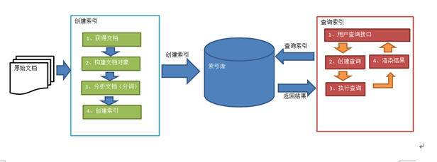
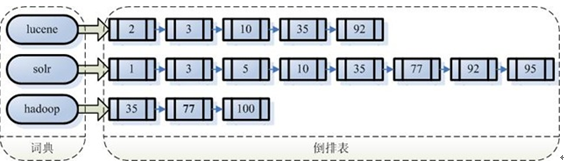
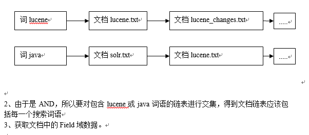
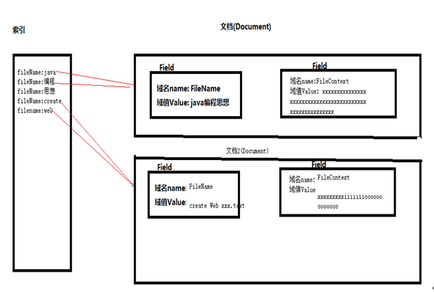

# Lucene

##  数据分类
1. 结构化数据：指具有固定格式或有限长度的数据，如数据库，元数据等。
2. 非结构化数据：指不定长或无固定格式的数据，如邮件，word文档等磁盘上的文件

##  非结构化数据查询方法
1. 顺序扫描法

所谓顺序扫描，比如要找内容包含某一个字符串的文件，就是一个文档一个文档的看，对于每一个文档，从头看到尾，如果此文档包含此字符串，则此文档为我们要找的文件，接着看下一个文件，直到扫描完所有的文件。如利用windows的搜索也可以搜索文件内容，只是相当的慢。

2. 全文检索法

将非结构化数据中的一部分信息提取出来，重新组织，使其变得有一定结构，然后对此有一定结构的数据进行搜索，从而达到搜索相对较快的目的。这部分从非结构化数据中提取出的然后重新组织的信息，我们称之索引。

**全文检索的应用场景**

对于数据量大，数据结构不固定的数据可采用全文检索的方式

1、绿色表示索引过程，对要搜索的原始内容进行索引构建一个索引库，索引过程包括：
确定原始内容即要搜索的内容--采集文档--创建文档--分析文档--索引文档

2、红色表示搜索过程，从索引库中搜索内容，搜索过程包括：
用户通过搜索界面--创建查询--执行搜索，从索引库搜索--渲染搜索结果

####  创建索引

对所有文档分析得出的语汇单元进行索引，索引的目的是为了搜索，最终要实现只搜索被索引的语汇单元从而找到Document（文档）。

注意：创建索引是对语汇单元索引，通过词语找文档，这种索引的结构叫倒排索引结构。
传统方法是根据文件找到该文件的内容，在文件内容中匹配搜索关键字，这种方法是顺序扫描方法，数据量大、搜索慢。

倒排索引结构是根据内容（词语）找文档，如下图：

#### 查询索引

查询索引也是搜索的过程。搜索就是用户输入关键字，从索引（index）中进行搜索的过程。根据关键字搜索索引，根据索引找到对应的文档，从而找到要搜索的内容（这里指磁盘上的文件）。

####  创建查询

用户输入查询关键字执行搜索之前需要先构建一个查询对象，查询对象中可以指定查询要搜索的Field文档域、查询关键字等，查询对象会生成具体的查询语法，比如：
语法 “fileName:spring.txt”表示要搜索Field域的内容为“spring.txt”的文档
语法 “lucene AND java” 表示要搜索即包括关键字“lucene”也包括“java”的文档。

####  执行查询

搜索索引过程：
1.根据查询语法在倒排索引词典表中分别找出对应搜索词的索引，从而找到索引所链接的文档链表。
比如搜索语法为“lucene AND java”表示搜索出的文档中即要包括lucene也要包括java。

####  Lucene查询结构

