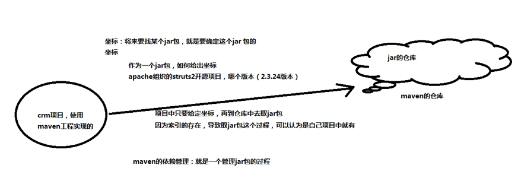
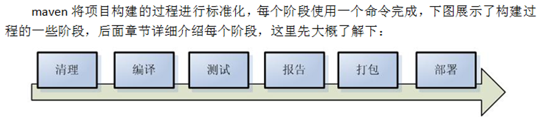

# Maven

## Maven的优点

1. 平时我们开发项目时，一般都是一个项目就是一个工程。我们划分模块时，都是使用package来进行划分。但是，当项目很大时，有很多子模块时，即使是package来进行划分，也是让人眼花缭乱。

      优点一：项目非常大时，可借助Maven将一个项目拆分成多个工程，最好是一个模块对应一个工程，利于分工协作。而且模块之间还是可以发送消息的。

2. 同一项目的jar包  复制 和 粘贴到WEB/INF/lib下

        问题：
        同样的jar包重复出现在不同的工程中，一方面浪费空间，同时也让工程臃肿

      优点二：借助Maven，可将jar包仅仅保存在“仓库”中，有需要该文件时，就引用该文件接口，不需要复制文件过来占用空间

3. 如果jar包都到各个官网网站下载，会浪费很多时间，而且可能不全

      优点三：借助Maven可以以规范的方式下载jar包，因为所有的知名框架或第三方工具的jar包已经按照统一的规范存放到了Maven的中央仓库中

4. 一个jar包依赖的其他jar包可能没导入到项目而导致项目跑不起来

      优点四：Maven会自动将你要加入到项目中的jar包导入，不仅导入，而且还会将该jar包所依赖的jar包都自动导入进来

## Maven的优点是如何实现的

1. 依赖管理

    就是对jar 包管理的过程：

2. 项目的一键构建

    （编译-----测试-----   运行   --打包--------------安装 ）

    什么是构建？
    指的是项目从编译-----测试-----   运行   --打包--------------安装整个过程都交给maven进行管理，这个过程称为构建

