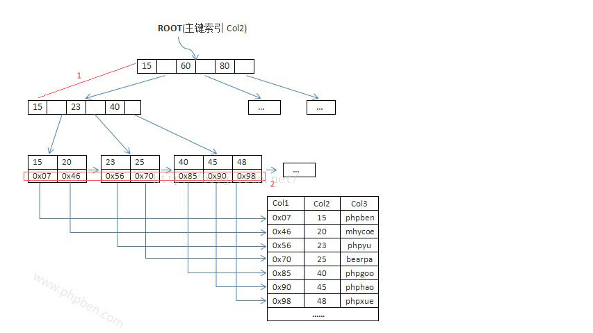
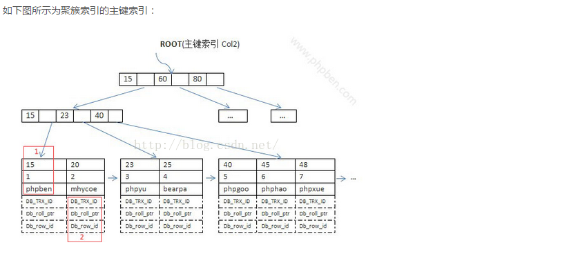
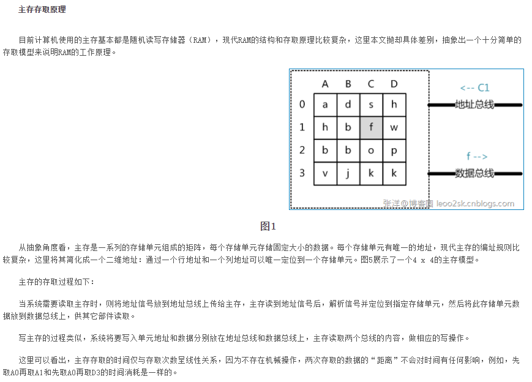
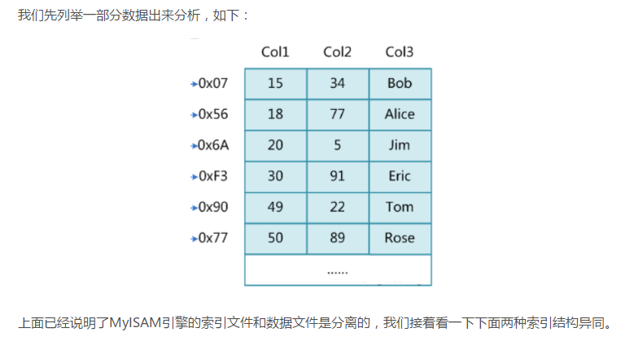
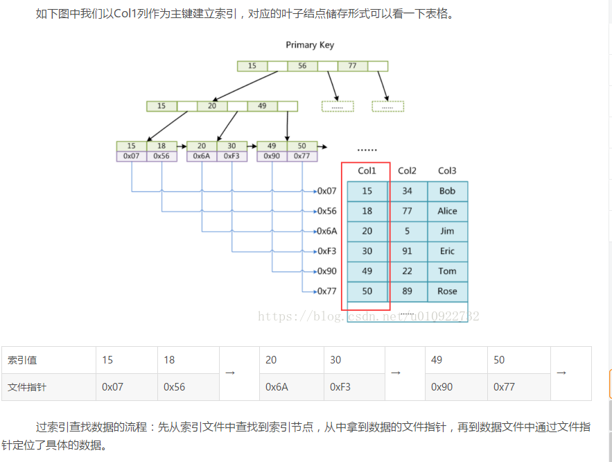
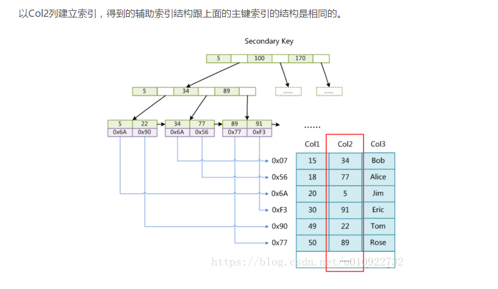
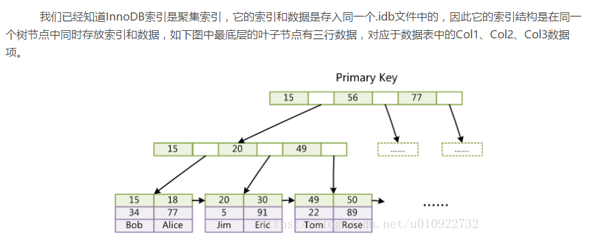
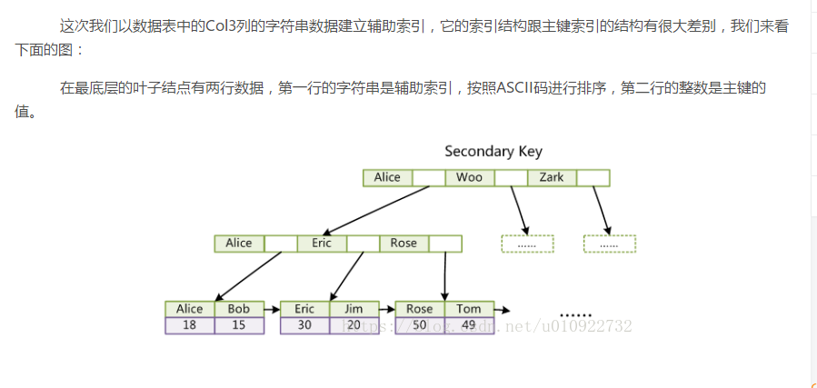

# Mysql索引类型及创建

索引分为聚簇索引和非聚簇索引两种，聚簇索引是按照数据存放的物理位置为顺序的，而非聚簇索引就不一样了；聚簇索引能提高多行检索的速度，而非聚簇索引对于单行的检索很快。

## Mysql索引的类型
### 1.普通索引

这是最基本的索引，它没有任何限制.

**直接创建索引**
1. ALTER TABLE

ALTER TABLE用来创建普通索引、UNIQUE索引或PRIMARY KEY索引。
```
ALTER TABLE table_name ADD INDEX index_name (column_list)
ALTER TABLE table_name ADD UNIQUE (column_list)
ALTER TABLE table_name ADD PRIMARY KEY (column_list)
```
其中table_name是要增加索引的表名，column_list指出对哪些列进行索引，多列时各列之间用逗号分隔。索引名index_name可选，缺省时，MySQL将根据第一个索引列赋一个名称。另外，ALTER TABLE允许在单个语句中更改多个表，因此可以在同时创建多个索引。
2. CREATE INDEX

CREATE INDEX可对表增加普通索引或UNIQUE索引。
```
CREATE INDEX index_name ON table_name (column_list)
CREATE UNIQUE INDEX index_name ON table_name (column_list)
```
table_name、index_name和column_list具有与ALTER TABLE语句中相同的含义，索引名不可选。另外，不能用CREATE INDEX语句创建PRIMARY KEY索引

索引类型：


在创建索引时，可以规定索引能否包含重复值。如果不包含，则索引应该创建为PRIMARY KEY或UNIQUE索引。对于单列惟一性索引，这保证单列不包含重复的值。对于多列惟一性索引，保证多个值的组合不重复。
PRIMARY KEY索引和UNIQUE索引非常类似。事实上，PRIMARY KEY索引仅是一个具有名称PRIMARY的UNIQUE索引。这表示一个表只能包含一个PRIMARY KEY，因为一个表中不可能具有两个同名的索引。
3. 创建表时直接创建索引

```
CREATE TABLE `table` (

`id` int(11) NOT NULL AUTO_INCREMENT ,

`title` char(255) CHARACTER SET utf8 COLLATE utf8_general_ci NOT NULL ,

`content` text CHARACTER SET utf8 COLLATE utf8_general_ci NULL ,

`time` int(10) NULL DEFAULT NULL ,

PRIMARY KEY (`id`),

INDEX index_name (title(length))

)

删除索引

DROP INDEX index_name ON table
```
**唯一索引**
与普通索引类似，不同的就是：索引列的值必须唯一，但允许有空值（注意和主键不同）。如果是组合索引，则列值的组合必须唯一，创建方法和普通索引类似。

```
–创建唯一索引

CREATE UNIQUE INDEX indexName ON table(column(length))

–修改表结构

ALTER TABLE table_name ADD UNIQUE indexName ON (column(length))

–创建表的时候直接指定

CREATE TABLE `table` (

`id` int(11) NOT NULL AUTO_INCREMENT ,

`title` char(255) CHARACTER SET utf8 COLLATE utf8_general_ci NOT NULL ,

`content` text CHARACTER SET utf8 COLLATE utf8_general_ci NULL ,

`time` int(10) NULL DEFAULT NULL ,

PRIMARY KEY (`id`),

UNIQUE indexName (title(length))

);
```
**删除索引**


可利用ALTER TABLE或DROP INDEX语句来删除索引。类似于CREATE INDEX语句，DROP INDEX可以在ALTER TABLE内部作为一条语句处理

```
DROP INDEX index_name ON talbe_name
ALTER TABLE table_name DROP INDEX index_name
ALTER TABLE table_name DROP PRIMARY KEY
```

其中，前两条语句是等价的，删除掉table_name中的索引index_name。
第3条语句只在删除PRIMARY KEY索引时使用，因为一个表只可能有一个PRIMARY KEY索引，因此不需要指定索引名。如果没有创建PRIMARY KEY索引，但表具有一个或多个UNIQUE索引，则MySQL将删除第一个UNIQUE索引。
如果从表中删除了某列，则索引会受到影响。对于多列组合的索引，如果删除其中的某列，则该列也会从索引中删除。如果删除组成索引的所有列，则整个索引将被删除。

**全文索引（FULLTEXT）**

FULLTEXT索引仅可用于MyISAM表；他们可以从CHAR，VARCHAR或TEXT列中作为CREATE TABLE语句的一部分被创建，或是随后使用ALTER TABLE或CREATE INDEX被添加。对于较大的数据集，将你的资料输入一个没有FULLTEXT索引的表中，然后创建索引，其速度比把资料输入现有FULLTEXT索引的速度更为快。不过切记对于大容量的数据表，生成一个全文索引时一个非常消耗时间非常消耗硬盘空间的做法
```
–创建表的适合添加全文索引

CREATE TABLE `table` (

`id` int(11) NOT NULL AUTO_INCREMENT ,

`title` char(255) CHARACTER SET utf8 COLLATE utf8_general_ci NOT NULL ,

`content` text CHARACTER SET utf8 COLLATE utf8_general_ci NULL ,

`time` int(10) NULL DEFAULT NULL ,

PRIMARY KEY (`id`),

FULLTEXT (content)

);

–修改表结构添加全文索引

ALTER TABLE article ADD FULLTEXT index_content(content)

–直接创建索引

CREATE FULLTEXT INDEX index_content ON article(content)
```
**单列索引**

多个单列索引与单个多列索引的查询效果不同，因为执行查询时，MySQL只能使用一个索引，会从多个索引中选择一个限制最为严格的索引。
**组合索引（最左前缀）**

平时用的sql查询语句一般都有比较多的限制条件，所以为了进一步榨取MySQL的效率，就要考虑建立组合索引，例如针对title和time建立一个组合索引：ALTER TABLE article ADD INDEX index_titme_time (title(50),time(10))。建立这样的组合索引，其实是相当于分别建立了下面两组组合索引：
```
–title,time
–title
```

为什么没有time这样的组合索引呢？这是因为MySQL组合索引“最左前缀”的结果。简单的理解就是只从最左面的开始组合。并不是只要包含这两列的查询都会用到该组合索引，如下：

```
–使用到上面的索引

SELECT * FROM article WHREE title='测试' AND time=1234567890;

SELECT * FROM article WHREE utitle='测试';

–不使用上面的索引

SELECT * FROM article WHREE time=1234567890;
```
mysql索引的优化：

上面都在说使用索引的好处，但过多的使用索引将会造成滥用。因此索引也会有它的缺点：虽然索引大大提高了查询速度，同时却会降低更新表的速度，如对表进行INSERT、UPDATE和DELETE。因为更新表时，MySQL不仅要保存数据，还要保存一下索引文件。建立索引会占用磁盘空间的索引文件。一般情况这个问题不太严重，但如果你在一个大表上创建了多种组合索引，索引文件的会膨胀很快。索引只是提高效率的一个因素，如果你的MySQL有大数据量的表，就需要花时间研究建立最优秀的索引，或优化查询语句。下面是一些总结以及收藏的MySQL索引的注意事项和优化方法。

##  什么是索引？为什么要建立索引？

索引用于快速找出某一列中有一特定值的行，不使用索引，MYSQL必须从第一条记录开始读完整个表，直到找到相关的行，表越大，查询数据所花费的时间就越多，如果表中查询的列有一个索引，MySQL能够快速到达一个位置去搜索数据文件，而不必查看所有数据，那么将会节省很大一部分时间

例如：有一张person表，其中有2W条记录，记录着2W个人的信息。有一个Phone的字段记录每个人的电话号码，现在想要查询出电话号码为xxxx的人的信息。

如果没有索引，那么将从表中第一条记录一条条往下遍历，直到找到该条信息为止。

如果有了索引，那么会将该Phone字段，通过一定的方法进行存储，好让查询该字段上的信息时，能够快速找到对应的数据，而不必在遍历2W条数据了。其中MySQL中的索引的存储类型有两种：BTREE、HASH。 也就是用树或者Hash值来存储该字段，要知道其中详细是如何查找的，就需要会算法的知识了。我们现在只需要知道索引的作用，功能是什么就行。

## MYSQL中索引的优点和缺点和使用原则

**优点：**

1. 所有的MySql列类型（字段类型）都可以被索引，也就是给任意字段设置索引
2. 大大加快数据的查询速度

**缺点：**

1.创建索引和维护索引要耗费时间，并且随着数据量的增加锁耗费的时间也会增加

2.索引页需要占空间，我们知道数据表中的数据也会有最大上线设置，如果我们有大量的索引，索引文件可能会比数据文件更快达到上限值

3.当对表中的数据进行增加，删除，修改时，索引也需要动态维护，降低了数据的维护速度

**使用原则：**

通过上面说的优点和缺点，我们应该可以知道，并不是每个字段设置索引就好，也不是索引越多越好，而是需要自己合理的使用

1.对经常更新的表就避免对其进行过多的索引，对经常用于查询的字段应该创建索引

2.数据量小的表最好不要使用索引，因为由于数据较少，可能查询全部数据花费的时间比遍历索引的时间还要短，索引就可能不会产生优化效果

3.在不同直少的列（字段上）不要建立索引，比如在学生的“性别”字段上只有男，女两个不同值。相反的，在一个字段上不同值较多可建立索引

**索引的分类**

**注意：**
索引是在存储引擎中实现的，也就是说不同的存储引擎，会使用不同的索引。

MyISAM和In弄DB存储引擎：只支持BTREE索引，也就是说默认使用BTREE，不能够更换

MEMORY和HEAP存储引擎：支持HASH和BTREE索引

1、索引我们分为四类来讲 单列索引(普通索引，唯一索引，主键索引)、组合索引、全文索引、空间索引、

1.1、单列索引：一个索引只包含单个列，但一个表中可以有多个单列索引。 这里不要搞混淆了。

1.1.1、普通索引：

　　　　　　　　　　　MySQL中基本索引类型，没有什么限制，允许在定义索引的列中插入重复值和空值，纯粹为了查询数据更快一点。

1.1.2、唯一索引：

　　　　　　　　　索引列中的值必须是唯一的，但是允许为空值，

1.1.3、主键索引：

　　　是一种特殊的唯一索引，不允许有空值。

1.2、组合索引

　　　　在表中的多个字段组合上创建的索引，只有在查询条件中使用了这些字段的左边字段时，索引才会被使用，使用组合索引时遵循最左前缀集合。这个如果还不明白，等后面举例讲解时在细说　

1.3、全文索引

　　　　全文索引，只有在MyISAM引擎上才能使用，只能在CHAR,VARCHAR,TEXT类型字段上使用全文索引，介绍了要求，说说什么是全文索引，就是在一堆文字中，通过其中的某个关键字等，就能找到该字段所属的记录行，比如有"你是个大煞笔，二货 ..." 通过大煞笔，可能就可以找到该条记录。这里说的是可能，因为全文索引的使用涉及了很多细节，我们只需要知道这个大概意思，如果感兴趣进一步深入使用它，那么看下面测试该索引时，会给出一个博文，供大家参考。

1.4、空间索引

　　　空间索引是对空间数据类型的字段建立的索引，MySQL中的空间数据类型有四种，GEOMETRY、POINT、LINESTRING、POLYGON。

　　　在创建空间索引时，使用SPATIAL关键字。

　　　要求，引擎为MyISAM，创建空间索引的列，必须将其声明为NOT NULL。具体细节看下面　

## MySQL索引详解与索引优化

### 一.BTree索引
 MySQL数据库中使用最频繁的索引类型，基本所有存储引擎都支持BTree索引

 **存储结构**

 这类索引的物理文件大多就是以BTree结构来存储的，但是会有不同的存储引擎在使用BTree索引时，对存储结构稍作修改，比如MyISAM存储引擎，使用B+Tree的数据结构，它相对与BTree结构，所有的数据都存放在叶子节点上，且把叶子节点通过指针连接到一起，形成一条数据链表，以加快相邻数据的检索效率。

 另外，对于In弄DB存储引擎，虽然同样使用B+Tree作为索引的存储结构，但具体实现却与MyISAM截然不同。

 （1）MyISAM引擎索引结构的叶子结点的数据域，存放的并不是实际的数据记录，而是数据记录的地址。索引文件与数据文件分离，这样的索引称为“非聚簇索引”。MyISAM的主索引与辅助索引区别并不大，只是主键索引不能有重复的关键字

 如下图所示为非聚簇索引的主键索引：


其检索算法：先按照B+Tree的检索算法检索，找到指定关键字，则取出对应数据域的值，作为地址取出数据记录

（2）In弄DB引擎索引结构的叶子节点数据域，存放的就是实际的数据记录（对于主索引，此处会存放表中所有的数据记录；对于辅助索引此处会引用主键，检索的时候通过主键到主键索引中找到对应的数据行）。或者说，InnoDB的数据文件本身就是主键索引文件，这样的索引被称为“聚簇索引”，一个表只能有一个聚簇索引。



###  Hash索引

**1、概述及存储结构**

主要就是通过Hash算法（常见的Hash算法有直接定址法、平方取中法、折叠法、除数取余法、随机数法），将数据库字段数据转换成定长的Hash值，与这条数据的行指针一并存入Hash表的对应位置；如果发生Hash碰撞（两个不同关键字的Hash值相同），则在对应Hash键下以链表形式存储。

检索算法：在检索查询时，就再次对待查关键字再次执行相同的Hash算法，得到Hash值，到对应Hash表对应位置取出数据即可，如果发生Hash碰撞，则需要在取值时进行筛选。目前使用Hash索引的数据库并不多，主要有Memory等。

**2、Hash索引的弊端**

一般来说，索引的检索效率非常高，可以一次定位，不像B-Tree索引需要进行从根节点到叶节点的多次IO操作。有利必有弊，Hash算法在索引的应用也有很多弊端。

a、Hash索引仅仅能满足等值的查询，范围查询不保证结果正确。因为数据在经过Hash算法后，其大小关系就可能发生变化。

b、Hash索引不能被排序。同样是因为数据经过Hash算法后，大小关系就可能发生变化，排序是没有意义的。

c、Hash索引不能避免表数据的扫描。因为发生Hash碰撞时，仅仅比较Hash值是不够的，需要比较实际的值以判定是否符合要求。

d、Hash索引在发生大量Hash值相同的情况时性能不一定比B-Tree索引高。因为碰撞情况会导致多次的表数据的扫描，造成整体性能的低下，可以通过采用合适的Hash算法一定程度解决这个问题。

e、Hash索引不能使用部分索引键查询。因为当使用组合索引情况时，是把多个数据库列数据合并后再计算Hash值，所以对单独列数据计算Hash值是没有意义的。

**Full-Text索引**

**1.概述**

全文索引，目前MySQL中只有MyISAM存储引擎支持，并且只有CHAR、VARCHAR、TEXT类型支持。它用于替代效率较低的LIKE模糊匹配操作，而且可以通过多字段组合的全文索引一次性全模糊匹配多个字段。

**2.存储结构**

同样使用B-Tree存放索引数据，但使用的是特定的算法，将字段数据分割后再进行索引（一般每4个字节一次分割），索引文件存储的是分割前的索引字符串集合，与分割后的索引信息，对应Btree结构的节点存储的是分割后的词信息以及它在分割前的索引字符串集合中的位置。



###  一.MyISAM存储引擎（MySQL默认的存储引擎）

**1、物理文件结构**

每一个表在MyISAM存储引擎中都以三个以表名命名的物理文件构成。

(1)任何存储引擎都不可或缺的存放表结构定义的.frm（Form）文件

(2)存放表数据的.MYD文件（My Data）

(3)存放索引数据的.MYI文件（My Index）

**2.支持的索引类型**

（1）BTree索引

（2）R-Tree索引

（3）Full-Text索引

**3.锁机制-支持表级锁定**

4、事务处理——为保证效率，不支持事务处理

5、增删改查性能——SELECT性能较高，适合执行查询较多的情况使用

6、COUNT(*)问题——MyISAM存储引擎记录表行数，所以在使用COUNT(*)时，只需取出存储的行数，而不用遍历表，效率较高

### InnoDB存储引擎

**1.物理文件结构**

(1)同MyISAM一样的是，InnoDB存储引擎也有.frm文件存储表结构定义

(2)与MyISAM不同的是，InnoDB的表数据与索引数据是存储在一起的，但在这个文件中每张表是独自占有一块表空间还是共享所有表空间，是由用户决定的。如果独享表空间，每个表的表数据与索引数据都会存放在一个.ibd(innoDB data)文件中；如果是共享表空间，通过innodb_data_file_path指定后，每次增加数据文件后必须停机重启才能生效，很不方便。

(3)InnoDB有支持事务及安全的日志文件，这个文件非常重要，InnoDB可以通过日志文件将数据库崩溃时已经完成但还没来得及将内存中已经修改但未完全写入磁盘的数据写入磁盘，也可以把已部分完成并写入磁盘的未完成事务回滚，保证数据一致性。如果错误删除日志文件会导致数据库崩溃且无法启动。

**2、支持的索引类型**

与MyISAM基本一致，但具体实现因为文件结构的不同有很大差异，具体差异参看上述博客。

**3、锁机制的改进**

实现了行级锁，为承受高并发增加了竞争力。

**4、事务处理**

实现了事务处理，可谓与MyISAM最重要的区别之一。

**5、增删改查性能**

如果执行大量的增删改操作，推荐使用InnoDB存储引擎，它在删除操作时是对行删除，不会重建表。

**6、COUNT()问题**

InnoDB存储引擎会遍历表以计算数量，效率较低。

**7、其他特点**

实现了外键、提供了多版本数据的提取。

### MyISAM主键索引和辅助索引的结构



**1.主键索引**



**2.辅助索引**



###  InnoDB主键索引与辅助索引饥饿否

**1.主键索引**



**2.辅助索引**



### InnoDB索引结构需要注意的点

1.数据文件本身就是索引文件

2.表数据文件本身就是按照B+Tree组织的一个索引结构文件

3.聚集索引叶节点包含了完整的数据记录

4.InnoDB表必须有主见，并且推荐使用整型自增主键

正如我们上面介绍InnoDB存储结构，索引与数据是共同存储的，不管是主键索引还是辅助索引，在查找时都是通过先查找到索引节点才能拿到相对应的数据，如果我们在设计表结构时没有显式指定索引列的话，MySQL会从表中选择数据不重复的列建立索引，如果没有符合的列，则MySQL自动为InnoDB表生成一个隐含字段作为主键，并且这个字段长度为6个字节，类型为整型。

**那为什么推荐使用整型自增主键而不是选择UUID？**

1.UUID是字符串，比整型消耗更多的存储空间；

2.在B+树中进行查找时需要跟经过的节点值比较大小，整型数据的比较运算比字符串更快速；

3.自增的整型索引在磁盘中会连续存储，在读取一页数据时也是连续；UUID是随机产生的，读取的上下两行数据存储是分散的，不适合执行where id > 5 && id < 20的条件查询语句
。
4.在插入或删除数据时，整型自增主键会在叶子结点的末尾建立新的叶子节点，不会破坏左侧子树的结构；UUID主键很容易出现这样的情况，B+树为了维持自身的特性，有可能会进行结构的重构，消耗更多的时间。

**为什么非主键索引结构叶子节点存储的是主键值？**

保证数据一致性和节省存储空间，可以这么理解：商城系统订单表会存储一个用户ID作为关联外键，而不推荐存储完整的用户信息，因为当我们用户表中的信息（真是名称、手机号、收货地址···）修改后，不需要再次维护订单表的用户数据，同时也节省了存储空间。
