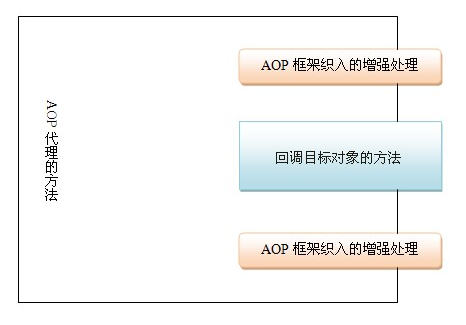
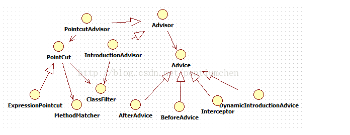

## 一.什么是AOP
AOP(面向切面编程)，可以说是OOP的补充和完善。OOP引入封装，继承和多态等概念来监利一中对象层次结构，用以公共行为的一个集合。当我们需要为分散的对象引入公共行为的时候，OOP则显的无能为力。OOP允许你从上到下的关系，但是并不适合定义从左到右。例如日志功能。日志代码往往水平地散布在所有对象层次中，而与它所散布到的对象的核心功能毫无关系。对于其他类型的代码，如安全性、异常处理和透明的持续性也是如此。这种散布在各处的无关的代码被称为横切（cross-cutting）代码，在OOP设计中，它导致了大量代码的重复，模块间的藕合度高，而不利于各个模块的重用。

而AOP技术则恰恰相反，它利用一种称为“横切”的技术，剖解开封装的对象内部，并将那些影响了多个类的公共行为封装到一个可重用模块，并将其名为“Aspect”，即切面。所谓“切面”，简单地说，就是将那些与业务无关，却为业务模块所共同调用的逻辑或责任封装起来，便于减少系统的重复代码，降低模块间的耦合度，并有利于未来的可操作性和可维护性。

使用“横切”技术，AOP把软件系统分为两个部分：核心业务逻辑组件和横切关注点。横切关注点模块化为特殊的类，这些类被称为“切面”，好处：1.横切关注点都集中于一块，不会出现大量重复代码；2.核心模块只关注核心功能的代码，模块间藕合度降低。

## 二.AOP实现原理


AOP 实际上是由目标类的代理类实现的。AOP 代理其实是由 AOP 框架动态生成的一个对象，该对象可作为目标对象使用。AOP 代理包含了目标对象的全部方法，但 AOP 代理中的方法与目标对象的方法存在差异，AOP 方法在特定切入点添加了增强处理，并回调了目标对象的方法。

### 三.AOP 相关概念
连接点（Joinpoint）：在程序执行过程中某个特定的点，比如某方法调用的时候或者处理异常的时候。在Spring AOP中，一个连接点总是表示一个方法的执行。通俗的说就是加入切点的那个点

通知（Advice）：在切面的某个特定的连接点上执行的动作。其中包括了“around”、“before”和“after”等不同类型的通知（通知的类型将在后面部分进行讨论）。许多AOP框架（包括Spring）都是以拦截器做通知模型，并维护一个以连接点为中心的拦截器链。

切入点（Pointcut）：匹配连接点的断言。通知和一个切入点表达式关联，并在满足这个切入点的连接点上运行（例如，当执行某个特定名称的方法时）。切入点表达式如何和连接点匹配是AOP的核心：Spring缺省使用AspectJ切入点语法。

引入（Introduction）：用来给一个类型声明额外的方法或属性（也被称为连接类型声明（inter-type declaration））。Spring允许引入新的接口（以及一个对应的实现）到任何被代理的对象。例如，你可以使用引入来使一个bean实现IsModified接口，以便简化缓存机制。

织入（Weaving）：将切面应用到目标对象来创建新的代理对象的过程。这些可以在编译时（例如使用AspectJ编译器），类加载时和运行时完成。Spring和其他纯Java AOP框架一样，在运行时完成织入。

增强（Advice）：是织入到目标类连接点上的一段程序代码。Spring使用增强类定义横切逻辑，同时由于Spring只支持方法连接点，增强还包括了在方法上的哪一点加入横切代码的方位信息，所以增强既包括横切逻辑、还包含部分连接点的信息。

引介（Introduction）：是一种特殊的增强，为类添加一些属性和方法。

切面（Advisor）：代表一般切面，包含了横切代码和连接点信息，本身是一个简单的切面，横切的连接点是目标类的所有方法。3种类型：一般切面（advisor）、切点切面（PointcutAdvisor）、引介切面（IntroductionAdvisor）。


**Spring 采用jdk动态代理模式来实现Aop机制。
Spring AOP采用动态代理过程：
1.将切面使用动态代理的方式动态织入到目标对象，形成一个代理对象。
2.目标对象如果没有实现代理接口，那么spring会采用CGLib来生成代理对象，该代理对象是目标对象的子类。
3.目标对象如果是final类，也没有实现接口，就不能运用AOP**

**AOP的实现包含下面几个方面：**
1. 根据配置或注解解析切面
2. 生成AOP代理对象，给目标对象生成一个代理类以及代理类实例，根据解析出的切面，生成通知链设置到代理对象，在代理的回调中会执行通知链。
3. 把AOP代理对象注册到容器中代替目标对象，当使用者向容器请求目标bean时，容器会返回代理对象。

**切面解析**


1. PointCut：描述切点，在进行切点匹配时，使用ClassFilter进行类匹配，MethodMatcher进行执行方法匹配。
2. Advice：通知，AfterAdvice后通知，BeforeAdvice前通知，DynamicIntroductionAdvice引用通知，环绕通知通过Interceptor实现。
3. Advisor：通知器，也就是切面，PointcutAdvisor切点通知器，IntroductionAdvisor引用通知器。

**aop标签解析**

aop名称空间的解析器是AopNamespaceHandler：
再AopNamespaceHandler中可以看到aop下各个标签对应的解析器：
```
public class AopNamespaceHandler extends NamespaceHandlerSupport {

	/**
	 * Register the {@link BeanDefinitionParser BeanDefinitionParsers} for the
	 * '{@code config}', '{@code spring-configured}', '{@code aspectj-autoproxy}'
	 * and '{@code scoped-proxy}' tags.
	 */
	public void init() {
		// In 2.0 XSD as well as in 2.1 XSD.
		registerBeanDefinitionParser("config", new ConfigBeanDefinitionParser());
		registerBeanDefinitionParser("aspectj-autoproxy", new AspectJAutoProxyBeanDefinitionParser());
		registerBeanDefinitionDecorator("scoped-proxy", new ScopedProxyBeanDefinitionDecorator());

		// Only in 2.0 XSD: moved to context namespace as of 2.1
		registerBeanDefinitionParser("spring-configured", new SpringConfiguredBeanDefinitionParser());
	}

}
```
在init方法中注册了各个标签的解析器，可以看到aop:config标签的解析器是ConfigBeanDefinitionParser。
在ConfigBeanDefinitionParser的parse方法中对aop:config下面的三个直接子标签pointcut、advisor、aspect分别进行解析。
```
List<Element> childElts = DomUtils.getChildElements(element);
for (Element elt: childElts) {
	String localName = parserContext.getDelegate().getLocalName(elt);
	if (POINTCUT.equals(localName)) {
		parsePointcut(elt, parserContext);
	}
	else if (ADVISOR.equals(localName)) {
		parseAdvisor(elt, parserContext);
	}
	else if (ASPECT.equals(localName)) {
		parseAspect(elt, parserContext);
	}
}
```
**pointcut标签解析**
解析器会为pointcut标签创建一个切点bean定义，并且把bean定义注册到容器中，代码在ConfigBeanDefinitionParser类的parsePointcut和createPointcutDefinition方法。
```
private AbstractBeanDefinition parsePointcut(Element pointcutElement, ParserContext parserContext) {
	String id = pointcutElement.getAttribute(ID);
	String expression = pointcutElement.getAttribute(EXPRESSION);

	AbstractBeanDefinition pointcutDefinition = null;

	try {
		this.parseState.push(new PointcutEntry(id));
		pointcutDefinition = createPointcutDefinition(expression);
		pointcutDefinition.setSource(parserContext.extractSource(pointcutElement));

		String pointcutBeanName = id;
		if (StringUtils.hasText(pointcutBeanName)) {
			parserContext.getRegistry().registerBeanDefinition(pointcutBeanName, pointcutDefinition);
		}
		else {
			pointcutBeanName = parserContext.getReaderContext().registerWithGeneratedName(pointcutDefinition);
		}

		parserContext.registerComponent(
				new PointcutComponentDefinition(pointcutBeanName, pointcutDefinition, expression));
	}
	finally {
		this.parseState.pop();
	}

	return pointcutDefinition;
}
protected AbstractBeanDefinition createPointcutDefinition(String expression) {
	RootBeanDefinition beanDefinition = new RootBeanDefinition(AspectJExpressionPointcut.class);
	beanDefinition.setScope(BeanDefinition.SCOPE_PROTOTYPE);
	beanDefinition.setSynthetic(true);
	beanDefinition.getPropertyValues().add(EXPRESSION, expression);
	return beanDefinition;
}
```
该切点bean定义的类型是AspectJExpressionPointcut，这个类同时实现了ClassFilter和MethodMatcher接口执行类匹配和方法匹配逻辑。它有一个expression属性设置表达式，AspectJ最终会把该表达式解析成一个PointcutExpression对象执行相关的语义

**aspect标签解析**
aspect标签的解析要相对复杂一些，扫描它下面的所有通知子标签（aop:before、aop:after等标签）。

1、把这些标签都解析成通知类，通知标签的方法属性（method属性）会被解析成一个MethodLocatingFactoryBean类型的bean，把aspect引用的bean名称（aop:aspect标签的ref属性）和method方法通过属性注入到MethodLocatingFactoryBean类型bean中。

2、生成一个SimpleBeanFactoryAwareAspectInstanceFactory类型的bean，这个bean的作用是用来加载aspect引用的bean，把aspect引用的bean名称通过属性注入到该这个bean中。

3、生成一个通知（Advice）bean。

3.1、把aspect bean id和order（指定通知在通知链中的顺序）通过属性注入到该bean。

3.2、把各个通知标签特有属性注入（比如returning，throwing等属性）。

3.3、把上面生成方法MethodLocatingFactoryBean类型bean通过构造器注入。

3.4、构造子注入引用的切点bean，pointcut或pointcut-ref指定，如果是pointcut-ref属性，直接引用这个bean，如果是pointcut属性，生成一个匿名的切点bean。

3.5、构造子注入上面的SimpleBeanFactoryAwareAspectInstanceFactory类型bean。

通知bean的类型根据标签的不同而不同，aop;before对应AspectJMethodBeforeAdvice，aop:after对应AspectJAfterAdvice，aop:aroude对应AspectJAroundAdvice，在通知方法中通过反射调用method属性中设置的方法。通过ConfigBeanDefinitionParser类的getAdviceClass方法可以看出标签和类的对应关系。

**如何使用Spring AOP**
可以通过文件或则编程的方式来使用Spring AOP

配置可以通过xml文件来进行，大概有四种方式：

1.        配置ProxyFactoryBean，显式地设置advisors, advice, target等

2.        配置AutoProxyCreator，这种方式下，还是如以前一样使用定义的bean，但是从容器中获得的其实已经是代理对象

3.        通过<aop:config>来配置

4.        通过<aop: aspectj-autoproxy>来配置，使用AspectJ的注解来标识通知及切入点

**在Spring中使用AOP编程步骤：**

1、在Spring配置文件（applicationContext.xml）中配置Spring对AspectJ的支持；以下两种方式任意一种即可

（1）<aop:aspectj-autoproxy/>

（2）< bean class="org.springframework.aop.aspectj.annotation.AnnotationAwareAspectJAutoProxyCreator" />

2、引入Jar文件（在Spring的根目录下的lib/aspectj下）
     aspectjrt.jar  和  aspectjweaver.jar

3、定义连接点(若不使用接口编程，即SimplePersonManager不实现任何接口，此时要实现AOP代理，需要引入CGLIB 包cglib-nodep-2.1_3.jar，但是一旦实现了接口Spring就会使用JDK的动态代理实现)
```
public interface PersonManager {  

    public void addPerson(Person person);  
}  
```
```
public class SimplePersonManager implements PersonManager{  

    public void addPerson(Person person) {  
        Person.persons.add(person);  
                System.out.println("添加了一个用户");  
    }  
}  
```
4、定义一个切面类，该切面类中定义了一个切入点，连接点为SimplePersonManager类中的addPerson方法

```
import org.aspectj.lang.annotation.Aspect;  
import org.aspectj.lang.annotation.Before;  

@Aspect  
public class SimpleAspect {  

    @Before ("execution (* rote.spring.aop.service.impl.SimplePersonManager.addPerson(..))")  
    public void addPersonAop(){  
        System.out.println("-------------------addPerson-----------------------");  
    };  

}  
```
5、在Spring配置文件中声明切面类
    <!-- 切面声明 -->
    <bean id="simpleAspectj" class="rote.spring.aop.aspectj.SimpleAspect">
    </bean>

6、在Spring配置文件中配置连接点类
     <bean id="personManager" class="rote.spring.aop.service.impl.SimplePersonManager">
    </bean>

**Spring AOP的XML实现方式，先实现一个接口：**
```
public interface HelloWorld
{
    void printHelloWorld();
    void doPrint();
}
```
定义两个接口实现类：
```
public class HelloWorldImpl1 implements HelloWorld
{
    public void printHelloWorld()
    {
        System.out.println("Enter HelloWorldImpl1.printHelloWorld()");
    }

    public void doPrint()
    {
        System.out.println("Enter HelloWorldImpl1.doPrint()");
        return ;
    }
}

public class HelloWorldImpl2 implements HelloWorld
{
    public void printHelloWorld()
    {
        System.out.println("Enter HelloWorldImpl2.printHelloWorld()");
    }

    public void doPrint()
    {
        System.out.println("Enter HelloWorldImpl2.doPrint()");
        return ;
    }
}
```
横切关注点：
```
public class TimeHandler
{
    public void printTime()
    {
        System.out.println("CurrentTime = " + System.currentTimeMillis());
    }
}
```
AOP.xml配置：
```
<?xml version="1.0" encoding="UTF-8"?>
<beans xmlns="http://www.springframework.org/schema/beans"
    xmlns:xsi="http://www.w3.org/2001/XMLSchema-instance"
    xmlns:aop="http://www.springframework.org/schema/aop"
    xmlns:tx="http://www.springframework.org/schema/tx"
    xsi:schemaLocation="http://www.springframework.org/schema/beans
        http://www.springframework.org/schema/beans/spring-beans-4.2.xsd
        http://www.springframework.org/schema/aop
        http://www.springframework.org/schema/aop/spring-aop-4.2.xsd">

        <bean id="helloWorldImpl1" class="com.xrq.aop.HelloWorldImpl1" />
        <bean id="helloWorldImpl2" class="com.xrq.aop.HelloWorldImpl2" />
        <bean id="timeHandler" class="com.xrq.aop.TimeHandler" />

        <aop:config>
            <aop:aspect id="time" ref="timeHandler">
                <aop:pointcut id="addAllMethod" expression="execution(* com.xrq.aop.HelloWorld.*(..))" />
                <aop:before method="printTime" pointcut-ref="addAllMethod" />
                <aop:after method="printTime" pointcut-ref="addAllMethod" />
            </aop:aspect>
        </aop:config>
</beans>
```
aspect里面有一个order属性，order属性的数字就是横切关注点的顺序，spring默认以aspect的定义顺序作为织如顺序

**Spring AOP代理对象的生成**

Spring提供了两种方式来生成代理对象: JDKProxy和Cglib，具体使用哪种方式生成由AopProxyFactory根据AdvisedSupport对象的配置来决定。默认的策略是如果目标类是接口，则使用JDK动态代理技术，否则使用Cglib来生成代理。下面我们来研究一下Spring如何使用JDK来生成代理对象，具体的生成代码放在JdkDynamicAopProxy这个类中，直接上相关代码：
```
/**
    * <ol>
    * <li>获取代理类要实现的接口,除了Advised对象中配置的,还会加上SpringProxy, Advised(opaque=false)
    * <li>检查上面得到的接口中有没有定义 equals或者hashcode的接口
    * <li>调用Proxy.newProxyInstance创建代理对象
    * </ol>
    */
   public Object getProxy(ClassLoader classLoader) {
       if (logger.isDebugEnabled()) {
           logger.debug("Creating JDK dynamic proxy: target source is " +this.advised.getTargetSource());
       }
       Class[] proxiedInterfaces =AopProxyUtils.completeProxiedInterfaces(this.advised);
       findDefinedEqualsAndHashCodeMethods(proxiedInterfaces);
       return Proxy.newProxyInstance(classLoader, proxiedInterfaces, this);
}

```
**下面的问题是，代理对象生成了，那切面是如何织入的？**

我们知道InvocationHandler是JDK动态代理的核心，生成的代理对象的方法调用都会委托到InvocationHandler.invoke()方法。而通过JdkDynamicAopProxy的签名我们可以看到这个类其实也实现了InvocationHandler，下面我们就通过分析这个类中实现的invoke()方法来具体看下Spring AOP是如何织入切面的。

```
publicObject invoke(Object proxy, Method method, Object[] args) throwsThrowable {
       MethodInvocation invocation = null;
       Object oldProxy = null;
       boolean setProxyContext = false;

       TargetSource targetSource = this.advised.targetSource;
       Class targetClass = null;
       Object target = null;

       try {
           //eqauls()方法，具目标对象未实现此方法
           if (!this.equalsDefined && AopUtils.isEqualsMethod(method)){
                return (equals(args[0])? Boolean.TRUE : Boolean.FALSE);
           }

           //hashCode()方法，具目标对象未实现此方法
           if (!this.hashCodeDefined && AopUtils.isHashCodeMethod(method)){
                return newInteger(hashCode());
           }

           //Advised接口或者其父接口中定义的方法,直接反射调用,不应用通知
           if (!this.advised.opaque &&method.getDeclaringClass().isInterface()
                    &&method.getDeclaringClass().isAssignableFrom(Advised.class)) {
                // Service invocations onProxyConfig with the proxy config...
                return AopUtils.invokeJoinpointUsingReflection(this.advised,method, args);
           }

           Object retVal = null;

           if (this.advised.exposeProxy) {
                // Make invocation available ifnecessary.
                oldProxy = AopContext.setCurrentProxy(proxy);
                setProxyContext = true;
           }

           //获得目标对象的类
           target = targetSource.getTarget();
           if (target != null) {
                targetClass = target.getClass();
           }

           //获取可以应用到此方法上的Interceptor列表
           List chain = this.advised.getInterceptorsAndDynamicInterceptionAdvice(method,targetClass);

           //如果没有可以应用到此方法的通知(Interceptor)，此直接反射调用 method.invoke(target, args)
           if (chain.isEmpty()) {
                retVal = AopUtils.invokeJoinpointUsingReflection(target,method, args);
           } else {
                //创建MethodInvocation
                invocation = newReflectiveMethodInvocation(proxy, target, method, args, targetClass, chain);
                retVal = invocation.proceed();
           }

           // Massage return value if necessary.
           if (retVal != null && retVal == target &&method.getReturnType().isInstance(proxy)
                    &&!RawTargetAccess.class.isAssignableFrom(method.getDeclaringClass())) {
                // Special case: it returned"this" and the return type of the method
                // is type-compatible. Notethat we can't help if the target sets
                // a reference to itself inanother returned object.
                retVal = proxy;
           }
           return retVal;
       } finally {
           if (target != null && !targetSource.isStatic()) {
                // Must have come fromTargetSource.
               targetSource.releaseTarget(target);
           }
           if (setProxyContext) {
                // Restore old proxy.
                AopContext.setCurrentProxy(oldProxy);
           }
       }
    }
```
**主流程可以简述为：获取可以应用到此方法上的通知链（Interceptor Chain）,如果有,则应用通知,并执行joinpoint; 如果没有,则直接反射执行joinpoint。而这里的关键是通知链是如何获取的以及它又是如何执行的，下面逐一分析下：**

首先，从上面的代码可以看到，通知链是通过Advised.getInterceptorsAndDynamicInterceptionAdvice()这个方法来获取的,我们来看下这个方法的实现:
```
public List<Object>getInterceptorsAndDynamicInterceptionAdvice(Method method, Class targetClass) {
                   MethodCacheKeycacheKey = new MethodCacheKey(method);
                   List<Object>cached = this.methodCache.get(cacheKey);
                   if(cached == null) {
                            cached= this.advisorChainFactory.getInterceptorsAndDynamicInterceptionAdvice(
                                               this,method, targetClass);
                            this.methodCache.put(cacheKey,cached);
                   }
                   returncached;
         }

```
可以看到实际的获取工作其实是由AdvisorChainFactory. getInterceptorsAndDynamicInterceptionAdvice()这个方法来完成的，获取到的结果会被缓存。

下面来分析下这个方法的实现：
```
/**
    * 从提供的配置实例config中获取advisor列表,遍历处理这些advisor.如果是IntroductionAdvisor,
    * 则判断此Advisor能否应用到目标类targetClass上.如果是PointcutAdvisor,则判断
    * 此Advisor能否应用到目标方法method上.将满足条件的Advisor通过AdvisorAdaptor转化成Interceptor列表返回.
    */
    publicList getInterceptorsAndDynamicInterceptionAdvice(Advised config, Methodmethod, Class targetClass) {
       // This is somewhat tricky... we have to process introductions first,
       // but we need to preserve order in the ultimate list.
       List interceptorList = new ArrayList(config.getAdvisors().length);

       //查看是否包含IntroductionAdvisor
       boolean hasIntroductions = hasMatchingIntroductions(config,targetClass);

       //这里实际上注册一系列AdvisorAdapter,用于将Advisor转化成MethodInterceptor
       AdvisorAdapterRegistry registry = GlobalAdvisorAdapterRegistry.getInstance();

       Advisor[] advisors = config.getAdvisors();
        for (int i = 0; i <advisors.length; i++) {
           Advisor advisor = advisors[i];
           if (advisor instanceof PointcutAdvisor) {
                // Add it conditionally.
                PointcutAdvisor pointcutAdvisor= (PointcutAdvisor) advisor;
                if(config.isPreFiltered() ||pointcutAdvisor.getPointcut().getClassFilter().matches(targetClass)) {
                    //TODO: 这个地方这两个方法的位置可以互换下
                    //将Advisor转化成Interceptor
                    MethodInterceptor[]interceptors = registry.getInterceptors(advisor);

                    //检查当前advisor的pointcut是否可以匹配当前方法
                    MethodMatcher mm =pointcutAdvisor.getPointcut().getMethodMatcher();

                    if (MethodMatchers.matches(mm,method, targetClass, hasIntroductions)) {
                        if(mm.isRuntime()) {
                            // Creating a newobject instance in the getInterceptors() method
                            // isn't a problemas we normally cache created chains.
                            for (intj = 0; j < interceptors.length; j++) {
                               interceptorList.add(new InterceptorAndDynamicMethodMatcher(interceptors[j],mm));
                            }
                        } else {
                            interceptorList.addAll(Arrays.asList(interceptors));
                        }
                    }
                }
           } else if (advisor instanceof IntroductionAdvisor){
                IntroductionAdvisor ia =(IntroductionAdvisor) advisor;
                if(config.isPreFiltered() || ia.getClassFilter().matches(targetClass)) {
                    Interceptor[] interceptors= registry.getInterceptors(advisor);
                    interceptorList.addAll(Arrays.asList(interceptors));
                }
           } else {
                Interceptor[] interceptors =registry.getInterceptors(advisor);
                interceptorList.addAll(Arrays.asList(interceptors));
           }
       }
       return interceptorList;
}

```
这个方法执行完成后，Advised中配置能够应用到连接点或者目标类的Advisor全部被转化成了MethodInterceptor.

接下来我们再看下得到的拦截器链是怎么起作用的。
```
if (chain.isEmpty()) {
                retVal = AopUtils.invokeJoinpointUsingReflection(target,method, args);
            } else {
                //创建MethodInvocation
                invocation = newReflectiveMethodInvocation(proxy, target, method, args, targetClass, chain);
                retVal = invocation.proceed();
            }
```
从这段代码可以看出，如果得到的拦截器链为空，则直接反射调用目标方法，否则创建MethodInvocation，调用其proceed方法，触发拦截器链的执行，来看下具体代码
```

public Object proceed() throws Throwable {
       //  We start with an index of -1and increment early.
       if (this.currentInterceptorIndex == this.interceptorsAndDynamicMethodMatchers.size()- 1) {
           //如果Interceptor执行完了，则执行joinPoint
           return invokeJoinpoint();
       }

       Object interceptorOrInterceptionAdvice =
           this.interceptorsAndDynamicMethodMatchers.get(++this.currentInterceptorIndex);

       //如果要动态匹配joinPoint
       if (interceptorOrInterceptionAdvice instanceof InterceptorAndDynamicMethodMatcher){
           // Evaluate dynamic method matcher here: static part will already have
           // been evaluated and found to match.
           InterceptorAndDynamicMethodMatcher dm =
                (InterceptorAndDynamicMethodMatcher)interceptorOrInterceptionAdvice;
           //动态匹配：运行时参数是否满足匹配条件
           if (dm.methodMatcher.matches(this.method, this.targetClass,this.arguments)) {
                //执行当前Intercetpor
                returndm.interceptor.invoke(this);
           }
           else {
                //动态匹配失败时,略过当前Intercetpor,调用下一个Interceptor
                return proceed();
           }
       }
       else {
           // It's an interceptor, so we just invoke it: The pointcutwill have
           // been evaluated statically before this object was constructed.
           //执行当前Intercetpor
           return ((MethodInterceptor) interceptorOrInterceptionAdvice).invoke(this);
       }
}
```

[Spring AOP与IOC](http://www.tianxiaobo.com/2018/01/18/%E8%87%AA%E5%B7%B1%E5%8A%A8%E6%89%8B%E5%AE%9E%E7%8E%B0%E7%9A%84-Spring-IOC-%E5%92%8C-AOP-%E4%B8%8A%E7%AF%87/)
