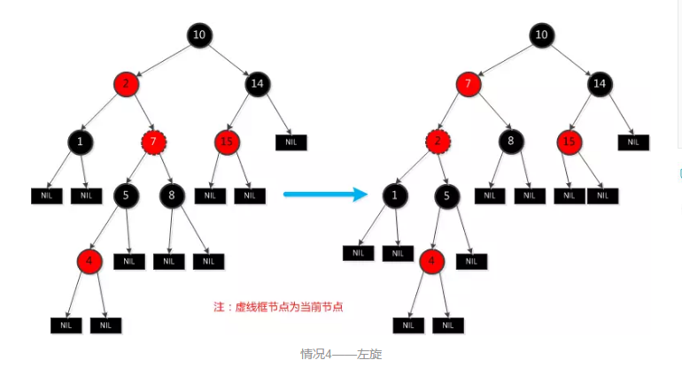

# HashMap底层源码解析（JDK1.8）
## 什么是哈希表
在讨论哈希表之前，我们先大概了解下其他数据结构的性能
##### 数组
    采用一段连续的存储单元来存储数据。对于指定的下标查找，时间复杂度为O(1);通过给定值进行查找，需要遍历数组，
    逐一比对给定关键字和数组元素，时间复杂度为O(n)，当然对于有序数组，则可采用二分查找，可将查找复杂度提高为O(log n)；对于一般的插入删除操作，涉及到数组元素的移动，器平均复杂度为O(n);
##### 线性链表：
    对于链表的新增，删除等操作（在找到指定操作位置后），仅需处理节点间的引用即可，时间复杂度为O(1)，而查找
    操作需要遍历链表逐一进行比对，复杂度为O(n);

##### 二叉树
    对一颗相对平衡的有序二叉树，对其进行插入，查找，删除等操作，平均复杂度均为O(log n);
#####  哈希表
    相比上述几种数据结构，在哈希表中进行添加，删除，查找等操作，性能很高，不考虑哈希冲突的情况下，仅需一次
    定位即可完成，时间复杂度为O(1)。

数据结构的物理存储结构只有两种：顺序存储结构  和  链式存储结构，在上面讲的，在数组中根据下标查找某个元素，  
一次定位就可以达到，哈希表利用了这种特性，哈希表的主干就是数组

我们要新增或查找某个元素，我们通过把当前元素的关键字 通过某个函数映射到数组中的某个位置，通过数组下标一次定位就可完成操作。

#### 哈希冲突

    如果两个不同的元素，通过哈希函数得出的实际存储地址相同怎么办？也就是说，当我们对某个元素进行哈希运算，得
    到一个存储地址，然后要进行插入的时候，发现已经被其他元素占用了，其实这就是所谓的哈希冲突，也叫哈希碰撞。
    前面我们提到过，哈希函数的设计至关重要，好的哈希函数会尽可能地保证 计算简单和散列地址分布均匀,但是，我们
    需要清楚的是，数组是一块连续的固定长度的内存空间，再好的哈希函数也不能保证得到的存储地址绝对不发生冲突。
    那么哈希冲突如何解决呢？哈希冲突的解决方案有多种:开放定址法（发生冲突，继续寻找下一块未被占用的存储地址）
    ，再散列函数法，链地址法，而HashMap即是采用了链地址法，也就是数组+链表的方式

# HashMap底层原理
      在JDK1.6，JDK1.7中，HashMap采用位桶+链表实现，即使用链表处理冲突，同一hash值的值都存储在一个链表里。
      但是当位于一个桶中的元素较多，即hash值相等的元素较多时，通过key值依次查找的效率较低。而JDK1.8中，
      hashMap采用位桶+链表+红黑树实现，当链表长度超过阈值（8）时，将链表转换为红黑树，这样就大大减少
      了查找时间。
首先有一个每个元素都是链表的数组，当添加一个元素（key-value）时，就首先计算元素Key的hash值，以此确定插入数
组中的位置，但是可能存在同一hash值的元素已经被放在数组的同一位置，这时就添加到同一hash值的元素的后面，他们在数组的同一位置，但是形成了链表，同一个链表上的Hash值是相同的，所以说shuz存放的是链表。而当链表长度太长时，链表就转换为红黑树，这样就大大提高了查找效率。


###### 当链表数组的容量超过初始容量的0.75时，再散列将链表数组扩大2倍，把原链表数组搬移到新数组中。
**HashMap原理图**


# JDK1.8中涉及的相关的数据结构
1. 基本的哈希节点                                            
其是hashMap中的静态类
```
    static  class Node<K,V> implements Map.Entry<K,V>{
          final int hash;                           //对key的hashCode值进行hash运算后的到的值，存储在Node中，避免重复计算
          final K key;
          V value;
          Node<K,V> next;                           //存储指向下一个Node的引用

          Node(int hash,K key, V value,Node<K,V> next){
            this.hash=hash;
            this.key=key;
            this.value=value;
            this.next=next;
          }

          public final K getKey(){ return key;}
          public final V getValue(){return value;}
          public final String toString(){return key+"="+value;}

          public final int hashCode(){            //计算每个节点的哈希值
            return Objects.hashCode(key)^objects.hashCode(value);
          }

          public final V setValue(V newValue){   //更新当前节点的值，并返回更新以前的值
            V oldValue = value;
            value = newValue;
            return oldValue;
          }

          public final boolean equals(Object o){ //判断两个节点是否相等
            if(o == this)
              return true;
            if(o instanceof Map.Entry){
              Map.Entry<?,?> e = (Map.Entry<?,?>) o;
              if(Objects.equals(key,e.getKey()) && Objects.equals(value,e.getValue()))
                return true;
            }
            return false;
          }
    }
```
2. 红黑树
```

static final class TreeNode<K,N> extends LinkedHashMap.Entry<K,V>{
   TreeNode<K,V> parent;       //父节点
   TreeNode<K,V> left;         //左子节点
   TreeNode<K,V> right;        //右子节点
   TreeNode<K,V> prev;         //
   boolean red;                //红黑节点

   final TreeNode<K,V> root(){    //返回当前节点的根节点
      for(TreeNode<K,V> r=this，p;;){
        if((p=r.parent)==null){
          return r;
        }
        r=p
      }
   }
}


```
# 一.源码中的数据域
**加载因子（默认0.75）：为什么需要使用加载因子，为什么扩展容量呢？**                                
因为如果填充比很大，说明空间利用率很多，如果一直不进行扩容的话，链表就会越来越长，这样查找的效率很低，因为链表的长度很大（当然最新版本使用了红黑树后会改进很多），扩容之后，将原来链表数组的每一个链表分成奇偶两个子链表分别挂在新链表数组的散列位置，这样就减少了每个链表的长度，增加查找效率。


      HashMap本来是以空间换时间，所以填充比每必要太大。但是填充比太小又会导致空间浪费。如果关注内存，填充可以稍大，如果主要关注查找性能，填充比可以稍小。
**源码中的基础数据**
```
static final int  DEFAULT_INITIAL_CAPACITY = 1<<4;   //数组的默认大小
static final int  MAXIMUM_CAPACITY  = 1 << 30;       //最大容量
static final float  DEFAULT_LOAD_FACTOR = 0.75f;     //加载因子，代表了table的填充度，默认是0.75
static final int TREEIFY_THRESHOLD = 8;              //当每个散列位置上的链表长度超过8时，将其链表转为红黑树
static final int UNTREEIFY_THRESHOLD = 6;      

static  final int MIN_TREEIFY_CAPACITY = 64;      //只有桶位数组大小达到64时，才允许桶位树化，否则只是扩容
                                                  // 至少为4 * TREEIFY_THRESHOLD以避免resize和树化的冲突

transient Node<K,V>[] table;                      //存储元素的数组
transient Set<Map.Entry<K,V>>  entrySet;
transient int size;                               //存放元素的个数，实际存储的key-value键值对的个数
transient int modCount；                          //用于快速失败，由于hashMap是非线程安全的，在对hashMap进行迭代时，如果期间其他线程的参
                                                   与导致HashMap的结构发生变化了（比如put，remove等操作），需要抛出异常
int threshold;                                    //阈值，当table=={}时，该值为初始容量（初始容量默认为16）；当table被填充了，也就是为table分配内存空
                                                  间后，threshold一般为capacity*loadFactory。hashMap进行扩容时需要参考threshold
final float loadFactor;                           //填充比（......后面略）
```
# 二.HashMap的构造函数
HashMap的构造方法有4种，主要涉及到的参数有，指定初始容量，指定填充比和用来初始化的Map：                                                
**构造函数1**
```
public  HashMap(int initialCapacity,float loadFactory){
  if(initialCapacity < 0)
    throw new IllegalArgumentException("Illegal initial capacity: "+initialCapacity);
  if(initialCapacity > MAXIMUM_CAPACITY)
    initialCapacity = MAXIMUM_CAPACITY;
  if(loadFactory <= 0|| Float.isNAN(loadFactory))
    throw new IllegalArgumentException("Illegal load factory:"+loadFactor);
  this.loadFactor=loadFactor;
  this.threshold=tableSizeFor(initialCapacity);
}

其中的tableSizeFor（int cap）函数：
static final int tableSizeFor(int cap) {//该方法用来返回大于等于该给定整数的最小2^次幂值；
                                          首先需要了解一下，7=0111，其最小2^次幂为1000=0111+1；
                                          11=1011，其最小2^次幂为10000=01111+1；
                                          29=011101，其最效2^次幂为100000=011111+1；
                                          由上面可以看出来对于给定整数m，其二进制第一次出现1的位数为n，那么其最小2^次幂值为：2的(n+1)次幂或者2的n次幂；


    int n = cap - 1;                     //n=cap-1;避免n=2^m这种情况，经过下面运算后导致结果比n本身大一倍
    n |= n >>> 1;                        //n|=n>>>1;确保第一次出现1的位及其后一位都是1；
    n |= n >>> 2;                        //n|=n>>>2;确保第一次出现1的位及其后三位都是1；
    n |= n >>> 4;                        //n|=n>>>4;确保第一次出现1的位及其后7位都是1；
    n |= n >>> 8;                        //n|=n>>>8;确保第一次出现1的位及其后15位都是1;
    n |= n >>> 16;                       //n|=n>>>16;确保第一次出现1的位及其后面所有位都是1；
                                        //此时将n=0x00111111...11；
                                        // n+1即为0x0100000......00就是大于等于n的最小2^次幂
    return (n < 0) ? 1 : (n >= MAXIMUM_CAPACITY) ? MAXIMUM_CAPACITY : n + 1;
}
```

**构造方法2**
```
public HashMap（int initialCapacity）{
  this(initialCapacity,DEFAULT_LOAD_FACTOR);;
}
```

**构造函数3**
```
public HashMap（）{
  this.loadFactor=DEFAULT_LOAD_FACTOR;  //其他字段都是默认值
}
```
**构造函数4**
```
public HashMap（Map<? extends K,? extends V> m）{
  this.loadFactor=DEFAULT_LOAD_FACTOR;
  putMapEntries(m,false);
}


其中的putMapEntries()函数如下：
final void putMapEntries(Map<? extends K,? extends V> m,boolean  evict){

  //获取该map的实际长度

  int s=m.size();
  if(s>0){

    //判断table是否初始化，如果没有初始化

    if（table == null）{

      //求出需要的容量，因为实际的使用长度 = 容量*0.75得来的，+1是因为小数相除，基本都不会是整数，容量大小不能为小数，后面转换为int，多余的小数就要
      //被丢弃掉，所以+1

      float  ft=((float) s/loadFactor)+1.0f;

      //判断该容量大小是否超出上限

      int t=（（ft<(float)MAXIMUM_CAPACITY）? int(ft):MAXIMUM_CAPACITY）;

      //对临界值进行初始化，tableSizeFor（）这个方法会返回大于t值的，且离其最近的2次幂

      if（t>threshold）
        threshold=tableSizeFor(t);
    }

    //如果table已经初始化，则进行扩容操作，resize()就是扩容。

    else if(s>threshold)
      resize();

    //遍历，把map中的数据转存到hashMap中

    for（Map.Entry<? extends K,? extends V>e : m.entrySet()）{
      K key=e.getKey();
      V value=e.getValue();
      putVal(hash(key),key,value,false,evict);
    }
  }
}
```
**该构造函数，传入一个Map，然后把该Map转为hashMap，resize方法是进行扩容的函数，在上面中entrySet方法会返回Set<Map.Entry<K,V>>,泛型为Map的内部类Entry，它是一个存放key-value的实例，也就是Map中的每一个key-value 就是一个Entry实例，为什么使用这个方式进行遍历，因为效率高。
有两种遍历方式：第一种是先利用keySet方法获取所有的Key的集合，然后再利用get方法获取值。
第二种是直接获取Entry<K,V>的集合，可以直接从Entry中取得key和value值。
而get方法中其实也是从Entry中取值。这样第一种方法和第二种方法相比，显然第二种方法的效率更高。**

# 三 HashMap常用的方法  增,删,改,查
在此之前先看一下怎么计算hash值：
```
static final int hash(Object key){
  int h;
  return (key==null) ? 0:(h=key.hashCode())^(h>>>16);
}
```
**只做一次16位右移异或混合，右移16位，正好是32bit的一半，自己的高半区和低半区做异或，就是为了混合原始哈希码的高位和低位，一次来加大地位的随机性。而且混合后的低位掺杂了高位的部分特征，这样高位的信息也被变相保留下来。**

##### 1.HashMap如何获取getValue的值
```
public V get(Object key){
  Node<K,V> e;
  return (e=getNode(hash(key),key)) == null ? null :e.value;
}

final Node<K,V> getNode(int hash,Object key){
  Node<K,V>[] tab;                              //Entry对象数组
  Node<K,V> first,e;                            //在tab数组中经过散列的第一个位置
  int n;                      
  K k;
// 找到插入的第一个Node，方法是hash值与n-1相与，在一条链上的hash值是相同的

if（( tab = table ) != null && ( n = tab.length ) > 0 && ( first = tab[ (n-1) & hash ]) != null）{

  //检查第一个Node是不是要找的Node

  if(first.hash == hash && ((k=first.key)==key || (key != null) && key.equals(k)))
    return first;

  //检查first后面的节点

  if((e=first.next) != null){
    if(first instanceof TreeNode)
      return ((TreeNode<K,V>) first).getTreeNode(hash,key);
    do{
      if(e.hash == hash && ((k = e.key) == key ||(key !=null && key.equals(k))))
        return e;
    }while((e=e.next) != null)
  }
  return null;
}

}
```
**get(key)方法时获取key的hash值，计算hash&(n-1)得到在链表数组中的位置first=tab[hash&(n-1)],先判断first的key是否与参数key相等，不等就遍历后面的链表找到相同的key值返回对应的Value值即可**
##### 2.put(K key,V value)方法
```
public V put(K key,V Value){
  return putVal(hash(key),key,value,false,true);
}

final  V putVal(int hash,K key,V value, boolean onlyIfAbsent, boolean evict){
  Node<K,V>[] tab;                        //哈希数组
  Node<K,V> p;                            //该哈希数组的首节点
  int n,i;                                //n表示该HashMap的首节点，i表示计算出的数组下标
  if((tab=table)==null || (n = tab.length) == 0)  //获取数组长度并进行扩容，使用的是懒加载，table一开始是没有加载的，等put后才开始加载
    n=(tab=resize()).length;
  if((p = tab[i = (n-1)&hash]) == null)  //如果计算出的哈希表的位置没有值，则把新插入的key-value放到此处，此处就算没有插入成功，也就是发生哈希冲突时
                                         //也会把哈希表的首节点赋予p
    tab[i] = newNode(hash,key,value,null);
  else{                                   //发生哈希冲突的几种情况
     Node<K,V> e;
     K k;                                 //e 临时节点的作用，K存放该当前节点

     //第一种情况，插入的key-value的hash值，key都与当前节点相等，e=p，则表示为首节点

     if(p.hash == hash && ((k = p.key)==key || (key !=null && key.equals(k))))
        e=p;
     else  if （p  instanceof  TreeNode）  //第二种  hash值的key-value不等于首节点，判断p是否等于红黑树的节点

              //如果为红黑树的节点，则在红黑树中进行添加，如果该节点已经存在，则返回该节点（不为null），该值很重要，用来判断put操作是否成功
              //如果添加成功返回null

              e = ((TreeNode<K,V>)p).putTreeNode(this,tab,hash,key,value)
          else {   //第三种，hash值不等于首节点，不为红黑树节点，则为链表的节点
               for(int binCount = 0;;++binCount){
                 if((e = p.next) == null){
                   p.next = newNode(hash,key,value,null); //如果找到尾部，则表明添加的key-value没有重复，在尾部进行添加

                   if(binCount >= TREEIFY_THRESHOLD - 1)   //判断是否要转换为红黑树
                        treeifyBin(tab,hash);
                  break;
                 }
                if(e.hash == hash &&((k=e.key)==key || (key != null && key.equals(k))))  //如果链表中有重复的key，e则为当前重复的节点，结束循环
                      break;
                p = e;
               }
          }

          if(e !=null){             //用重复的key，则用带插入值进行覆盖，返回旧值
            V oldValue = e.value;
            if(!onlyIfAbsent || oldValue == null)
                e.value=value;
            afterNodeAccess(e);

            return oldValue;
          }

     }

     // 到了此步，则表明带插入的key-value是没有重复的，因为插入成功e节点的值为null。若有重复 则已经在上面返回了，
    //修改次数+1

    ++modCount;

    //实际长度+1，判断是否大于临界值，大于则扩容

    if(++size > threshold)
       resize();
    afterNodeInsertion(evict);

    return null;   //添加成功

}
```

 **下面简单说下添加键值对put(key,value)的过程：**                                                                                                      
 1. 判断键值对数值tab[]是否为空或为null，否则以默认大小resize();
 2. 根据键值对key计算hash值得到插入的数组索引i，如果tab[i] == null，直接新建节点添加，否则转入3
 3. 判断当前数组中处理处理hash冲突的方式为链表还是红黑树(检查第一个节点类型即可)，分别处理

##### 3.HashMap的扩容机制
构造hash表示，如果不指名初始大小，默认大小为16(即Node数组大小16)，如果Node[]数组中的元素达到（填充比*Node.length）重新调整HashMap大小变为原来的2倍大小，扩容很耗时
```
final  Node<K,V>[] resize(){
  Node<K,V>[] oldTab = table;             //把没插入之前的哈希数组叫做oldTab
  int oldCap = ( oldTab == null) ? 0 :oldTab.length;    //old的长度
  int oldThr = threshold;                               //old的临界值
  int newCap,newThr=0                                   //初始化new的长度和临界值
  if(oldCap > 0) {                                      //oldCap > 0 也就是说不是首次初始化，因为hashMap用的是懒加载

        if(oldCap >= MAXIMUM_CAPACITY){
             threshold = Integer.MAX_VALUE;           //临界值为整数的最大值
             return  oldTab;
        }
      else if((newCap = oldCap << 1) < MAXIMUM_CAPACITY && oldCap >=DEFAULT_INITIAL_CAPACITY)//扩容两倍，并且扩容后的长度也要小于最大值 ，大于默认值
            newThr=oldThr << 1;              临界值也扩容为就得临界值的2倍
  }
  //如果oldCap<0,但是已经初始化了，像把元素删除完之后的情况，那么它的临界肯定还存在。如果是首次初始化话，它的临界值则为0
  else  if(oldThr > 0)
           newCap = oldThr;
       else{                                        首次初始化，给与默认值
           newCap =DEFAULT_INITIAL_CAPACITY;
           newThr=(int)(DEFAULT_LOAD_FACTOR * DEFAULT_INITIAL_CAPACITY)
       }
  if(newThr == 0) {                                 //此处的临界值为0，也就是初始化时容量小于默认16，此时newtThr没有赋值
    float ft =（float）newCap*loadFactor;           //new的临界值
    newThr = (newCap < MAXIMUM_CAPACITY && ft < (float)MAXIMUM_CAPACITY ?
                      (int)ft : Integer.MAX_VALUE);
  }
  //把上面各种情况分析出的临界值，在此处真正进行改变，也就是容量和临界值都改变了。
  threshold = newThr;

  //初始化
  Node<K,V>[] newTab = (Node<K,V>[])new Node[newCap];
  table  = newTab;                                //赋予当前table

  if(oldTab != null){                             //此处自然是把old中的元素。遍历到new中
      for（int j=0;j < oldCap; j++）{
        Node<K,V> e;                              //临时变量
        if((e = oldTab[j]) !=null){               //当前哈希表的位置不为null，也就是数组下标处有值，因为有值表示有可能会发生冲突
             oldTab[j]=null;                      //把已赋值后的位置置null，当然是为了好回收，释放内存
             if(e.next == null)                   //如果下标处的节点没有下一个元素
                   newTab[e.hash&(newCap -1)]=e;
            else if(e instanceof TreeNode)        //该节点为红黑树结构，也就是存在哈希冲突，该哈希桶中有多个元素
                 ((TreeNode<K,V>)e).split(this,newTab,j,oldCap);   //把此树转移到newCap中
            else{                                //此处为链表结构，就是遍历链表，把链表转移到newCap中，并把原来的链表置null
                 Node<K,V> loHead = null,loTail = null;
                 Node<K,V> hiHead = null,hiTail = null;
                 Node<K,V> next;

                 do {
              next = e.next;                               //记录下一个结点
                                                           //新表是旧表的两倍容量，实例上就把单链表拆分为两队，
　　　　　　　　　　　　　                                  　//e.hash&oldCap为偶数一队，e.hash&oldCap为奇数一对
            if ((e.hash & oldCap) == 0) {
                  if (loTail == null)
                          loHead = e;
                  else
                          loTail.next = e;
                  loTail = e;
                   }
                  else {
                  if (hiTail == null)
                         hiHead = e;
                  else
                        hiTail.next = e;
                  hiTail = e;
                   }
                  } while ((e = next) != null);

                  if (loTail != null) {    //lo队不为null，放在新表原位置

                        loTail.next = null;
                        newTab[j] = loHead;
                  }
                  if (hiTail != null) {    ////hi队不为null，放在新表j+oldCap位置
                        hiTail.next = null;
                        newTab[j + oldCap] = hiHead;
                  }


            }

        }
      }
  }
  return  newTab;
}
```
#### 4.删除元素remove()
```
public V remove(Object key){
  Node<K,V> e;                //临时变量
  return (e = removeNode(hash(key),key,null,false,true))== null ? null:e.value;//第一个参数为哈希值，第二个为key，第三个为value,第四个为true的话，
                                                                              //则表示删除key对应的value，不删除key，第四个如果为false，表示删除后，
                                                                              //不移动节点。
}


final Node<K,V> removeNode(int hash,Object key,Object value,boolean matchValue,boolean movable){
  Node<K,V>[] tab;Node<K,V> p; int n,index;        //tab 哈希数组，p数组下标的节点，n长度，index当前数组下标
  if((tab=table)!=null && (n=tab.length)> 0 && (p= tab[index=(n-1)&hash]) != null){ //哈希数组不为null，且长度大于0，然后获得要删除key的节点所在
                                                                                    //是数组下标位置
       Node<K,V> node = null,e; K k; V v;                                   //node存储要删除的节点，e临时变量，k当前节点的key，v表示当前节点的value
       if(p.hash == hash && ((k = p.key)== key || (key != null && key.equals(k))))
            node = p;                                                       //如果数组下标的节点正好是要删除的节点，把值赋给临时变量node
       else  if((e.p.next) != null){                                        //要删除的节点，在链表或则红黑树上，先判断是否为红黑树节点
             if(p instanceof TreeNode)
                  node =((TreeNode<K,V>)p).getTreeNode(hash,key);           //遍历红黑树，找到该节点并返回
             else{                                                          //表示为链表节点，一样的遍历找到该节点
                 do{
                     if(e.hash == hash && ((k = e.key)== key ||(key != null && key.equals(k)))){
                       node =e; break;
                     }
                     p=e;                                                  //如果进入了链表中的遍历，name此处的p不再是数组下标的节点，而是要删除的节点
                 }while((e. e.next) !=null);

             }

       }
       if(node != null && (!matchValue || (v = node.value)==value ||(value !=null && value.equals(v)))){  //找到要删除的节点，判断！matchValue,正常
                                                                                                          //的 remove删除，！matchValue都为true
                  if(node instanceof TreeNode)                           //如果删除的节点是红黑树节点，则去红黑树除
                      ((TreeNode<K,V>)node).removeTreeNode(this,tab,movable);
                  else  if(node==p)                                      //如果是链表结构，且删除的节点为数组下标节点，也就是头结点，直接让下一个作为头
                            tab[index] = node.next;
                        else                                          ///为链表结构，删除的节点在链表中，把要删除的下一个节点设为上一个结点的下一个节点
                            p.next = node.next;
                  ++modCount;                                  //修改计数器
                  --size；                                     //长度减一
                  afterNodeRemoval(node);                      //此方法在hashMap中是为了让子类去实现，主要是对删除节点后的链表进行处理
                  return node；        
         }
      }
      return  null;  //返回null则表示没有该节点，删除失败
}

```
##JDK8做的优化
JDK8使用的是2次幂的扩展（指长度扩围原来的2倍），所以，元素的位置幺妹是在原位置，幺妹是在原位置再移动2次幂的位置。看下图就明白这句话的意思，n为table的长度，图（a）表示扩容前的key1和key2两种key确定索引位置的示例，图（b）表示扩容后key1和key2两种key确定索引位置的示例，其中hash1是可以1对应的哈希与高位运算结果。


元素在重新计算hash之后，因为n变为2倍，那么n-1的mask范围在高位多1bit（红色），因此新的index就会发生这样的变化：


因此，我们在扩充HashMap的时候,不需要像JDK1.7的实现那样重新计算hash ,只需要看看原来的hash值新增的那个bit是1还是0就好了,是0的话索引没变,是1的话索引变成“原索引+oldCap”,可以看看下图为16扩充为32的resize示意图:


有一点注意区别, JDK1.7中rehash的时候，旧链表迁移新链表的时候,如果在新表的数组索引|位置相同,则链表元素会倒置,但是从上图可以看出，JDK1.8不会倒置，JDK1.8是从链表的尾部插入。

# JDK1.8 使用红黑树改进hashMap
在java JDK8以前HashMap处理碰撞的时候，都是采用链表来存储，当碰撞的节点很多时，查询时间O(n).在JDK1.8中，HashMap处理"碰撞"增加了红黑树这种数据结构，当碰撞节点较少时，采用链表存储，当较大时(> 8个)，采用红黑树(特点是查询时间O(log n))存储(有一个阈值控制，大于阈值(8个)，将链表存储转换成红黑树存储)

# JDK8线程安全性问题  

**在 JDK1.7 中并发扩容操作可能会导致哈希碰撞的链表结构为循环链表，从而导致在后续 put、get 操作时发生死循环。而对于 JDK1.8 中扩容链表的顺序是不会发生逆向的，所以自然怎么遍历都不会出现循环链表的情况，故 JDK1.8 中不会出现并发循环链表，但由于 JDK1.7 与 JDK1.8 中都是无锁保护的，所以依然是并发不安全的**              


### JDK1.8HashMap的红黑树是这样的解决查询时间慢的问题：
**如果某个桶中的记录过大(当前是TREEIFY_THRESHOLD = 8),HashMap会动态的使用一个专门的treemap实现来替换掉它。这样做的结果会更好是O(log n),而不是糟糕的O(n);
当桶中链表中的个数超过这个阈值后，HashMap开始将列表升级成一个二叉树，使用哈希值作为树的分支变量，如果哈希值不相等，但指向同一个桶的话，较大的那个会插入到右子树。如果哈希值相等，HashMap希望key值最好是实现Comparable接口的，这样它可以按顺序来进行插入。这对HashMap的key来说并不是必须的，不过如果实现了当然最好。如果没有实现这个接口，在出现严重的哈希碰撞的时候，性能就不会有太多提升。**
##  红黑树
红黑树是一种特殊的二叉查找树，在满足二叉查找树的特性外，在每个节点上增加了存储颜色的标识，颜色要么是红色，要么是黑色，定义：
1. 每个节点要么是黑色，要么是红色
2. 根节点是黑色
3. 所有的叶子节点是黑色，即空节点（NIL）
4. 如果一个节点是红色的，则它的两个子节点补习是黑色的，也就是父子节点不能都为红
5. 从一个节点到其所有叶子节点的所有路径上包含相同数目的黑色节点

**注意**
1. 特性3中的叶子节点，只是为空（NIL或null）的节点
2. 特性5，确保没有一条路径回避其他路径长出两倍，因为，红黑树是相对接近平衡的二叉树。因此在最坏情况下，红黑树能保证时间复杂度为O（log n  ）

####  红黑树的插入
**规则约定**
1. 在红黑树中插入节点时，节点的初始颜色都是红色。因为这样可以在插入过程中尽量避免对树的结构进行调整
2. 初始插入按照二叉树的性质插入，即找到合适大小的节点，在其左边或右边插入子节点

**我们插入一个节点后，可能会使原树的那些性子改变呢**
1. 由于是以二叉树的性质插入，因此节点的查找性质不会破坏
2. 如果插入空树中，称为根节点，则性质2会被破坏，需要重新涂色。
3. 如果插入节点的父节点是红色，则性质4会被破坏，需要以插入的当前节点为中心进行旋转或则重新涂色来恢复红黑树的性质。执行旋转或重新涂色来恢复红黑树的性质。 。执行旋转或重新涂色后有可能红黑树仍不满住性质，则需要将当前节点变换回溯到其父节点或祖父节点，以父节点或祖父节点为中心继续旋转或重新涂色，如此循环到根节点知道瞒住红黑树的性质

**恢复红黑树性质的策略**
1. 把出现违背红黑树性质的节点向上移（通过旋转操作或变换当前节点到父节点或祖父节点后再旋转达到向上移动的目的），如果能够到根节点，那么很容易就能通过直接修改根节点的颜色，或旋转根节点来恢复红黑树的性质。
2. 旋转或涂色处理可分为5中情况处理

**情况1：空树中插入跟节点**  
  违反性质2

  恢复策略： 初始插入的节点均为红色，因此简单讲红色重涂为黑色即可。

**情况2：插入节点的父节点是黑色**

没有违反任何性质，无须做调整

**情况3：当前节点的父节点是红色，且叔叔节点也是红色**

违反：性质2

此时祖父节点一定存在，否则插入前就已经不是红黑树了

与此同时，又分为父节点是祖父的左子还是右子，由于对称性，只要解开一个方向就可以了，这里只考虑父节点为祖父的左子节点。
同时还可分为当前节点是其父节点的左子还是右子，但处理方式都是一样的，我们将此归为一类。

恢复策略：将当前节点的父节点和叔叔节点涂黑，祖父节点涂红，把当前节点指向祖父节点，以祖父节点为中心开始新一轮的旋转或涂色


以插入节点4位当前节点，判断父节点和叔叔节点是否都为红，如果为红色，则将祝福节点7的颜色改为红色，父节点5和叔叔节点8的颜色改为黑色。同时当前节点移动到祖父节点7.此时，当前节点7的父节点也为红色，出现父节点都为红色的情况，且叔叔节点为黑色，这是情况4，需要按照情况4的策略调整。

**情况4：当前节点的父节点为红色，叔叔节点是黑色，且当前节点是右子节点**

 违反：性质4

 恢复策略：以当前节点的父节点作为新的当前节点，以当前节点为支撑点，进行左旋操作。旋转操作后再按新的情况进行旋转或涂色



这里的操作为：当前节点由原来的7变换为其父节点2，以新的当前节点2，做左旋操作如上图。操作完成后，发现父节点仍然都是红色，继续进行旋转或涂色。这里的情况使用情况5.

**情况5：当前节点的父节点是红色，叔叔节点是黑色，当前节点是左子节点**

违反：则性质4

恢复策略：父节点改变为黑色祖父节点变为红色，然后再以祖父节点为新的当前节点，左右旋操作。


此时已满足红黑树的性质，如果仍不满足，则仍按照情况1-情况5的方式进行旋转和涂色。

##为什么不用平衡二叉树作为底层实现

那是因为平衡二叉是高度平衡的树，而每一次对树的修改，都要重新平衡，这里的开销回避红黑树大。如果插入一个node引起了树的不平衡，平衡二叉树和红黑树都是最多需要2次旋转操作，即两者都是O（1）；但是在删除node引起的不平衡时，最坏的情况下，平衡二叉树需要维护从被删除node到root这条路径上所有node的平衡性，因此需要旋转的良机O（logN），而红黑树最多只需要三次旋转，只需要O（1）的复杂度，所以平衡二叉树需要 rebalance的频率会更高，因此红黑树在大量插入和删除的场景下效率更高


### hashMap 红黑树的具体实现

分为三个节点：
**第一阶段：将链表转化为二叉树**
**第二阶段：验证是否满足红黑树的五大特征**
**第三阶段：对二叉树进行左右旋转。**

一开始并非直接转换为红黑树，而是通过扩容table到2倍的方式，只有table的长度大于64之后，才会将超过8个元素的链表转红黑树。红黑树的构造过程是在TreeBin的构造方法中完成的。

###  将链表转化为二叉树
```
final void treeifyBin(Node<K,V>[] tab, int hash) {
        int n, index; Node<K,V> e;
        if (tab == null || (n = tab.length) < MIN_TREEIFY_CAPACITY)
            resize();
        // 重新计算 hash段位，及table的索引位，第一个节点
        else if ((e = tab[index = (n - 1) & hash]) != null) {

            /************　双向链表　start***************/
            //　hd头节点, tl尾节点
            TreeNode<K,V> hd = null, tl = null;
            do {
                // 循环所有节点
                TreeNode<K,V> p = replacementTreeNode(e, null);
                if (tl == null)
                    hd = p;
                else {
                    p.prev = tl;
                    tl.next = p;
                }
                tl = p;
            } while ((e = e.next) != null);// 循环下一个节点
            /************　双向链表　end***************/


            // 前面仅仅转换为双向链表，treeify才是转换红黑树的处理方法入口　
            // 第一个节点赋值为头节点,也就是根节点
            if ((tab[index] = hd) != null)
                // 将二叉树转换为红黑树
                hd.treeify(tab);
        }
    }
```

###  验证是否满足红黑树的五大特征  

```
* 调用这个方法之前　也就是一个双向链表
         * 初始进入值为　this头节点
         * 将双向链表转换为红黑树
         * 目标：查询　root　节点
         * @param tab
         */
        final void treeify(Node<K,V>[] tab) {
            TreeNode<K,V> root = null;//root节点
            for (TreeNode<K,V> x = this, next; x != null; x = next) {
                next = (TreeNode<K,V>)x.next; //next　下一个节点
                x.left = x.right = null;//设置左右节点为空
                if (root == null) {//首次循环　root　== null
                    x.parent = null; // 将根节点的父节点设置位空
                    x.red = false; // 将根节点设置为 black
                    root = x; //将x 设置为根节点
                }
                else {// 非根节点
                    K k = x.key;//　获取当前循环节点ｋｅy
                    int h = x.hash;// 获取当前节点ｈａｓｈ
                    Class<?> kc = null;
                    // 从根节点开始验证
                    for (TreeNode<K,V> p = root;;) {
                        int dir, ph;
                        K pk = p.key;// 每个节点的ｋｅｙ
                        if ((ph = p.hash) > h) //每个节点的ｈａｓh 与　外层循环的ｘ.hash做比较
                            dir = -1;// <0 ,沿左路径查找　-１
                        else if (ph < h)// >0, 沿右路径查找　１
                            dir = 1;

                        // 如果存在比较对象，则根据比较对象定义的comparable进行比较
                        // 比较之后返回查询节点路径（左或右）
                        else if ((kc == null &&
                                (kc = comparableClassFor(k)) == null) ||
                                (dir = compareComparables(kc, k, pk)) == 0)
                            dir = tieBreakOrder(k, pk);

                        // p设置位ｘ的父节点　xp
                        TreeNode<K,V> xp = p;

                        //　如果父节点的左节点或右节点为空时，才进行插入操作
                        if ((p = (dir <= 0) ? p.left : p.right) == null) {
                            // 将px设置为ｘ的父节点
                            x.parent = xp;
                            if (dir <= 0)
                                xp.left = x;
                            else
                                xp.right = x;
                            // 将二叉树转换位红黑树－正式转换红黑树
                            root = balanceInsertion(root, x);
                            break;
                        }
                    }
                }
            }
            moveRootToFront(tab, root);
        }
```

###  红黑树的基本操作（删除）

将红黑树的某一个节点删除。需要执行的操作一次是：首先，将红黑树当做一颗二叉树，将该节点从二叉树中删除；然后，通过“旋转和重新着色”等一系列来修正该树，使之重新成为一棵红黑树。

**第一步：将红黑树当做一颗二叉查找树，将节点删除**

这和"删除常规二叉查找树中删除节点的方法是一样的"。分3种情况：

  ① 被删除节点没有儿子，即为叶节点。那么，直接将该节点删除就OK了。

  ② 被删除节点只有一个儿子。那么，直接删除该节点，并用该节点的唯一子节点顶替它的位置。

  ③ 被删除节点有两个儿子。那么，先找出它的后继节点；然后把“它的后继节点的内容”复制给“该节点的内容”；之后，删除“它的后继节点”。
**第二步：通过“旋转和重新着色”等一系列来修正树，使之重新成为一颗红黑树。**
我们再次温习一下红黑树的几个特性：

(1) 每个节点或者是黑色，或者是红色。

(2) 根节点是黑色。

(3) 每个叶子节点是黑色。 [注意：这里叶子节点，是指为空的叶子节点！]

(4) 如果一个节点是红色的，则它的子节点必须是黑色的。

(5) 从一个节点到该节点的子孙节点的所有路径上包含相同数目的黑节点。

**为了便于分析，我们假设"x包含一个额外的黑色"(x原本的颜色还存在)，这样就不会违反"特性(5)"。为什么呢？**

通过RB-DELETE算法，我们知道：删除节点y之后，x占据了原来节点y的位置。 既然删除y(y是黑色)，意味着减少一个黑色节点；那么，再在该位置上增加一个黑色即可。这样，当我们假设"x包含一个额外的黑色"，就正好弥补了"删除y所丢失的黑色节点"，也就不会违反"特性(5)"。 因此，假设"x包含一个额外的黑色"(x原本的颜色还存在)，这样就不会违反"特性(5)"。

 现在，x不仅包含它原本的颜色属性，x还包含一个额外的黑色。即x的颜色属性是"红+黑"或"黑+黑"，它违反了"特性(1)"

 **解决思路**

 将x所包含的额外的黑色不断沿树上移(向根方向移动)，直到出现下面的姿态：

(1)x指向一个“红+黑”节点时。此时，将x设为一个 黑色 节点。

(2)x指向跟。此时，将 想设为一个 黑色  节点

(3)非前面两种姿态

将上面的姿态，可以概括为3中情况

1. 情况说明：x是“红+黑”节点

处理方法：直接把x设为黑色，结束。此时红黑树性质全部恢复。

2. 情况说明：想是“黑+黑”节点，且x是根

处理方法：什么都不做，结束。此时红黑树的性质全部恢复。

3.情况说明： x是“黑+黑”节点，且x不是根

处理方法：这种情况又可以划分为4中情况：

**第一种：x是“黑+黑”节点，x的兄弟节点是红色**

**处理策略**
1. 将x的兄弟节点设为“黑色”
2. 将x的父节点设置为“红色”
3. 对x的父节点进行左旋
4. 左旋后，重新设置x的兄弟节点


这样做的目的是将“Case 1”转换为“Case 2”、“Case 3”或“Case 4”，从而进行进一步的处理。对x的父节点进行左旋；左旋后，为了保持红黑树特性，就需要在左旋前“将x的兄弟节点设为黑色”，同时“将x的父节点设为红色”；左旋后，由于x的兄弟节点发生了变化，需要更新x的兄弟节点，从而进行后续处理。

**第二种：x是“黑+黑”节点，x的兄弟节点是黑色，x的兄弟节点的两个孩子都是黑色**

**处理策略**
1. 将x的兄弟节点设为“红色”
2. 设置x的父节点为新的“x”节点


这个情况的处理思想：是将“x中多余的一个黑色属性上移(往根方向移动)”。 x是“黑+黑”节点，我们将x由“黑+黑”节点 变成 “黑”节点，多余的一个“黑”属性移到x的父节点中，即x的父节点多出了一个黑属性(若x的父节点原先是“黑”，则此时变成了“黑+黑”；若x的父节点原先时“红”，则此时变成了“红+黑”)。 此时，需要注意的是：所有经过x的分支中黑节点个数没变化；但是，所有经过x的兄弟节点的分支中黑色节点的个数增加了1(因为x的父节点多了一个黑色属性)！为了解决这个问题，我们需要将“所有经过x的兄弟节点的分支中黑色节点的个数减1”即可，那么就可以通过“将x的兄弟节点由黑色变成红色”来实现。

经过上面的步骤(将x的兄弟节点设为红色)，多余的一个颜色属性(黑色)已经跑到x的父节点中。我们需要将x的父节点设为“新的x节点”进行处理。若“新的x节点”是“黑+红”，直接将“新的x节点”设为黑色，即可完全解决该问题；若“新的x节点”是“黑+黑”，则需要对“新的x节点”进行进一步处理。

**第三种：x是“黑+黑”节点，x的兄弟节点是黑色；x的兄弟节点的左孩子是红色，右孩子是黑色的**

**处理策略**
1. 将x兄弟节点的左孩子设为“黑色”。
2. 将x兄弟节点设为“红色”。
3. 将x的兄弟节点进行右旋
4. 右旋后，重新设置x的兄弟节点


我们处理“Case 3”的目的是为了将“Case 3”进行转换，转换成“Case 4”,从而进行进一步的处理。转换的方式是对x的兄弟节点进行右旋；为了保证右旋后，它仍然是红黑树，就需要在右旋前“将x的兄弟节点的左孩子设为黑色”，同时“将x的兄弟节点设为红色”；右旋后，由于x的兄弟节点发生了变化，需要更新x的兄弟节点，从而进行后续处理。

**第四种x是“黑+黑”节点，x的兄弟节点是黑色；x的兄弟节点的右孩子是红色的，x的兄弟节点的左孩子任意颜色**

**恢复策略：**
1. 将x父节点颜色赋值给x的兄弟节点。
2. 将x父节点设置为“黑色”
3. 将x兄弟节点的右子节点设为“黑色”
4. 对x的父节点进行左旋
5. 设置x为根节点


 我们处理“Case 4”的目的是：去掉x中额外的黑色，将x变成单独的黑色。处理的方式是“：进行颜色修改，然后对x的父节点进行左旋。下面，我们来分析是如何实现的

 为了便于说明，我们设置“当前节点”为S(Original Son)，“兄弟节点”为B(Brother)，“兄弟节点的左孩子”为BLS(Brother's Left Son)，“兄弟节点的右孩子”为BRS(Brother's Right Son)，“父节点”为F(Father)

 我们要对F进行左旋。但在左旋前，我们需要调换F和B的颜色，并设置BRS为黑色。为什么需要这里处理呢？因为左旋后，F和BLS是父子关系，而我们已知BL是红色，如果F是红色，则违背了“特性(4)”；为了解决这一问题，我们将“F设置为黑色”。 但是，F设置为黑色之后，为了保证满足“特性(5)”，即为了保证左旋之后：

       第一，“同时经过根节点和S的分支的黑色节点个数不变”。
           若满足“第一”，只需要S丢弃它多余的颜色即可。因为S的颜色是“黑+黑”，而左旋后“同时经过根节点和S的分支的黑色节点个数”增加了1；现在，只需将S由“黑+黑”变成单独的“黑”节点，即可满足“第一”。

      第二，“同时经过根节点和BLS的分支的黑色节点数不变”。
             若满足“第二”，只需要将“F的原始颜色”赋值给B即可。之前，我们已经将“F设置为黑色”(即，将B的颜色"黑色"，赋值给了F)。至此，我们算是调换了F和B的颜色。
      第三，“同时经过根节点和BRS的分支的黑色节点数不变”。
             在“第二”已经满足的情况下，若要满足“第三”，只需要将BRS设置为“黑色”即可。
经过，上面的处理之后。红黑树的特性全部得到的满足！接着，我们将x设为根节点，就可以跳出while循环(参考伪代码)；即完成了全部处理。
