# 常见算法排序总结

**排序的定义**
对一序列对象根据某个关键字进行排序

**术语说明**

**稳定：**
如果a原本在b前面，而a=b，排序之后a仍然在b的前面

**不稳定：**
如果a原本在b的前面，而a=b，排序之后a可能会出现在b的后面

**内排序：**
所有排序操作都在内存中完成

**外排序：**
由于数据太大，因此把数据放在磁盘中，而排序通过磁盘和内存的额数据传输才能进行

**时间复杂度：**
一个算法执行所耗费的时间

**空间复杂度：**
运行完一个程序所需内存的大小

**算法总结**

**n:数据规模 k：“桶”的个数 In-place：占用常数内存，不占用额外内存  Out-place：占用二外内存**

**算法分类：**

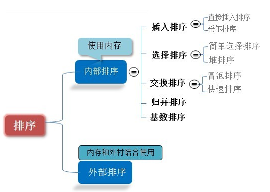

###  1.冒泡排序（Bubble Sort）

冒泡排序是一种简单的排序算法。它重复地走访过要排序的数列，一次比较两个元素，如果它们的顺序错误就把他们交换过来。走访数列的工作时重复地进行直到没有在需要交换，也就是说该数列已经排序完成。每次循环都会把遍历得到的最大的元素放到数组的后面。

**算法描述**

1. 比较相邻的元素。如果第一个比第二个大，就交换它们两个；
2. 对每一对相邻元素作同样的工作，从开始第一对到结尾的最后一对，这样在最后的元素应该会是最大的数；
3. 针对所有的元素重复以上的步骤，除了最后一个；
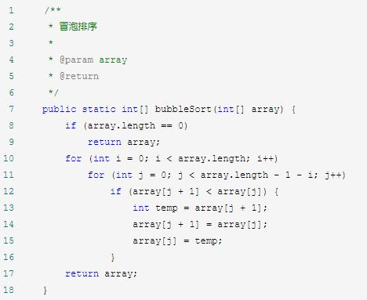

**算法分析：**
最佳情况：数组已排好序，只需进行n-1比较，时间复杂度T(n)=O(n)

最差情况：数组已经排好序，但是是反序的，需要进行n-1比较，n-1次交换，时间复杂度：T(n)=O(n2)

平均情况：T(n)=O(n2)

###  2.选择排序

表现最稳定的排序算法之一，因为无论什么数据进去都是O(n2)的时间复杂度，所以用到它的时候，数据规模越小越好。唯一的好处就是不占用额外的内存空间

选择排序：首先在未排序序列序列中找到最大（小）元素，存放到排序序列的起始位置，然后再从剩余未排序元素中继续寻找最大（小）元素，然后放到已排好序列的末尾。依次类推，直到所有元素均排序完毕。

**2.1 算法描述**

n个记录的直接选择排序可经过n-1趟直接选择排序得到有序结果。

初始状态：无序化为R[1..n],有序区为空

第i趟排序（i=1,2,3....n-1）,当前有序区和无序区分别为R[1..i-1]和R[i..n]。该趟排序从当前无序区中选出关键字最小的记录R[k]，将它与无序区的第一个记录R交换，使R[1..i]和R[i+1...n]分别变为记录个数增加1个的新的有序区和记录个数减少1个的新无序区。

n-1趟结束，数组有序化了。

**动图演示**

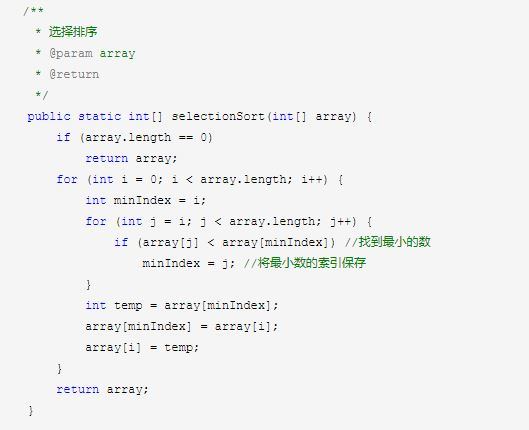

**算法分析**

最佳情况：已经排好序，但仍然要进行n2次级别的比较  时间复杂度T(n)=O(n2)

最差情况：也已经排好序，但是是反序的，所以也要进行n2次级别的比较，还有n-1次交换，市价复杂度T(n)=O
(n2)

平均情况：T(n)=O(n2)

### 3.插入排序（Insertion Sort）

插入排序的算法描述是一种简单直观的排序算法。它的工作原理是通过构建有序序列，对于未排序数据，在已排序序列中从后向前扫描，找到相应位置并插入。插入排序在实现上，通常采用in-place排序（即只需要用到O(1)的额外空间排序），吟哦在从后向前排序扫描过程中，需要反复把已排好序的元素逐步向后移位，为最新元素提供插入空间。

**算法描述**

一般来说，插入排序都采用in-place在数组上实现，具体算法描述如下：

从第一个元素开始，该元素可以认为已经被排序；

取出下一个元素，在已经排序好的元素序列中从后向前扫描；如果该元素（已排好）大于新元素，将该元素移到下一位置；

重复步骤3，直到找到已排序的元素小于或则等于新元素的位置；

将新元素插入到该位置后；重复步骤2-5

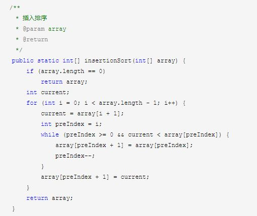

**算法分析：**

最佳情况：已经排好序，只需要进行n-1比较  时间复杂度 T(n)=O(n)

最坏情况：已经排好序但是是倒序          时间复杂度  T(n)=O(n2)

平均情况： 时间复杂度  T(n)=O(n2)

### 4.希尔排序

希尔排序也是一种插入排序，它是简单插入排序经过改进之后的一个更高效的版本，同时该算法是冲破O(n2)的第一批算法之一，它与插入排序的不同之处在于，它会优先比较距离较远的元素

希尔排序是把记录按表的一定增量分组，对每组使用插入排序算法排序；随着增量逐渐减少，每组包含的关键词越来越多，当增量减至1时，整个文件恰被分成一组，算法边终止。

**算法描述**

我们来看下希尔排序的基本步骤，在此我们选择增量gap=length/2，缩小增量继续以gap = gap/2的方式，这种增量选择我们可以用一个序列来表示，{n/2,(n/2)/2...1}，称为增量序列。希尔排序的增量序列的选择与证明是个数学难题，我们选择的这个增量序列是比较常用的，也是希尔建议的增量，称为希尔增量，但其实这个增量序列不是最优的。此处我们做示例使用希尔增量。

先将整个待排序的记录序列分割成为若干子序列分别进行直接插入排序，具体算法描述：

选择一个增量序列t1，t2，…，tk，其中ti>tj，tk=1；

按增量序列个数k，对序列进行k 趟排序；

每趟排序，根据对应的增量ti，将待排序列分割成若干长度为m 的子序列，分别对各子表进行直接插入排序。仅增量因子为1 时，整个序列作为一个表来处理，表长度即为整个序列的长度。

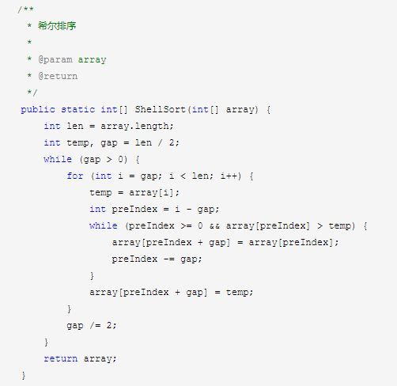

**算法分析：**

最佳情况：T(n)=O(nlogn)

最坏情况：T(n)=O(nlogn)

平均情况：T(n)=O(nlogn)

###  5.归并排序

和选择排序一样，归并排序的性能不受输入数据的影响，但表现比选择排序好的多，因为始终都是O(nlogn)的时间复杂度。代价是需要额外的内存空间。

归并排序是建立在归并操作上的一种有效的排序算法。该算法采用分治法的一个非常典型的应用。归并排序是一种稳定的排序方法。将已有序的子序列合并，得到完全有序的序列；即先使每个子序列有序，在使两个子序列间有序。若将两个有序表合并成一个有序表，称为2-路归并

**算法描述**

将长度为n的输入序列分成两个长度为n/2的子序列

对这两个子序列分别采用归并排序

将两个排序好的子序列合并成一个最终的排序序列

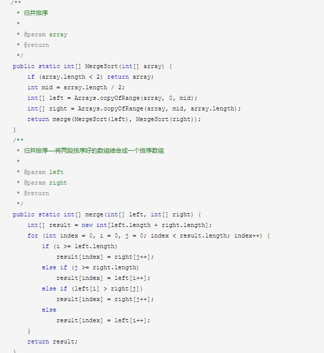

**算法分析**

最佳情况： 所有都是排好序的，只需要进行n-1次比较    T(n)=O(n)

最差情况：  T(n)=O(nlogn)

平均情况：  T(n)=O(nlogn)

###  快速排序

快速排序的思想：通过一趟排序将待排序记录分割成独立的两部分，其中一部分记录的关键字均比另一部分的关键字小，则可分别对这两部分继续进行排序，以达到整个序列有序。

**算法描述**

快速排序使用分治法来把一个串（list）分为两个子串（sub-lists）。具体算法描述如下：

从数列中挑出一个元素，称为 “基准”（pivot）；

重新排序数列，所有元素比基准值小的摆放在基准前面，所有元素比基准值大的摆在基准的后面（相同的数可以到任一边）。在这个分区退出之后，该基准就处于数列的中间位置。这个称为分区（partition）操作；

递归地（recursive）把小于基准值元素的子数列和大于基准值元素的子数列排序。

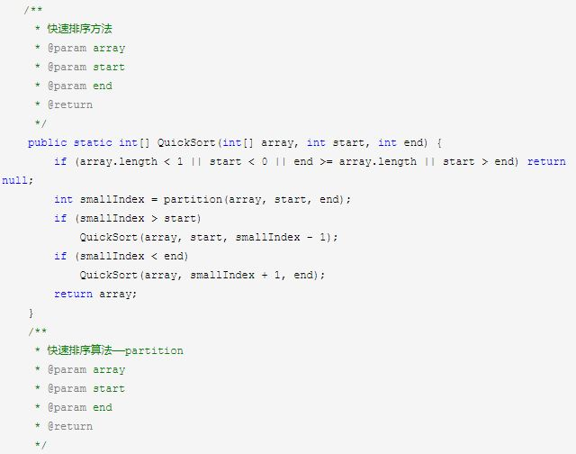
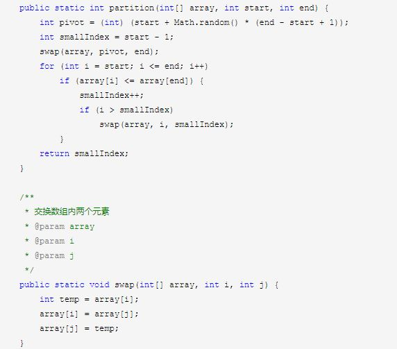

**算法分析：**
最佳情况： T(n)=O(nlogn)

最差情况：T(n)=O(n2)

平均：T(n)=O(nlogn)

### 7.堆排序

堆排序是指利用堆这种数据结构所设计的一种排序算法。堆积是一个近似完全二叉树的结构，并同时瞒住堆积的性质：即子节点的键值或索引总是小于（或则大于）它的父节点

**算法描述**

将初始待排序关键字序列（R1，R2。。。。Rn）构建成大顶堆，此堆为初始无序区；

将堆顶元素R1与最后一个元素Rn交换，，此时得到新的无序区（R1，R2，R3.....Rn-1）和新的有序区（Rn），且满足R[1,2....n-1]<=Rn;

由于交换后新的堆顶R1可能违反堆的性质，因此需要对当前无序区（R1，R2....Rn-1）调整为新堆，然后再次将R1与无序区最后一个元素交换，得到新的无序区(R1，R2....Rn-2)和新的有序区(Rn-1,Rn)。不断重复此过程直到有序区的元素个数为n-1，则整个排序过程完成。

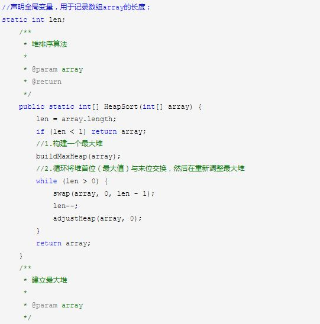
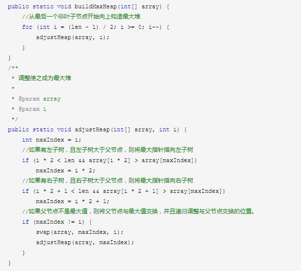

**算法分析**
最佳情况：T(n)=O(nlogn)

最差情况：T(n)=O(nlogn)

平均情况：T(n)=O(nlogn)

###  计数排序

计数排序的核心在于将输入的数据值转化为键存储在额外开辟的数组空间中。作为一种线性时间复杂度的排序，计数排序要求输入的数据必须是有确定范围的证书。

计数排序是一种稳定的排序算法。计数排序使用一个额外的数组C，其中第i个元素是待排数组A中值等于i的元素的个数。然后根据数组C来讲A中的元素排到正确的位置。它只能对整数进行排序。

**算法描述**

找出待排序的数组中最大和最小的元素；

统计数组中每个值i的元素出现的次数，存储数组C的第i项；

对所有的计数累加（从C中的第一个元素开始，每一项和前一项相加）

反向填充目标数组：将每个元素i放在放在新数组的第C(i),每放 一个元素就将C(i)减去1

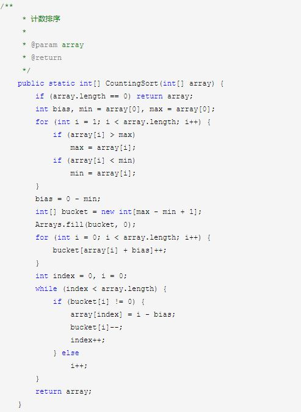

**算法分析**

当输入的元素是n 个0到k之间的整数时，它的运行时间是 O(n + k)。计数排序不是比较排序，排序的速度快于任何比较排序算法。由于用来计数的数组C的长度取决于待排序数组中数据的范围（等于待排序数组的最大值与最小值的差加上1），这使得计数排序对于数据范围很大的数组，需要大量时间和内存。
最佳情况：T(n) = O(n+k)  最差情况：T(n) = O(n+k)  平均情况：T(n) = O(n+k)

###  桶排序

桶排序是计数排序的升级版。它利用了函数的映射关系，高效与否的关键就在于这个映射函数的确定。

桶排序的工作原理： 假设输入数据服从均匀分布，将数据分到有限数量的桶里，每个桶里再分别排序（有可能再使用别的排序算法或则是以递归方式继续使用桶排序）

**算法描述：**
人为设置一个BucketSize，作为每个桶所能放置多少个不同数值（例如当BucketSize==5时，该桶可以存放{1,2,3,4,5}这几种数字，但是容量不限，即可以存放100个3）；

遍历输入数据，并且把数据一个一个放到对应的桶里去；

对每个不同的桶进行排序，可以使用其他的办法，也可以使用桶排序；

从不是空的桶里把排序好的数据拼接起来。

**代码：**

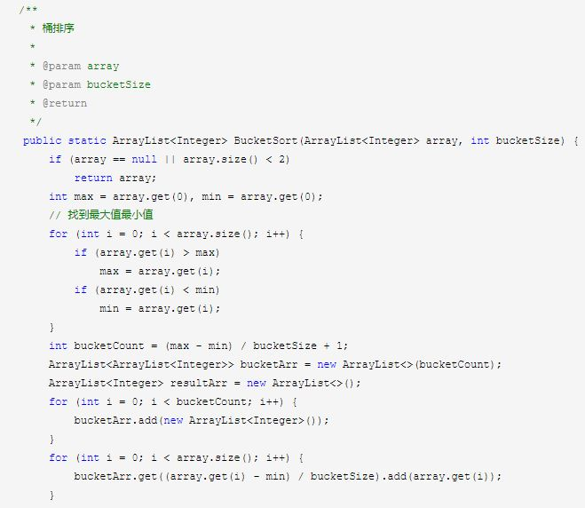
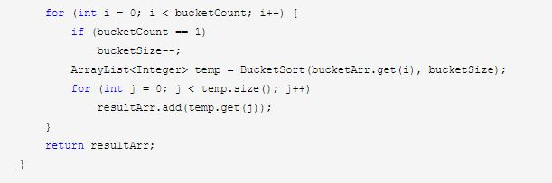

**算法分析：**
桶排序最好情况下使用线性时间O(n),桶排序的时间复杂度取决于各个桶之间进行排序的时间复杂度，因为其他部分的时间复杂度都为O(n).很显然，桶划分越小，各个桶之间的数据越少，排序所用的时间也会越少。但相应的空间消耗就会增大。

最佳情况： T(n)=O(n+k)

最差情况：T(n)=O(n+k)

平均情况：T(n)=O(n2)

###  基数排序

基数排序也是非比较的排序算法，对每一位进行排序，从最低位开始排序，复杂度为O(nk)，n为数组长度，k为数组中的数的最大的位数；

基数排序是按照低位先排序，然后收集；再按照高位排序，然后再收集；依次类推，直到最高位。有些时候有些属性是有优先级顺序的，先按低位优先级排序，再按高位优先级排序。最后的次序就是高优先级的在前，高优先级相同的低优先级高的在前。计数排序基于分别排序，分别收集，所以是稳定的

**算法描述：**

取得数组中的最大数，并取得位数；

arr为原始数组，从最低位开始取每个位组成radix数组；

对radix进行计数排序（利用计数排序使用与小范围的特点）

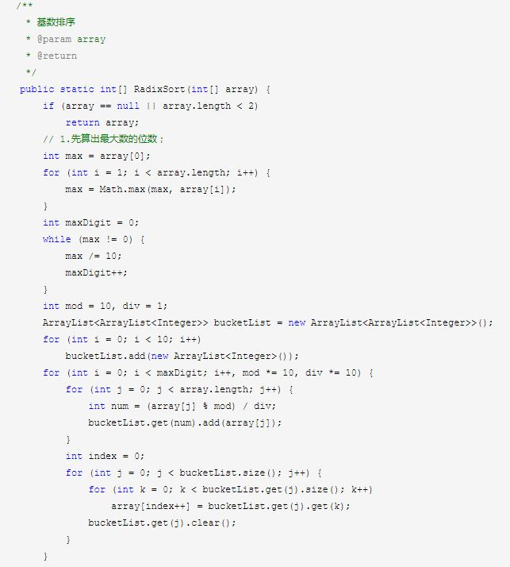

**算法分析**

最佳情况： T(n)=O(n*k)  最差情况： T(n)=O(n*k)  平均情况： T(n)=O(n*k)

基数排序有两种方法：
MSD从高位开始进行排序LSD从低位开始进行排序

基数排序 vs 计数排序 vs桶排序

这三种排序算法都利用了桶的概念，但对桶的使用方法上有明显差异：

基数排序：根据键值的每位数字分配桶

基数排序：每个桶只存储单一键值

桶排序：每个桶存储一定范围的数值
