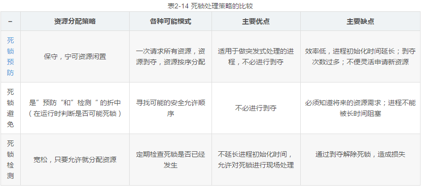
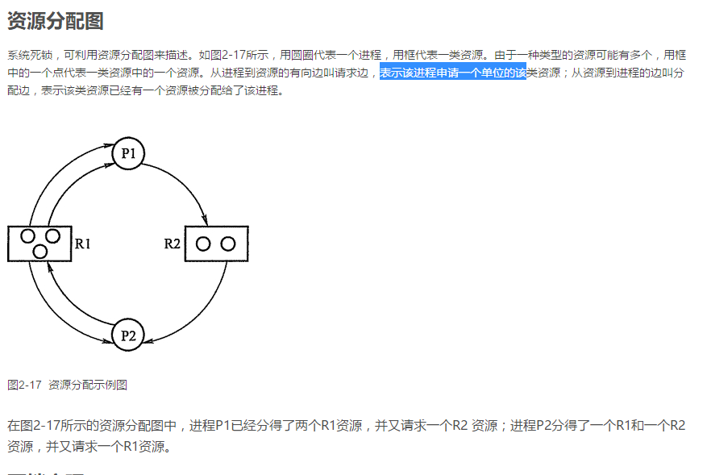
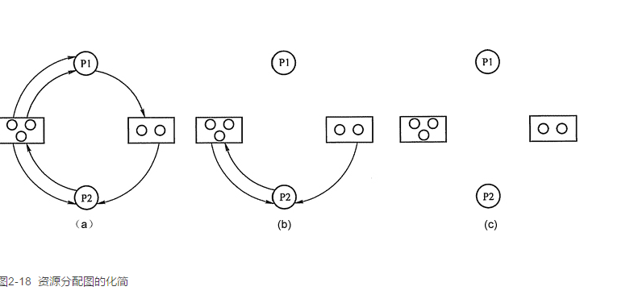

##  处理机的调度
####  1.处理机调度的类型
**（1）作业调度**

作业调度的本质就是根据某种算法，把外存上的作业调入内存，并为之创建进程，分配处理机并执行。

**（2）进程调度**

进程调度的本质就是根据某种算法，把处理机分配给进程。进程调度首先会保存处理机现场。将程序计数器等指定寄存器中的内容保存到PCB中。然后将按照某种算法从就绪队列中选取进程，把处理机分配给进程。最后，把指定进程的PCB中的处理机现场信息恢复到处理机中，处理机分配给进程执行。

1）进程调度中的三个基本机制

排队器：将所有的就绪进程按照一定方式 （如优先级）排成一个队列，以便调度程序找到。

分派器:把从就绪队列中取出的进程，处理机上下文切换后，把处理机分配给该进程执行。

上下文切换机制:
　　（PS：这里有一个额外的知识：通常每一次上下文切换需要花费几毫秒的时间。有一种简单的方式，通过多组寄存器来减少上下文切换的时间。一组寄存器供处理机在系统态使用，一组供处理机在应用程序状态时使用。这样，上下文切换的时候只需要改变指针，指向当前的寄存器。）

　　（PSS：CPU的系统态就是CPU在执行操作系统，用户态则是CPU在执行普通应用程序。）

　　2）进程调度的两种调度方式

非抢占式（Nonpreemptive Mode）。说白了就是一旦把进程分配给某个进程，除非它自愿退出，它将永远运行下去。
抢占式（Preemptive Mode）。说白了就是可以根据某种条件，使正在运行的进程暂停，将处理机分配给另一个进程。相当于信号量机制中的条件变量。

“抢占”不是一种任意性行为，必须遵循一定的原则：
1. 优先权原则
2. 短进程优先原则
3. 时间片原则

**（3）中级调度**

中级调度的本质就是让暂时不能运行的进程挂起，释放内存资源，并把它们调到外存上去等待。什么是外存？外存就是硬盘、磁盘等存储设备。

#### 2.作业调度算法

**先来先服务调度算法（FCFS）：**
该算法即可以用于作业调度，也可以用于进程调度。

就是先来的先进入内存或占用处理机。对于作业调度，就是从后备作业队列中选择一个或多个最先进入队列的作业，将其调入内存。对于进程调度就是从就绪队列选择最先进入的进程，为之分配处理机。

**短作业（进程）优先调度算法（SJF）**

就是在选择作业或进程的时候，先估算每个作业、进程的服务时间，选择其中最短的优先获得处理机。

缺点：

1.必须预知作业的运行时间

2.对长作业非常不利，长作业的周转时间明显增长

**优先级调度算法和高响应比优先调度算法**

1. 优先级调度算法and 高响应比优先调度算法

基于作业的紧迫程度，由外部赋予作业响应的优先级

这种算法给进程加了一个属性，那就是优先权。这个算法的本质就是，高优先权的优先调用。优先权有两种类型，一种是静态的，即每个进程、作业的优先权在它创建的时候就已经确定，此后都不能改变。另一种是动态的，即进程、作业的优先权是可以改变的。最常见的做法就是进程、作业在等待中，优先权以一定速率随时间增长，这样等待时间越长，被调用的可能性就越大。

####  3.进程调度算法

**轮转调度算法**

1. 轮转法的基本原理

这就是分时系统中采用的调度算法。原理就是把所有的就绪队列进程按先来先服务的原则排成队列。每次都把CPU分配给队首，让其执行一个时间片，执行完毕，调度器中断进程，并把该进程移至就绪队列的队尾，然后再取一个队首进程，继续执行下一个时间片。时间片是什么，就是一段很短的CPU时间，几毫秒到几百毫秒不等。

2. 进程切换时机

两种情况:

(1)时间片未完成，正在运行的程序便已经完成，就立即激活调度程序，将它从就绪队列中删除，再调度就绪队列中队首的进程运行

(2)在一个时间片用完时，计时器中断处理程序被激活，将该程序放到就绪队列的队尾

3. 时间片大小的确定

时间片太小，意味着会频繁地执行进程调度和进程上下文切换

时间片太长就会退化成FCFS算法

一个较为可取的时间片大小是略大于一次典型的交互所需要的时间，使大多数交互式进程能在一个时间片内完成，从而可以获得很小的响应时间

**优先级调度算法**

两种类型：

1. 非抢占式优先级调度算法：一旦把处理机分配给就绪队列中优先级最高的进程后，该进程便一直执行下去直至完成
2. 抢占式调度算法：把处理机分配给优先级最高的进程，使之执行，但在其执行时间内，只要出现了另一个其优先级更高的进程，调度程序就将处理机分配给新到的优先级最高的进程

**优先级的类型**

静态优先级：创建程序时确定的

动态优先级：先赋予其一个优先级，然后其值随进程的推进或等待时间的增加而改变，以便获得更好的调度性能

**多队列调度算法**

该算法将系统中的进程就绪队列从一个拆分为若干个，将不同类型或性质的进程固定分配在不同的就绪队列，不同的额就绪队列采用不同的调度算法，一个就绪队列中的进程可以设置不同的优先级，不同的就绪队列本身也可以设置不同的优先级

**多级反馈队列调度算法**

（1）设置多个就绪队列，第一个就绪队列优先级最高。第二个就绪队列优先级第二，其余队列也一样，优先级依次递减，时间片依次增加

（2）每个队列都采用FCFS算法

（3）按队列的优先级进行调度。调度程序首先调度最高优先级队列中的诸进程运行，仅当第一队列空时才调度第二队列中的进程运行。

**基于公平原则的调度算法**

1. 保证调度算法

保证调度算法是另外一种类型的调度算法，它向用户所做出的保证并不是优先运行，而是明确的性能保证，该算法可以做到调度的公平性。一种比较容易实现的性能保证是处理机分配的公平。如果有n个相同类型的进程同时运行，为了公平起见，须保证每个进程获得相同的处理机时间1/n

2. 公平分享调度算法

分配给每个进程相同的处理机时间，显然这对诸进程而言，是体现了一定程度的公平，但是如果各个用户所拥有的进程数不同，就会发生对用户的不公平问题。

####  实时调度

**1.实现实时调度的基本条件**

1.提供必要的信息

（1）就绪时间，是指某任务称为就绪状态的起始时间

（2）开始截止时间和完成截止时间

（3）处理时间，一个任务从开始执行，直到完成时所需要的时间

（4）资源要求，任务执行时所需的一组资源

（5）优先级

2.系统能力强

在实时系统中，若是处理能力不够强，则可能因为处理机忙不过来，而致使某些实时任务不能得到及时的处理，从而导致发生难以预料的后果

3.采用抢占式调度机制

4.具有快速切换的机制：（1）对中断的快速响应能力（2）快速的任务分配能力

**实时调度算法**

1.抢占式调度算法

2.非抢占式调度算法

**1.最早截止时间优先EDF算法：**
该任务是根据任务的截止时间确定任务的优先级，任务的截止时间越早，其优先级越高，具有最早截止时间的任务排在队列的队首。调度程序在选择任务时，总是优先选择就绪队列中的第一个任务，为之分配处理机

**2.最低松弛度优先LLF算法：**
该算法在确定任务的优先级时，根据的是任务的紧急（或松弛）程度。任务紧急程度越高，赋予该任务的优先级就越高，以是使之优先执行。例如一个任务在200ms时必须完成，而它本身所需运行时间为100ms，因此调度程序必须在100ms之前调度执行，该任务的紧急程度为100ms。实现该算法时系统中有一个按松弛程度排序的实时任务就绪队列，松弛度最低的任务排在最前面。

## 死锁

在多道程序系统中，由于多个进程的并发执行，改善了系统资源的利用率并提高了系统的处理能力。所谓死锁是指多个进程因竞争资源而造成的一种僵局（互相等待），若无外力作用，这些进程都将无法向前推进

**死锁产生的的原因：**

1. 系统资源的竞争

（1）竞争不可抢占性资源而引起的死锁：通常系统中拥有不可剥夺资源，其数量不足以满足多个进程运行的需要，使得进程在运行过程中，会因争夺资源而陷入僵局。如磁盘，打印机
（2）竞争可消耗资源引起的死锁：例如：p1收到p2的消息向并p2发出消息，同时p2收到p1发出的消息，并向p1发出消息，两个进程形成一个环，如果两个进程一个收一个发则不会造成死锁，若两个进程同时都进行收操作以后才发送消息就会造成死锁。

2. 进程推进顺序非法

进程在运行过程中，请求和释放资源的顺序不当，也同样会导致死锁。例如，并发进程 P1、P2分别保持了资源R1、R2，而进程P1申请资源R2，进程P2申请资源R1时，两者都会因为所需资源被占用而阻塞。

**死锁产生的必要条件**

产生死锁必须同时满足以下四个条件，只要其中任一条件不成立，死锁就不会发生。

互斥条件：进程要求对所分配的资源（如打印机）进行排他性控制，即在一段时间内某资源仅为一个进程所占有。此时若有其他进程请求该资源，则请求进程只能等待。

不剥夺条件：进程所获得的资源在未使用完毕之前，不能被其他进程强行夺走，即只能由获得该资源的进程自己来释放（只能是主动释放)。

请求和保持条件：进程已经保持了至少一个资源，但又提出了新的资源请求，而该资源已被其他进程占有，此时请求进程被阻塞，但对自己已获得的资源保持不放。

循环等待条件：存在一种进程资源的循环等待链，链中每一个进程已获得的资源同时被链中下一个进程所请求。即存在一个处于等待状态的进程集合{Pl, P2, …, pn}，其中Pi等待的资源被P(i+1)占有（i=0, 1, …, n-1)，Pn等待的资源被P0占有

**处理死锁的方法**

1. 预防死锁：设置某些限制条件，破坏产生死锁的四个必要条件中的一个或几个，以防止发生死锁。
2. 避免死锁：在资源的动态分配过程中，用某种方法防止系统进入不安全状态，从而避免死锁。
3. 检测死锁：无需釆取任何限制性措施，允许进程在运行过程中发生死锁。通过系统的检测机构及时地检测出死锁的发生，然后釆取某种措施解除死锁。
4. 解除死锁：当系统检测到系统中已经发生死锁时，就采取相应的措施，将进程从死锁中解脱出来。常用的方法就是撤销一些进程，回收他们的资源，将他们分配给已经处于阻塞状态的进程。



**预防死锁**

1) 破坏互斥条件

如果允许系统资源都能共享使用，则系统不会进入死锁状态。但有些资源根本不能同时访问，如打印机等临界资源只能互斥使用。所以，破坏互斥条件而预防死锁的方法不太可行，而且在有的场合应该保护这种互斥性。

2) 破坏不剥夺条件

当一个已保持了某些不可剥夺资源的进程，请求新的资源而得不到满足时，它必须释放已经保持的所有资源，待以后需要时再重新申请。这意味着，一个进程已占有的资源会被暂时释放，或者说是被剥夺了，或从而破坏了不可剥夺条件。

该策略实现起来比较复杂，释放已获得的资源可能造成前一阶段工作的失效，反复地申请和释放资源会增加系统开销，降低系统吞吐量。这种方法常用于状态易于保存和恢复的资源，如CPU的寄存器及内存资源，一般不能用于打印机之类的资源。

3) 破坏请求和保持条件

釆用预先静态分配方法，即进程在运行前一次申请完它所需要的全部资源，在它的资源未满足前，不把它投入运行。一旦投入运行后，这些资源就一直归它所有，也不再提出其他资源请求，这样就可以保证系统不会发生死锁。

这种方式实现简单，但缺点也显而易见，系统资源被严重浪费，其中有些资源可能仅在运行初期或运行快结束时才使用，甚至根本不使用。而且还会导致“饥饿”现象，当由于个别资源长期被其他进程占用时，将致使等待该资源的进程迟迟不能开始运行。

4) 破坏循环等待条件

为了破坏循环等待条件，可釆用顺序资源分配法。首先给系统中的资源编号，规定每个进程，必须按编号递增的顺序请求资源，同类资源一次申请完。也就是说，只要进程提出申请分配资源Ri，则该进程在以后的资源申请中，只能申请编号大于Ri的资源。

**死锁避免**

1.系统安全状态

避免死锁的方法中，允许进程动态地申请资源，但系统在进行资源分配之前，应先计算此次资源分配的安全性。若此次分配不会导致系统进入不安全状态，则将资源分配给进程； 否则，让进程等待。

所谓安全状态，是指系统能按某种进程推进顺序( P1, P2, …, Pn)，为每个进程Pi分配其所需资源，直至满足每个进程对资源的最大需求，使每个进程都可顺序地完成。此时称 P1, P2, …, Pn 为安全序列。如果系统无法找到一个安全序列，则称系统处于不安全状态。

并非所有的不安全状态都是死锁状态，但当系统进入不安全状态后，便可能进入死锁状态；反之，只要系统处于安全状态，系统便可以避免进入死锁状态。

2.银行家算法

银行家算法是最著名的死锁避免算法。它提出的思想是：把操作系统看做是银行家，操作系统管理的资源相当于银行家管理的资金，进程向操作系统请求分配资源相当于用户向银行家贷款。操作系统按照银行家制定的规则为进程分配资源，当进程首次申请资源时，要测试该进程对资源的最大需求量，如果系统现存的资源可以满足它的最大需求量则按当前的申请量分配资源，否则就推迟分配。当进程在执行中继续申请资源时，先测试该进程已占用的资源数与本次申请的资源数之和是否超过了该进程对资源的最大需求量。若超过则拒绝分配资源，若没有超过则再测试系统现存的资源能否满足该进程尚需的最大资源量，若能满足则按当前的申请量分配资源，否则也要推迟分配。

1) 数据结构描述

可利用资源矢量Available：含有m个元素的歎组，其中的每一个元素代表一类可用的资源数目。Available[j]=K，则表示系统中现有Rj类资源K个。

最大需求矩阵Max：为n*m矩阵，定义了系统中n个进程中的每一个进程对m类资源的最大需求。Max[i, j]=K，则表示进程i需要Rj类资源的最大数目为K。

分配矩阵Allocation：为n*m矩阵，定义了系统中每一类资源当前已分配给每一进程的资源数。All0Cati0n[i, j]= K，则表示进程i当前已分得Rj类资源的数目为K。

需求矩阵Need：为n*m矩阵，表示每个进程尚需的各类资源数。Need[i, j]=K，则表示进程i还需要Rj类资源的数目为K。

上述三个矩阵间存在下述关系：
Need[i, j] = Max[i, j] - Allocation[i, j]

2) 银行家算法描述

设Requesti是进程Pi的请求矢量，如果Requesti[j]K，表示进程Pi需要Rj类资源K个。当Pi发出资源请求后，系统按下述步骤进行检查：

①如果Requesti[j] <= Need[i, j]，便转向步骤②；否则认为出错，因为它所需要的资源数已超过它所宣布的最大值。

②如果Requesti[j] <= Available[j]，便转向步骤③;否则，表示尚无足够资源，Pi须等待。

③系统试探着把资源分配给进程Pi，并修改下面数据结构中的数值：
```
Available[j] = Available[j] - Requesti[j];
Allocation[i, j] = Allocation[i, j] + Requesti[ j];
Need[i, j] = Need[i, j] - Requesti[j];
```
④系统执行安全性算法，检查此次资源分配后，系统是否处于安全状态。若安全，才正式将资源分配给进程Pi，以完成本次分配；否则，将本次的试探分配作废，恢复原来的资源分配状态，让进程Pi等待。

**安全性算法**

①设置两个矢量。工作矢量Work；它表示系统可提供给进程继续运行所需的各类资源数目，它含有所个元素，在执行安全算法开始时，Work=Available; Finish：它表示系统是否有足够的资源分配给进程，使之运行完成。开始时 Finish[i]=false；当有足够资源分配给进程 Pi 时，再令 Finish[i]=true。

②从进程集合中找到一个能满足下述条件的进程：Finish[i]=false;    Need[i, j]<=Work[j]; 若找到，执行下一步骤，否则，执行步骤4。

③当进程Pi获得资源后，可顺利执行，直至完成，并释放出分配给它的资源，故应执行：
```
Work[j]=Work[j]+Allocation[i, j];
Finish[i]=true;
go to step <2>;
```
④如果所有进程的Finish[i]=tme都满足，则表示系统处于安全状态；否则，系统处于不安全状态。

**死锁的检测和解除**



**死锁定理**

可以通过将资源分配图简化的方法来检测系统状态S是否为死锁状态。简化方法如下：

1) 在资源分配图中，找出既不阻塞又不是孤点的进程Pi（即找出一条有向边与它相连，且该有向边对应资源的申请数量小于等于系统中已有空闲资源数量。若所有的连接该进程的边均满足上述条件，则这个进程能继续运行直至完成，然后释放它所占有的所有资源）。消去它所有的请求边和分配边，使之成为孤立的结点。在图2-18(a)中，P1是满足这一条件的进程结点，将P1的所有边消去，便得到图248(b)所示的情况。

2) 进程Pi所释放的资源，可以唤醒某些因等待这些资源而阻塞的进程，原来的阻塞进程可能变为非阻塞进程。在图2-17中，进程P2就满足这样的条件。根据第1) 条中的方法进行一系列简化后,若能消去图中所有的边，则称该图是可完全简化的，如图2-18(c)所示。

S为死锁的条件是当且仅当S状态的资源分配图是不可完全简化的,该条件为死锁定理。



**死锁的解除**

一旦检测出死锁，就应立即釆取相应的措施，以解除死锁。死锁解除的主要方法有：

1) 资源剥夺法。挂起某些死锁进程，并抢占它的资源，将这些资源分配给其他的死锁进程。但应防止被挂起的进程长时间得不到资源，而处于资源匮乏的状态。
2) 撤销进程法。强制撤销部分、甚至全部死锁进程并剥夺这些进程的资源。撤销的原则可以按进程优先级和撤销进程代价的高低进行。
3) 进程回退法。让一（多）个进程回退到足以回避死锁的地步，进程回退时自愿释放资源而不是被剥夺。要求系统保持进程的历史信息，设置还原点。
