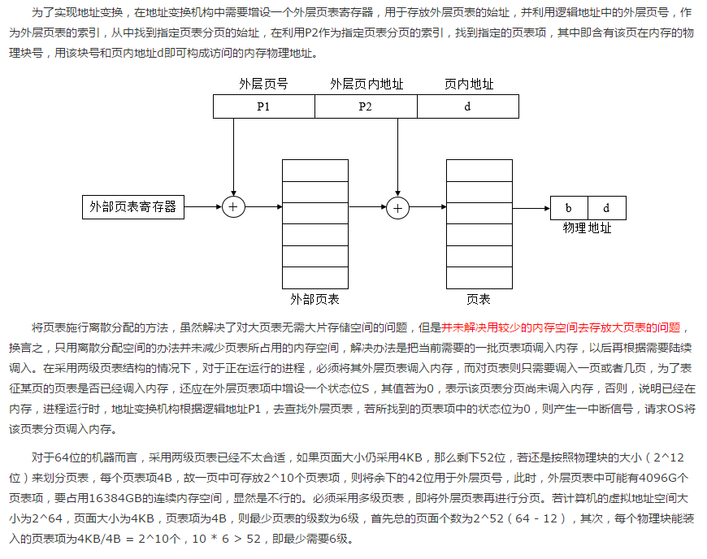

## 存储器管理

#### 一.存储器的层次结构

1. 主存储器

主存储器是计算机系统中的一个主要部件，用于保存进程运行时的程序和数据，CPU的控制部件只能从主存储器中取得指令和数据，数据能够从主存储器中读取并将他们装入到寄存器中，或者从寄存器存入到主存储器，CPU与外围设备交换的信息一般也依托于主存储器地址空间。但是，主存储器的访问速度远低于CPU执行指令的速度，于是引入了寄存机和告诉缓冲。

2. 寄存器

寄存器访问速度最快，能与CPU协调工作，价格昂贵，容量不大，寄存器用于加速存储器的访问速度，如用寄存器存放操作数，或用作地址寄存器加快地址转换速度等。

3. 高速缓存

高速缓存容量大于或远大于寄存器，但小于内存，访问速度高于主内存器，根据程序局部性原理，将主存中一些经常访问的信息存放在高速缓存中，减少访问主存储器的次数，可大幅度提高程序执行速度。通常，进程的程序和数据存放在主存，每当使用时，被临时复制到高速缓存中，当CPU访问一组特定信息时，首先检查它是否在高速缓存中，如果已存在，则直接取出使用，否则，从主存中读取信息。有的计算机系统设置了两级或多级高速缓存，一级缓存速度最高，容量小，二级缓存容量稍大，速度稍慢。

4. 磁盘存储

　磁盘的IO速度远低于对主存的访问速度，因此将频繁使用的一部分磁盘数据和信息暂时存放在磁盘缓存中，可减少访问磁盘的次数，磁盘缓存本身并不是一种实际存在的存储介质，它依托于固定磁盘，提供对主存储器空间的扩充，即利用主存中的存储空间，来暂存从磁盘中读出或写入的信息，主存可以看做是辅存的高速缓存，因为，辅存中的数据必须复制到主存方能使用，反之，数据也必须先存在主存中，才能输出到辅存。

#### 二.连续分配存储管理方式

为了能将用户程序装入内存，必须为它分配替丁大小的内存空间。连续分配方式是最早出现的一种存储器分配方式。

**连续分配的方式**

1. **单一连续分配:** 这是一种最简单的存储管理方式，但只能在单用户、单任务的操作系统中，将内存分为系统区和用户区，系统区供OS使用，通常放在内存的低地址，用户区是指除系统区以外的全部内存空间，提供给用户使用。

2. **固定分区分配:** 固定分区分配是一种最简单的可运行多道程序的存储管理方式，将内存用户空间划分为若干个固定大小的区域，在每个分区只装入一道作业，这样，便允许多道作业并发执行，当有空闲分区时，便可以再从外存的后备作业队列中选择一个适当大小的作业装入该分区，当该作业结束时，又可再从后备作业队列中找出另一作业调入该分区。

对于内存的用户空间的划分，有如下两种方法。

　　① 分区大小相等，即所有的内存分区大小相等。缺点是缺乏灵活性，即当程序太小时，会造成内存资源的浪费，程序太大时，一个分区由不足以装入该程序，只是该程序无法运行。

　　② 分区大小不等，把内存区划分成含有多个较小的分区、适量中等分配和少量大分区，这样，便可根据程序的大小为之分配适当的分区。

为了便于内存分配，将分区按大小进行排队，并为之简历一张分区使用表，其中各表项包括每个分区的起始地址、大小、状态（是否已分配），当有一个程序需要装入时，由内存分配程序检索该表，从中找出一个能满足要求的，尚未分配的分区，将之分配给该程序，然后将该表项中的状态设置为已分配，若未找到大小足够的分区，则拒绝为该用户分配内存。

3. **动态分区分配：** 动态分区分配是根据进程的实际需要，动态地为之分配内存空间，在实现可变分区分配时，将涉及到分区分配中所用的数据结构、分区分配算法、分区的分配和回收等。

　① 分区分配中的数据结构，为了实现分区分配，胸中必须配置相应的数据结构，用来描述空闲分区和已分配分区的情况，为分配提供依据，常用的数据结构有如下两种形式：空闲分区表（在系统中设置一张空闲分区表，用于记录每个空闲分区的情况，每个空闲分区占一个表目，表目中包括分区序号、分区始址、分区大小等，在前面已有介绍）、空闲分区链（为了实现对空闲分区的分配和链接，在每个分区的起始部分，设置一些用于控制分区分配的信息，以及用于链接各分区所用的向前指针；在分区尾部设置一向后指针，这样，可以将空闲分区链接成一个双向链），为了检索方便，在分区尾部重复设置状态为和分区大小表目，当分区被分配出去以后，把状态为从0改成1，此时前后指针都失去意义（已经不再空闲链表中）。

　　③ 分区分配操作，在动态分区分配存储管理中，主要的操作是分配内存和回收内存。

**回收分区：**　当进程运行完毕释放内存时，系统根据回收区的首址，从空闲区链（表）中找到相应的插入点，此时会出现如下四种情况之一：回收分区与插入点的前一个空闲区F1相邻接，此时将回收区与插入点的前一分区合并，不必为回收区分配新表项，只需要修改前一分区F1的大小。回收分区与插入点的后以空闲分区F2相邻接，此时将两分区合并，形成新的空闲分区，用回收区的首址作为新空闲区的首址，大小为两者之和。回收区同时与插入点的前、后两个分区邻接，此时将三个分区合并，使用F1的表项和F1的首址，取消F2的表项，大小为三者之和。回收区既不与F1邻接，也不与F2邻接，这时为回收区单独建立一个新表项，填写回收区的首址和大小，并根据其首址插入到空闲链中的适当位置。

**分区分配算法：**
为把一个新作业装入内存，需按照一定的分配算法，从空闲分区表或空闲分区链中选出一分区分配给该作业，目前常用一下五种分配算法。

**（1）首次适应算法  ：**
以空闲分区链为例进行说明，FF算法要求空闲分区链以地址递增的次序链接，在分配内存时，从链首开始顺序查找，直至找到一个大小能满足要求的空闲分区为止，然后再按照作业的大小，从该分区划出一块内存空间分配给请求者，余下的空闲分区仍留在空闲链中，若从链首直至链尾都不能找到一个能满足要求的分区，则此次内存分配失败，返回。该算法倾向于优先利用内存中低址部分的空闲分区，从而保留了高址部分的大空闲区，这给以后达到的大作业分配大的内存空闲创造了条件，缺点在与低地址空间不断被划分，会留下许多难以利用的、很小的空闲分区，而每次查找又都是从低地址部分开始，这无疑会增加查找可用空闲分区的开销。

**（2）循环首次适应算法  ：**　由首次适应算法演变而来，在未进程分配内存空间时，不再是每次都从链首开始查找，而是从上次找到的空闲分区的下一个空闲分区开始查找，直至找到一个能满足要求的空闲分区，从中划分出一块与请求大小相等的内存空间分配给作业。进行空闲分区分配时，会采用循环查找方式，即如果最后一个（链尾）空闲分区的大小仍不能满足要求，则返回第一个空闲分区。该算法能使内存中的空闲分区分布得更加均匀，从而减少了查找空闲分区时的开销，但是会缺乏大的空闲分区。

**（3）最佳适应算法  ：**
该算法总是能把满足要求、又是最小的空闲分区分配给作业，避免大材小用，为了加速寻找，该算法要求把所有的空闲分区按其容量以从小到大的顺序形成一个空闲分区链，这样，第一次就能找到满足要求的空闲区，必然是最佳的，孤立地看，最佳适应算法似乎是最佳的，然而宏观上却不一定，因为每次分配后所切割下来的剩余部分总是最小的，会留下很多难以使用的小空闲区。

#### 基于索引搜索的动态分区分配算法

为了提高搜索空闲分区的速度，在大，中型系统中往往会采用基于索引搜索的动态分区分配算法，目前常用的有  快速适应算法，伙伴系统和哈希算法。

**（1）快速适应算法  ：**

该算法又称为分类搜索法，是将空闲分区容量大小进行分类，对于每一类具有相同容量的所有空闲分区，单独设立一个空闲分区链表，这些，系统中存在多个空闲分区链表，同时在内存中设立一张管理索引表，该表的每一项对应了一种空闲分区类型，并记录了该类型空闲分区链表表头的指针。该算法的优点是查找效率高，仅需根据进程的长度，寻找到能容纳它的最小空闲区链表，并取下第一块进行分配即可。该算法在进行空闲分区分配时，不会对任何分区产生分割，所以能保留大的分区，满足对大空间的需求，也不会产生内存碎片。但是在分区归还主存时算法复杂，系统开销大。

**（2）伙伴系统   ：**
伙伴系统规定，无论已分配分区还是空闲分区，其大小均为2的k次幂，k为整数，1<= k <= m，其中，2^1表示分配的最小分区的大小，2^m表示分配的最大分区的大小，通常2^m是整个可分配内存的大小。假设系统开始时的初始容量为2^m个字，由于不断切分，可能会形成若干个不连续的空闲分区，将这些空闲分区根据分区的大小进行分类，对于每一类具有相同大小的所有空闲分区，单独设立一个空闲分区双向链表。这样，不同大小的空闲分区形成了k个空闲分区链表。

　　当需要为进程分配一个长度为n的存储空间时，首先计算一个i值，使2^i-1 < n <= 2^i，然后，在空闲分区大小为2^i的空闲分区链表中查找，若找到，即把该空闲分区分配给进程，否则，表明2^i的空闲分区已经耗尽，在大小为2^i+1的空闲分区链表中查找，若存在，则将该空闲分区分为两个大小为2^i的分区，一个用于分配，一个加入到大小为2^i的空闲分区链表中，若还是不存在，则继续在大小为2^i+2的空闲分区链表中查找，若存在，则将空闲分区进行两次分割，一次分割为两个大小为2^i+1的空闲分区，一个加入到大小为2^i+1的空闲分区链表中，另外一个继续进行分割，分成两个大小2^i的空闲块，一个用于分配，另外一个加入到大小为2^i的空闲分区链表中，以此类推。在最坏的情况下，可能需要对2^k的空闲分区进行k此分割才能得到所需分区。

　　当回收空闲分区时，也需要经过多次合并，如回收大小为2^i的空闲分区时，若事先已经存在2^i的空闲分区，则应将其与伙伴分区合并为一个大小为2^i+1的空闲分区，若事先已存在2^i+1的空闲分区，则再次进行合并，合并为2^i+2的分区，以此类推。

**（3）哈希算法  ：**

在上述的分类搜索算法和伙伴系统算法中，都是将空闲分区根据大小进行分类，对于每一类具有相同大小的空闲分区，单独设立一个空闲分区链表。在为进程分配空间时，需要在一张管理索引表中查找到所需空间大小所对应的表项，从中得到对应的空闲分区链表表头指针，从而通过查找得到一个空闲分区。如果空闲分区分类较细，则相应的表项就多了。

哈希算法就是利用快速查找的优点，以及空闲分区在可利用空闲表中的分布规律，建立哈希函数，构造一张以空闲分区大小为关键字的哈希表，该表的每一个表项记录了一个对应的空闲分区链表表头指针。

####  对换

在多道程序环境下，一方面，在内存中的某些进程由于某事件尚未发生而被阻塞运行，但它却占用了大量的内存空间，甚至有时可能出现在内存中所有进程都被阻塞而迫使CPU停止下来等待的情况，另一方面，却有很多作业在外存上等待，因无内存而无法进入内存运行的情况，这是对系统资源的浪费，为了解决这个问题，增设了对换设施，对换是把内存中暂时不能运行的进程或者暂时不用的程序和数据调出到外存上，以便腾出足够的内存空间，再把已具备运行条件的进程或者进程所需要的程序和数据调入内存。对换是提高内存利用率的有效措施。如果对换的单位是进程，便称为整体对换或进程对换，为了实现进程对换，系统必须实现对换空间的管理、进程的换出、进程的换入。

#### 基本的分页存储管理方式

连续分配方式会形成很多碎片，为之进行紧凑操作的开销非常大，如果允许一个进程直接分散地装入到许多不相邻接的分区中，则无须进行紧凑操作，基于这一思想产生了离散分配方式，如果离散分配的基本单位是页，则称为分页存储管理方式，若为段，则为分段存储管理方式。

**页面与页表**

分页存储管理是将一个进程的逻辑地址空间分成若干个大小相等的片，称为页面或页，并为各页进行编号，从0开始。相应地，把内存空间分成与页面相同大小的若干个存储块，称为（物理）块或者页框，也同样为它们编号，如0#块，1#块等。在进程分配内存时，以块为单位将进程的若干个页分别装入到多个可以不相邻接的物理块中，由于进程的最后一页经常装不满一块而形成不可利用的碎片，称之为页内碎片。

在分页系统中的页面其大小应适中，页面若太大，一方面可以是内存碎片减少，有利于提供内存利用率，但是，每一个进程占用的页面较多，导致页表过长，占用太多内存，会降低页面换进换出的效率。页面若太大，可减少页表的长度，提供页面换进换出的速度，但是，内存碎片会增大，所以，也页面大小应适中，通常为512B~8K：

**为了能够保证在内存中找到每个页面所对应的物理块，系统为每个进程建立了一张页面映射表，简称为页表。页表项纪录了相应页在内存中对应的物理块号，在配置了页表后，进程执行时，通过查找该表，即可找到每页在内存中的物理块号，页表实现了从页号到物理块号的地址映像。**

　即使在简单的分页系统中，也常在页表的表项中设置一存取控制字段，用于对该存储块中的内存加以保护，当存取控制字段仅有一位时，可用来规定该存储块中的内存时允许读/写，还是只读；若存取控制字段为二位，则可规定为读/写、只读、只执行等存取方式。

**地址变换机构**

为了能够将用户地址空间中的逻辑地址变换为内存空间中的物理地址，在系统中必须设置地址变换机构，该机构的基本任务是实现从逻辑地址到物理地址的转换，由于页内地址与物里块内的地址一一对应，无须再进行转换，因此，地址变换机构的任务实际上只是将逻辑地址中的页号转换为内存中的物理块号。又因为页面映射表的的作用就是用于实现从页号到物理块号的变换，因此，地址变换任务是借助页表来完成的。

页表的功能可以由一组专门的寄存器来实现，一个页表项用一个寄存器，由于寄存器具有较高的访问速度，因而有利于提高地址变换的速度，但成本较高，且页表项一般会很多，都使用寄存器实现不太现实，因此，页表大多驻留在内存。在系统中只设置一个页表寄存器PTR(Page-Table Register)，用于存放页表在内存的始址和页表的长度，平时，进程执行时，页表的始址和页表长度存放在本进程的PCB中，当调度程序调度到某进程时，将这两个数据装入页表寄存器，因此，在单处理机环境下，虽然系统中可以运行多个进程，但只需要一个页表寄存器。

　　当进程要访问某个逻辑地址中的数据时，分页地址变换机构会自动地将有效地址（相对地址）分为页号和页内地址两部分，再以页号为索引去检索页表，查找操作由硬件执行，在执行检索前，先将页号与页表长度进行比较，若页号大于或等于页表长度，则表示本次访问的地址超越了进程的地址空间，这一错误将被系统发现并产生一个地址越界中断。若未出现错误，则将页表始址加上页号与页表项长度的乘积，便得到该表项在页表中的位置，于是可从中得到该页的物理块号，将之装入物理地址寄存器，与此同时，再将有效地址寄存器中的页内地址送入物理地址寄存器的块内地址字段中，这样，便完成了逻辑地址到物理地址的转换。

上述操作中，每次存取一个数据时，都会访问内存两次，第一次是访问内存中的页表，从中找到指定页的物理块号，再将块号与页内偏移量W拼接，以形成物理地址，第二次访问时，才是从第一次所得的地址中获得所需数据，因此，这种方式会使计算机的处理速度降低一半，**为了提高地址变换速度，可以在地址变换机构中增设一个具有并行查询能力的特殊高速缓冲寄存器，又称为联想寄存器或快表，用以存放当前访问的那些页表项。**

**两级和多级页表**

####  基本存储管理方式

从固定分区到动态分区分配，再到分页存储管理方式，其主要动力为提高内存利用率，引入分段存储管理的目的在于满足用户在编程和使用上多方面的要求。如

　　① 方便编程，用户可以把自己的作业按照逻辑关系划分为若干段，每个段都是从0开始编址，并有自己的名字和长度。

　　② 信息共享，在实现对程序和数据的共享时，是以信息的逻辑单位为基础的，比如共享某个函数。

　　③ 信息保护，信息保护同样是对信息的逻辑单位进行保护。

　　④ 动态增长，在实际应用中，数据段在使用过程中往往会不断增长，而实现无法确切知道数据段会增长到多大，分段可以较好的解决这个问题。

　　⑤ 动态链接，再运行时，先将主程序所对应的目标程序装入内存并启动运行，当运行过程中有需要调用某段时，才将该段调入内存并进行链接。

**分段系统的基本原理**

在分段管理中，作业的地址空间被划分为若干个段，每个段定义了一组逻辑信息，如有主程序段MAIN，子程序段X，数据段D及栈段S，每个段都有自己的名字，每个段从0开始编址，并采用一段连续的地址空间，段的长度由相应的逻辑信息组的长度决定，因而各段长度不等，整个作业的地址空间由于是分成多个段，因而是二维的，即其逻辑地址由段号和段内地址构成。

　　说明：一个作业允许最长有64K个段，每个段的最大长度为64KB。

在分段式存储管理系统中，为每个分段分配一个连续的分区，而进程中的各个段可以离散地移入内存中不同的分区，为了使程序正常运行，能够物理内存中找出每个逻辑段所对应的位置，应该为每个进程建立一张段映射表，称为段表，每个段在表中有一个表项，其中记录了该段在内存中的起始地址和段的长度。段表可以存放在一组寄存器中，这样有利于提高地址转换速度，但通常将段表放在内存中。段表用于实现从逻辑段到物理内存区的映射。

**分页与分段存在很大的相似性，如都采用离散分配方式，都需要通过地址映射机构实现地址变换，但两者的主要区别如下。**

　　① 页是信息的物理单位，分页是为实现离散分配方式，以消减内存的外零头，提高内存的利用率，或者说，分页仅仅是由于系统管理的需要而不是用户的需要，段则是信息的逻辑单位，它含有一组意义相对完整的信息，分段的目的是为了能更好地满足用户的需要。

　　② 页的大小固定且由系统决定，由系统把逻辑地址划分为页号和页内地址两部分，是由机器硬件实现的，一个系统中，只存在一种大小的页面，段的长度则不固定，决定于用户所编写的程序，通常由编译程序在对源程序进行编译时，根据信息的性质来划分。

　　③ 分页的作业的地址空间是一维的，即单一的线性的地址空间，程序员只利用一个记忆符即可表示一个地址，而分段的作业地址空间是二维的，程序员在标识一个地址是，需要给出段名和段内地址。

**段页式存储管理**

分页系统能够有效的提高内存利用率（但是会存在页内碎片），分段系统则能够很好地满足用户需要。若能将两种方式结合起来，既具有分段系统的便于实现、分段可共享、易于保护、可动态链接等优点，又能像分页系统那样很好地解决内存的外部碎片问题，基于此，提出了段页式系统。

#虚拟存储器
内存的容量有限, 如果有大作业或大量作业运行, 内存就会不够用. 为解决这一问题边催生了虚拟存储器的概念.从逻辑上扩从内存。

常规存储器管理方式的特征

**一次性：**
作业必须一次性地全部装入内存后才能开始运行.

**驻留性：**
作业被装入内存后, 整个作业都一直驻留在内存中, 其中任何部分都不会被换出, 直至作业运行结束。

**局部性原理：**

时间局限性：如果程序中的某条指令一旦执行， 则不久以后该指令可能再次执行；如果某数据被访问过， 则不久以后该数据可能再次被访问。产生时间局限性的典型原因，是由于在程序中存在着大量的循环操作。

空间局限性：一旦程序访问了某个存储单元，在不久之后，其附近的存储单元也将被访问，即程序在一段时间内所访问的地址，可能集中在一定的范围之内，其典型情况便是程序的顺序执行。

**虚拟存储器的基本工作情况：**
应用程序在运行之前没有必要将之全部装入内存，而仅将那些当前要运行的少数页面或段先装入内存便可运行，其余的暂留在盘上。程序在运行时，如果它所要访问的页（段）已调入内存，便可继续执行下去；但是入伙程序所要访问的页（段）尚未调入内存，便发出缺页中断请求，此时OS系统将利用请求调页功能将它们调入内存。如果此时内存已满，OS系统还需再利用页的置换功能，将内存中暂时不用的页调至盘上，腾出足够的内存空间后，再将要访问的页面调入内存

定义：具有请求调入和置换功能, 能从逻辑上对内存容量加以扩充的存储器系统。

**特征：**

1.多次性. 一个作业中的程序和数据无需再作业运行时一次性全部装入内存, 而是允许被分成多次调入内存运行. (只需当前要运行的部分程序和数据装入内存即可)

2.对换性. 一个作业中的程序和数据, 无须在作业运行时一直常驻内存, 而是允许在作业的运行过程中进行对换操作.(在进程运行期间, 将有用的程序或数据换入, 无用的则换出)

3.虚拟性. 能够从逻辑上扩充内存容量. 提高内存利用率

虚拟性是以多次性和对换性为基础的.

**虚拟存储器可以通过请求分页, 请求分段的方法实现, 它们都需要软硬件支持, 主要硬件有页(段)表机制, 缺页(段)中断机构, 地址变换结构。**

###  请求分页存储管理方式
**求情页表机制**
请求页标机制，将用户地址空间中的逻辑地址映射成为内存空间中的物理地址。
**页表**

**缺页中断机制**

每当要访问的页面不再内存时, 便产生依次缺页中断, 请求OS将所缺之页调入内存.

1. 指令在执行期间产生和处理中断信号
2. 一条指令在执行期间可能产生多次缺页中断

**地址变换机构**

**内存分配**

**最小物理块数**
最小物理块数能保证进程正常运行, 它取决于指令的格式, 功能和寻址方式.

**内存分配策略**
内存在进行分配时可以采取固定分配和可变分配.

**固定分配：** 为每个进程分配一组固定数目的物理块, 在进程运行期间不可更改.

**可变分配：**
为每个进程分配一定数目的物理块, 在进程运行期间可以更改.
页面置换时可以采取全局置换和局部置换.

**全局置换：** 如果进程在运行期间返现缺页, 则将OS所保留的空间物理块取出一块分配给该进程, 或者以所有进程的全部物理块为标的, 选择一块换出, 然后将所缺之页调入.

**局部置换：** 如果进程在运行中发现缺页, 则只能从分配给该进程的n个页面中选出一页换出, 然后在调入一页, 以保证分配给该进程的内存空间不变.
通过以上可以组合一下三种策略:

**固定分配局部置换**
为每个进程分配多少物理块是根据进程类型(交互型或批处理型)或根据程序员的建议来确定.

**可变分配全局置换**
凡是产生缺页的物理块, 都将获得新的物理块.

**可变分配全局置换**
为每个进程分配一定数目的物理块, 但当某进程发现缺页时, 只允许从该进程在内存的页面中选择一页换出.

物理块分配算法

**平均分配算法.** 将系统中所有可供分配的物理块平均分配给各个进程.

**按比例分配算法** 根据进程大小按比例分配物理.

**考虑优先权的分配算法**
一部分按比例分配, 一部分根据进程的优先权分配

###  页面置换算法

**1.最佳置换算法：**
其所选择的被淘汰页面，将是以后永不使用的， 或许是在最长(未来)时间内不再被访问的页面。采用最佳置换算法，通常可保证获得最低的缺页率。

**2.先进先出页面置换算法：**
淘汰最先进入内存的页面, 即在内存中驻留时间最久的页面.
实现方便。不需要额外硬件。 效果不好。

**3.最近最久未使用的算法LRU（Least Recently Used）**
根据页面调入内存后的使用情况来做出决策。
为了快速知道哪一页是最近最久未使用的页面，需要硬件支持（寄存器和栈两类硬件之一的支持）

**寄存器：**
为了记录某个进程在内存中各页的使用情况，须为每个在内存中的页面置换一个移位寄存器，可表示R=R(n-1)R(n-2)R(n-3)R(n-4)R(n-5)....R0

当进程访问某个物理块时，要将相应的寄存器R(n-1)位置置1,。此时，定时信号将每隔一定时间将寄存器右移一位，如果我们把n位寄存器的数看成是一个整数，那么具有最小数值的寄存器所对应的页面，就是最近最久为使用的页面

**栈：**
可利用一个特殊的栈保存当前使用的各个页面的页面号。每当有进程访问某页面时，便将该页面的页面号从栈中移除，将它压入栈顶。因此栈顶始终就是最新被访问的页面编号，而栈低则是最近最久未使用页面的页面号

最近最久未使用的页面予以淘汰

**4.最少使用的页面置换算法**

在采用LFU算法时，应为在内存中的每个页面设置一个一位寄存器，用来记录该页面被访问的频率。该算法选择在最近时期使用最少的页面作为淘汰页

每次访问某页时，便将该移位寄存器的最高位置置1，每个一定时间右移一次。这样，在最近一段时间使用最少的将是  寄存器各个位置上的数字之和最小的页

LFU与LRU访问图完全相同，利用一套硬件既可以实现LRU算法，又可实现LFU算法

**Clock置换算法**
为每页设置一位访问位, 再将内存中的所有页面都通过链接指针链接成一个循环队列. 当某页被访问时, 其访问位被置1. 置换算法在选择一页淘汰时, 只需检查页的访问位. 如果是0, 就选择该页换出; 若为1, 则重新将它置0, 暂不换出; 再按照FIFO算法检查下一个页面. 当检查到队列中的最后一个页面时, 若其访问位仍为1, 则再返回到队首去检查第一个页面.

**改进型的Clock置换算法**
将一个页面换出时，如果页面已被修改过，便须将页重新写回到磁盘上；但如果该页面被修改过，则不必将它拷回到磁盘上。对于修改过的页面，在换出时所付出的开销比未修改的页面大，或则说，置换代价大。在改进型Clock算法中，除考虑页面的使用情况，还要增加一个因素-置换代价。这样，选择页面换出时，即要是未使用过的页面，又要是未被修改过的页面。

**1类(A=0, M=0): 表示该页最近既未被访问, 又未被修改, 是最佳淘汰页.**

**2类(A=0, M=1):表示该页最近未被访问, 但已被修改, 并不是很好的淘汰页.**

**3类(A=1, M=0)：最近已被访问, 但未被修改, 该页有可能再被访问.**

**4类(A=1, M=1):最近已被访问且被修改, 该页可能再被访问**

**执行过程：**
1. 从指针所指当前位置开始, 扫描循环队列, 寻找A=0且M=0的页面, 将遇到的第一个页面作为淘汰页. 在第一次扫描期间不改变访问位A.
2. 如果第一步失败, 即查找一轮后未遇到的第一类页面, 则开始第二轮扫描, 寻找A=0且M=1的页面, 将所遇到的第一个这类页面作为淘汰页. 在第二轮扫描期间, 将所有扫描过的页面的访问位置都置0.
3. 第二步也失败, 亦即未找到第二类页面, 则将指针返回到开始的位置, 并将所有的访问位复0. 然后重复第一步. 若果仍失败, 必要时重复第二步, 此时就一定能找到被淘汰的页.

**页面分配策略**
何时调入页面

1. 预调入策略
将在不久之后便会被访问的页面预先调入内存
2. 请求调入策略
当进程所访问的页面不再内存中时, 便立即请求, 由OS将所需页面调入内存.
从何处调入页面

若系统由足够的对换区, 则从对换区调入. 否则从文件区调入.
UNIX方式: 未运行国的页面从文件区调入, 运行过的页面从对换区调入(运行过的页面已被换出至对换区

###  抖动
抖动现象: 在系统中的进程太多, 需要频繁的进行进程的对换操作, 以至于占用太多时间, 从而处理机的利用率下降并趋于0的情况, 我们称之为抖动. 通常用工作集来避免抖动

工作集是在某段时间内, 进程实际索要访问的页面集合. 我们将这些页面又称为活跃页面.

预防抖动的方法

1. 采取局部置换策略
2. 工作集算法融入处理机调度
3. 调节缺页率
4. 暂停进程

###  请求分段存储管理方式

**缺段中断机构**

**请求分段地址变换**

#### 分页与分段的区别
段是信息的逻辑单位，它是根据用户的需要划分的，因此段对用户是可见的 ；页是信息的物理单位，是为了管理主存的方便而划分的，对用户是透明的。

段的大小不固定，有它所完成的功能决定；页大大小固定，由系统决定

段向用户提供二维地址空间；页向用户提供的是一维地址空间

段是信息的逻辑单位，便于存储保护和信息的共享，页的保护和共享受到限制。
