# 树
##  二叉查找树

二叉树是一种特殊的树类型，其每个节点最多只能有两个子节点。这两个子节点分别称为当前节点的左孩子和右孩子。

完全二叉树：深度为h，有n个节点的二叉树，当且仅当其每一个节点都与深度为K的满二叉树中编号从1至n的节点一一对应时称之为完全二叉树。

一棵二叉树至多只有最下面的一层上的结点的度数可以小于2，并且最下层上的结点都集中在该层最左边的若干位置上，而在最后一层上，右边的若干结点缺失的二叉树，则此二叉树成为完全二叉树。


满二叉树：一颗深度为h，且有2的h次方减一个节点称之为满二叉树

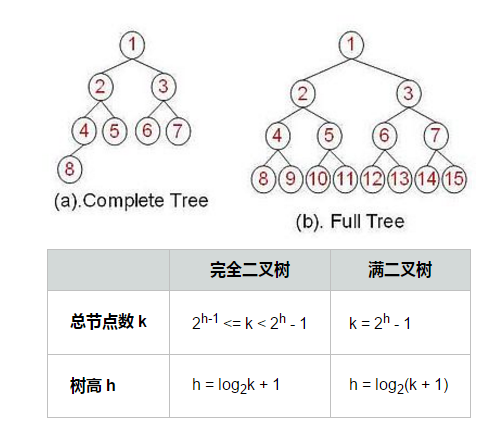

我们已经了解了数组是将元素连续地排列在内存当中，而二叉树却不是采用连续的内存存放。实际上，通常 BinaryTree 类的实例仅包含根节点（Root Node）实例的引用，而根节点实例又分别指向它的左右孩子节点实例，以此类推。

如果要访问二叉树中的某一个节点，通常需要逐个遍历二叉树中的节点，来定位那个节点。它不象数组那样能对指定的节点进行直接的访问。所以查找二叉树的渐进时间是线性的 O(n)，在最坏的情况下需要查找树中所有的节点。也就是说，随着二叉树节点数量增加时，查找任一节点的步骤数量也将相应地增加。

**二叉查找树**

二叉查找树（BST）是一种特殊的二叉树，它改善了二叉树节点查找的效率。二叉查找树有以下性质：

其左子树下的每个后代节点的值都小于节点n的值

其右子树下的每个厚道节点的值都大于节点n的值

二叉查找树查找算法的时间复杂度应该是 O(log­2n)，简写为 O(lg n)，如果节点数量增加 n，查找时间只缓慢地增加到 log­2n

**插入节点：**

BST 的插入算法的复杂度与查找算法的复杂度是一样的：最佳情况是 O(log­2n)，而最坏情况是 O(n)。因为它们对节点的查找定位策略是相同的。

**删除节点：**

删除节点算法的第一步是定位要被删除的节点，这可以使用前面介绍的查找算法，因此运行时间为 O(log­2n)。接着应该选择合适的节点来代替删除节点的位置，它共有三种情况需要考虑:

1. 如果删除的节点没有右孩子，那么就选择它的左孩子来代替原来的节点。二叉查找树的性质保证了被删除节点的左子树必然符合二叉查找树的性质。因此左子树的值要么都大于，要么都小于被删除节点的父节点的值，这取决于被删除节点是左孩子还是右孩子。因此用被删除节点的左子树来替代被删除节点，是完全符合二叉搜索树的性质的。
2. 如果被删除节点的右孩子没有左孩子，那么这个右孩子被用来替换被删除节点。因为被删除节点的右孩子都大于被删除节点左子树的所有节点，同时也大于或小于被删除节点的父节点，这同样取决于被删除节点是左孩子还是右孩子。因此，用右孩子来替换被删除节点，符合二叉查找树的性质。
3. 如果被删除节点的右孩子有左孩子，就需要用被删除节点右孩子的左子树中的最下面的节点来替换它，就是说，我们用被删除节点的右子树中最小值的节点来替换。

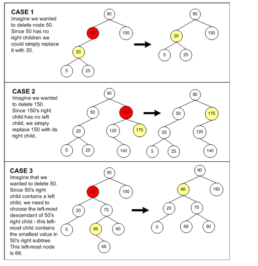

我们知道，在 BST 中，最小值的节点总是在最左边，最大值的节点总是在最右边。因此替换被删除节点右子树中最小的一个节点，就保证了该节点一定大于被删除节点左子树的所有节点。同时，也保证它替代了被删除节点的位置后，它的右子树的所有节点值都大于它。因此这种选择策略符合二叉查找树的性质。

**和查找、插入算法类似，删除算法的运行时间也与 BST 的拓扑结构有关，最佳情况是 O(log­2n)，而最坏情况是 O(n)。**

**遍历节点：**
1. 前序遍历（中左右）

可以通过递归和非递归两种方式实现：

**递归：**

```void inorder(btree ptr)//中序（输出根节点次序）遍历（递归实现）
{
    if (ptr != nullptr)
    {
        inorder(ptr->left);
        cout << ptr->data << " ";
        inorder(ptr->right);
    }
}

```

**非递归（使用栈）**

//非递归中序遍历（左节点->根节点->右节点）思想：即用栈实现  
因为中序遍历二叉树的特点，所以在当前节点cur不为空或栈不为空的条件下（在该条件下的原因：该条件说明  未遍历完二叉树），开始执行循环体，进行遍历：  
1.从当前节点cur开始，以cur为循环条件，当cur不为空时，将cur入栈，然后以cur=cur->_left跟进，直至 将该二叉树的最左节点入栈后，入栈操作结束  

2.取栈顶节点：先保存该节点（用top保存该节点的原因：还要考虑该节点的右孩子）并输出该节点的值，然后执行栈的pop操作。

3.继续以top->_right为cur值，转（1）操作.

```
void inorder2(btree ptr)//中序遍历的非递归实现
{
    stack<btree> st;
    while (ptr != nullptr || !st.empty())
    {
        while (ptr != nullptr)
        {
            st.push(ptr);
            ptr = ptr -> left;
        }
        btree tp = st.top();
        cout << tp -> data << " ";
        st.pop();
        ptr = tp -> right;
    }
}
```

2. 中序遍历（左中右）
```
void preorder2(btree ptr)//前序遍历的非递归实现
{
    stack<btree> st;
    if (ptr != nullptr)
    {
        st.push(ptr);
    }
    while (!st.empty())
    {       
        btree tp = st.top();
        st.pop();
        cout << tp -> data << " ";
        if (tp->right != nullptr)
            st.push(tp->right);
        if (tp->left != nullptr)
            st.push(tp->left);
    }
}

```

3. 后续遍历（左右中）

```
//非递归后序遍历（左节点->右节点->根节点）思想：即用栈实现  
//（1）在当前节点cur不为空或栈不为空的条件下（在该条件下的原因：该条件说明未遍历完二叉树）。  
//（2）从当前节点cur开始，以cur为循环条件，当cur不为空时，将cur入栈，然后以cur=cur->_left跟进，直至  
//     将该二叉树的最左节点入栈后，入栈操作结束。取栈顶节点top：先保存该节点（用top保存该节点的原因：  
//     还要考虑该节点的右孩子），  
//（3）若top->_right==NULL || lastVisited == top->_right,则输出top->_value,执行栈的pop操作,并执行lastVisited = top(  
//    用lastVisited保存最近一个所输出的节点，待到下一次同样的操作时，若lastVisited == top->_right，则  
//    说明top的右节点已经访问过了，可以访问top了，否则会陷在cur = top->_right这步操作里）;  
//（4）若条件（3）不满足，则继续以top->_right为cur值，转（1）操作.  
void postorder2(btree ptr)//后序遍历的非递归实现
{
    stack<btree> st;
    btree lastVisited  = nullptr;
    while (ptr != nullptr || !st.empty())
    {
        while (ptr != nullptr)
        {
            st.push(ptr);
            ptr = ptr -> left;
        }
        btree tp = st.top();
        if (tp->right == nullptr || lastVisited == tp->right)
        {   
            st.pop();
            cout << tp -> data << " ";
            lastVisited = tp;
        }
        else
            ptr = tp->right;
    }
}

```

##  平衡二叉树

平衡二叉树（Balanced Binary Tree）又被称为AVL树（有别于AVL算法），且具有以下性质：它是一 棵空树或它的左右两个子树的高度差的绝对值不超过1，并且左右两个子树都是一棵平衡二叉树。这个方案很好的解决了二叉查找树退化成链表的问题，把插入，查找，删除的时间复杂度最好情况和最坏情况都维持在O(logN)。但是频繁旋转会使插入和删除牺牲掉O(logN)左右的时间，不过相对二叉查找树来说，时间上稳定了很多。

**平衡二叉树不平衡的情形：**

把需要重新平衡的结点叫做α，由于任意两个结点最多只有两个儿子，因此高度不平衡时，α结点的两颗子树的高度相差2.容易看出，这种不平衡可能出现在下面4中情况中：
1. 对α的左儿子的左子树进行一次插入
2. 对α的左儿子的右子树进行一次插入
3. 对α的右儿子的左子树进行一次插入
4. 对α的右儿子的右子树进行一次插入

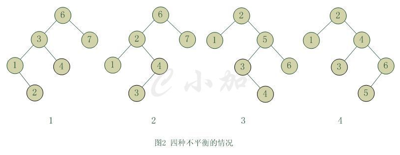

**总共分为4中情况：第一种情况是插入发生在“外边”的情形（左左或右右），该情况可以通过一次单旋转完成调整；第二种情况是插入发生在"n内边"情形（左右或右左），这种情况比较复杂，需要通过双旋转来调整**

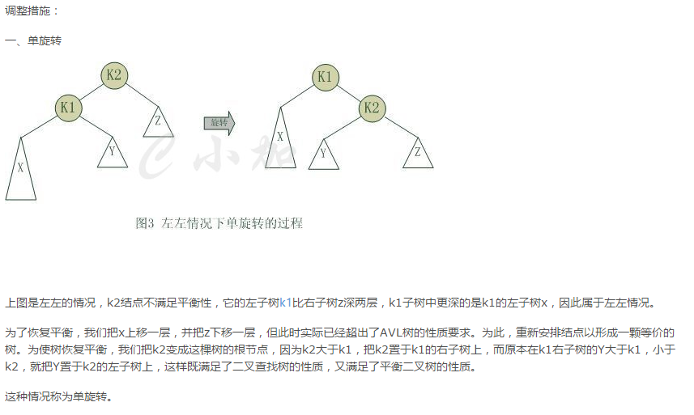
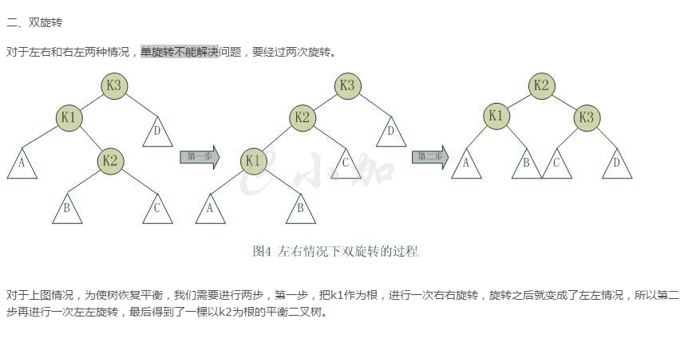

**AVL树的删除操作：**

同插入操作一样，删除结点时也有可能破坏平衡性，这就要求我们删除的时候要进行平衡性调整。

删除分为以下几种情况：

首先在整个二叉树中搜索要删除的结点，如果没搜索到直接返回不作处理，否则执行以下操作：

1.要删除的节点是当前根节点T。

如果左右子树都非空。在高度较大的子树中实施删除操作。

分两种情况：

(1)、左子树高度大于右子树高度，将左子树中最大的那个元素赋给当前根节点，然后删除左子树中元素值最大的那个节点。

(2)、左子树高度小于右子树高度，将右子树中最小的那个元素赋给当前根节点，然后删除右子树中元素值最小的那个节点。

如果左右子树中有一个为空，那么直接用那个非空子树或者是NULL替换当前根节点即可。

2、要删除的节点元素值小于当前根节点T值，在左子树中进行删除。

递归调用，在左子树中实施删除。

这个是需要判断当前根节点是否仍然满足平衡条件，

如果满足平衡条件，只需要更新当前根节点T的高度信息。

否则，需要进行旋转调整：

如果T的左子节点的左子树的高度大于T的左子节点的右子树的高度，进行相应的单旋转。否则进行双旋转。

3、要删除的节点元素值大于当前根节点T值，在右子树中进行删除

# B树

###  前言：

态查找树主要有：二叉查找树（Binary Search Tree），平衡二叉查找树（Balanced Binary Search Tree），红黑树(Red-Black Tree )，B-tree/B+-tree/ B*-tree (B~Tree)。前三者是典型的二叉查找树结构，其查找的时间复杂度O(log2N)与树的深度相关，那么降低树的深度自然会提高查找效率。

但是咱们有面对这样一个实际问题：就是大规模数据存储中，实现索引查询这样一个实际背景下，树节点存储的元素数量是有限的（如果元素数量非常多的话，查找就退化成节点内部的线性查找了），这样导致二叉查找树结构由于树的深度过大而造成磁盘I/O读写过于频繁，进而导致查询效率低下（为什么会出现这种情况，待会在外部存储器-磁盘中有所解释），那么如何减少树的深度（当然是不能减少查询的数据量），一个基本的想法就是：采用多叉树结构（由于树节点元素数量是有限的，自然该节点的子树数量也就是有限的）。

也就是说，因为磁盘的操作费时费资源，如果过于频繁的多次查找势必效率低下。那么如何提高效率，即如何避免磁盘过于频繁的多次查找呢？根据磁盘查找存取的次数往往由树的高度所决定，所以，只要我们通过某种较好的树结构减少树的结构尽量减少树的高度

**外存储器-磁盘**

计算机存储设备一般分为两种：内存储器(main memory)和外存储器(external memory)。 内存存取速度快，但容量小，价格昂贵，而且不能长期保存数据(在不通电情况下数据会消失)。

外存储器—磁盘是一种直接存取的存储设备(DASD)。它是以存取时间变化不大为特征的。可以直接存取任何字符组，且容量大、速度较其它外存设备更快。

**磁盘构造**

磁盘是一个扁平的圆盘(与电唱机的唱片类似)。盘面上有许多称为磁道的圆圈，数据就记录在这些磁道上。磁盘可以是单片的，也可以是由若干盘片组成的盘组，每一盘片上有两个面。如下图所示的6片盘组为例，除去最顶端和最底端的外侧面不存储数据之外，一共有10个面可以用来保存信息。

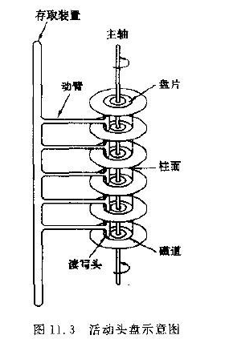

当磁盘驱动器执行读/写功能时。盘片装在一个主轴上，并绕主轴高速旋转，当磁道在读/写头(又叫磁头) 下通过时，就可以进行数据的读 / 写了。

一般磁盘分为固定头盘(磁头固定)和活动头盘。固定头盘的每一个磁道上都有独立的磁头，它是固定不动的，专门负责这一磁道上数据的读/写。

活动头盘 (如上图)的磁头是可移动的。每一个盘面上只有一个磁头(磁头是双向的，因此正反盘面都能读写)。它可以从该面的一个磁道移动到另一个磁道。所有磁头都装在同一个动臂上，因此不同盘面上的所有磁头都是同时移动的(行动整齐划一)。当盘片绕主轴旋转的时候，磁头与旋转的盘片形成一个圆柱体。各个盘面上半径相同的磁道组成了一个圆柱面，我们称为柱面 。因此，柱面的个数也就是盘面上的磁道数。

**磁盘的读/写原理和效率**

磁盘上数据必须用一个三维地址唯一表示：柱面号，盘面号，块号（刺刀上的盘块）

读/写磁盘上某一指定数据需要下面3个步骤：

(1)  首先移动臂根据柱面号使磁头移动到所需要的柱面上，这一过程被称为定位或查找 。

(2)  如上图所示的6盘组示意图中，所有磁头都定位到了10个盘面的10条磁道上(磁头都是双向的)。这时根据盘面号来确定指定盘面上的磁道。

(3) 盘面确定以后，盘片开始旋转，将指定块号的磁道段移动至磁头下。

经过上面三个步骤，指定数据的存储位置就被找到。这时就可以开始读/写操作了。

访问某一具体信息，由3部分时间组成：

● 查找时间(seek time) Ts: 完成上述步骤(1)所需要的时间。这部分时间代价最高，最大可达到0.1s左右。

● 等待时间(latency time) Tl: 完成上述步骤(3)所需要的时间。由于盘片绕主轴旋转速度很快，一般为7200转/分(电脑硬盘的性能指标之一, 家用的普通硬盘的转速一般有5400rpm(笔记本)、7200rpm几种)。因此一般旋转一圈大约0.0083s。

● 传输时间(transmission time) Tt: 数据通过系统总线传送到内存的时间，一般传输一个字节(byte)大概0.02us=2*10^(-8)s

**磁盘读取数据是以盘块（block）为基本单位的：**位于同一盘块中的左右数据都能被一次性全部读取出来。而磁盘IO代价花费主要在查找时间Ts上。因此我们应该尽量将相关信息存放在同一盘块，同一磁道中。。或则放在同一柱面或则相邻柱面上，以求在读/写信息时尽量减少磁头来回移动的次数，避免过多的查找时间Ts。

所以，在大规模数据存储方面，大量数据存储在外存磁盘中，而在外存磁盘中读取/写入块(block)中某数据时，首先需要定位到磁盘中的某块，如何有效地查找磁盘中的数据，需要一种合理高效的外存数据结构，就是下面所要重点阐述的B-tree结构，以及相关的变种结构：B+-tree结构和B*-tree结构。

B树是为了磁盘或其他存储设备而设计的一种多叉平衡查找树，与红黑树很相似，但是在降低磁盘I/O操作方面要更好一些。许多数据库系统都一般使用B树或者B树的各种变形结构

B树与红黑树最大的不同在于，B树的结点可以有许多子女，从几个到几千个。那为什么又说B树与红黑树很相似呢?因为与红黑树一样，一棵含n个结点的B树的高度也为O（lgn），但可能比一棵红黑树的高度小许多，应为它的分支因子比较大。所以，B树可以在O（logn）时间内，实现各种如插入（insert），删除（delete）等动态集合操作。

如下图所示，即是一棵B树，一棵关键字为英语中辅音字母的B树，现在要从树种查找字母R（包含n[x]个关键字的内结点x，x有n[x]+1]个子女（也就是说，一个内结点x若含有n[x]个关键字，那么x将含有n[x]+1个子女）。所有的叶结点都处于相同的深度，带阴影的结点为查找字母R时要检查的结点）：

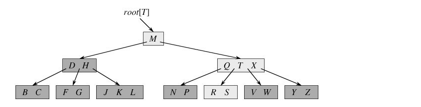

**相信，从上图你能轻易的看到，一个内结点x若含有n[x]个关键字，那么x将含有n[x]+1个子女。如含有2个关键字D H的内结点有3个子女，而含有3个关键字Q T X的内结点有4个子女。**

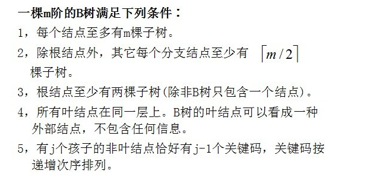

**B树的类型和节点定义**

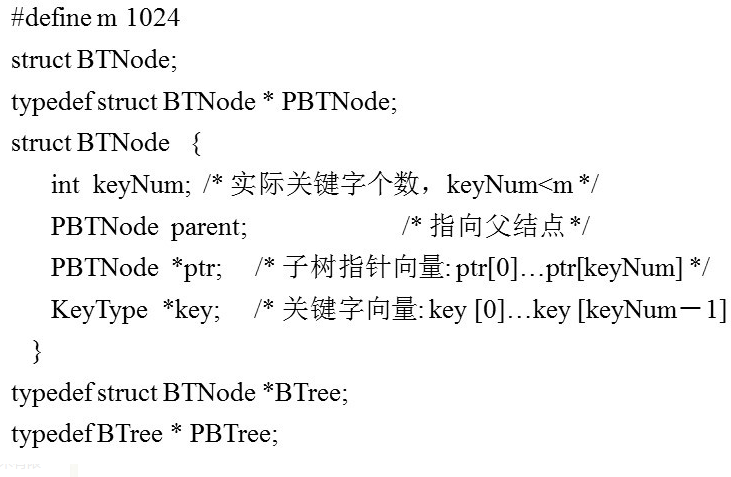
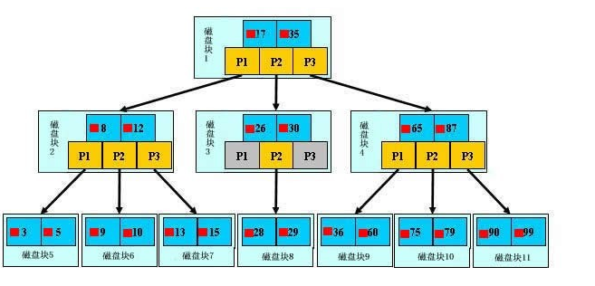
为了简单，这里用少量数据构造一棵3叉树的形式，实际应用中的B树结点中关键字很多的。上面的图中比如根结点，其中17表示一个磁盘文件的文件名；小红方块表示这个17文件内容在硬盘中的存储位置；p1表示指向17左子树的指针。

下面，咱们来模拟下查找文件29的过程：

1.根据根结点指针找到文件目录的根磁盘块1，将其中的信息导入内存。【磁盘IO操作 1次】    
此时内存中有两个文件名17、35和三个存储其他磁盘页面地址的数据。根据算法我们发现：17<29<35，因此我们找到指针p2。

2.根据p2指针，我们定位到磁盘块3，并将其中的信息导入内存。【磁盘IO操作 2次】    
此时内存中有两个文件名26，30和三个存储其他磁盘页面地址的数据。根据算法我们发现：26<29<30，因此我们找到指针p2。

3.根据p2指针，我们定位到磁盘块8，并将其中的信息导入内存。【磁盘IO操作 3次】    
此时内存中有两个文件名28，29。根据算法我们查找到文件名29，并定位了该文件内存的磁盘地址。

分析上面的过程，发现需要3次磁盘IO操作和3次内存查找操作。关于内存中的文件名查找，由于是一个有序表结构，可以利用折半查找提高效率。至于IO操作是影响整个B树查找效率的决定因素。

当然，如果我们使用平衡二叉树的磁盘存储结构来进行查找，磁盘4次，最多5次，而且文件越多，B树比平衡二叉树所用的磁盘IO操作次数将越少，效率也越高。

**B树的高度**

对于辅存做IO读的次数取决于B树的高度

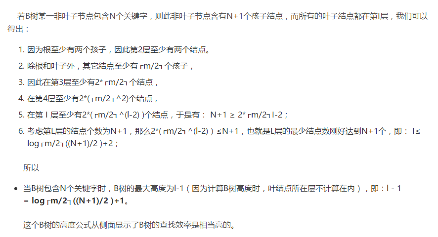

### B+树

B+-tree：是应文件系统所需而产生的一种B-tree的变形树。

一棵m阶的B+树和m阶的B树的异同点在于:

1.所有的叶子结点中包含了全部关键字的信息，及指向含有这些关键字记录的指针，且叶子结点本身依关键字的大小自小而大的顺序链接。 (而B 树的叶子节点并没有包括全部需要查找的信息)

2.所有的非终端结点可以看成是索引部分，结点中仅含有其子树根结点中最大（或最小）关键字。 (而B 树的非终节点也包含需要查找的有效信息)

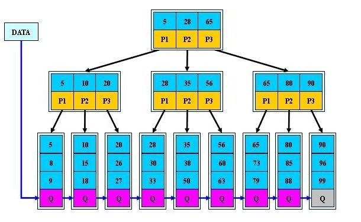

**为什么说B+-tree比B 树更适合实际应用中操作系统的文件索引和数据库索引？**

1. B+-tree的磁盘读写代价更低

B+-tree的内部结点并没有指向关键字具体信息的指针。因此其内部结点相对B 树更小。如果把所有同一内部结点的关键字存放在同一盘块中，那么盘块所能容纳的关键字数量也越多。一次性读入内存中的需要查找的关键字也就越多。相对来说IO读写次数也就降低了。

2.  B+-tree的查询效率更加稳定

由于非终结点并不是最终指向文件内容的结点，而只是叶子结点中关键字的索引。所以任何关键字的查找必须走一条从根结点到叶子结点的路。所有关键字查询的路径长度相同，导致每一个数据的查询效率相当。B+树相对于B树，范围查找的效率提高了。

### B*树

B*-tree是B+-tree的变体，在B+树的基础上(所有的叶子结点中包含了全部关键字的信息，及指向含有这些关键字记录的指针)，B*树中非根和非叶子结点再增加指向兄弟的指针；B*树定义了非叶子结点关键字个数至少为(2/3)*M，即块的最低使用率为2/3（代替B+树的1/2）。给出了一个简单实例，如下图所示：
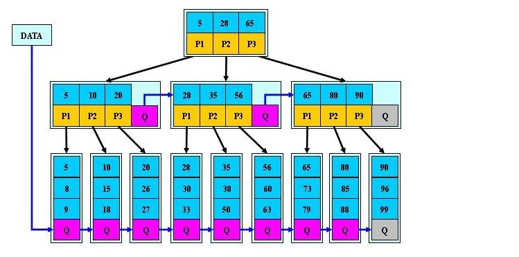

**B+树的分裂：**
当一个结点满时，分配一个新的结点，并将原结点中1/2的数据复制到新结点，最后在父结点中增加新结点的指针；B+树的分裂只影响原结点和父结点，而不会影响兄弟结点，所以它不需要指向兄弟的指针。

###### B*树的分裂:
当一个结点满时，如果它的下一个兄弟结点未满，那么将一部分数据移到兄弟结点中，再在原结点插入关键字，最后修改父结点中兄弟结点的关键字（因为兄弟结点的关键字范围改变了）；如果兄弟也满了，则在原结点与兄弟结点之间增加新结点，并各复制1/3的数据到新结点，最后在父结点增加新结点的指针。

#### 所以，B*树分配新结点的概率比B+树要低，空间使用率更高。

##  B树的插入操作

插入一个元素时，首先在B树中是否存在，如果不存在，即在叶子结点处结束，然后在叶子结点中插入该新的元素，注意：如果叶子结点空间足够，这里需要向右移动该叶子结点中大于新插入关键字的元素，如果空间满了以致没有足够的空间去添加新的元素，则将该结点进行“分裂”，将一半数量的关键字元素分裂到新的其相邻右结点中，中间关键字元素上移到父结点中（当然，如果父结点空间满了，也同样需要“分裂”操作），而且当结点中关键元素向右移动了，相关的指针也需要向右移。如果在根结点插入新元素，空间满了，则进行分裂操作，这样原来的根结点中的中间关键字元素向上移动到新的根结点中，因此导致树的高度增加一层。

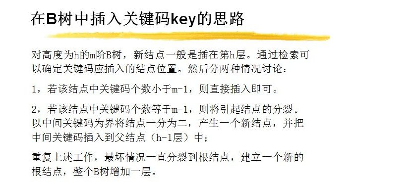

## B树的删除操作

删除元素，移动相应元素之后，如果某结点中元素数目（即关键字数）小于ceil(m/2)-1，则需要看其某相邻兄弟结点是否丰满（结点中元素个数大于ceil(m/2)-1）（还记得第一节中关于B树的第5个特性中的c点么?： c)除根结点之外的结点（包括叶子结点）的关键字的个数n必须满足： （ceil(m / 2)-1）<= n <= m-1。m表示最多含有m个孩子，n表示关键字数。在本小节中举的一颗B树的示例中，关键字数n满足：2<=n<=4），如果丰满，则向父节点借一个元素来满足条件；如果其相邻兄弟都刚脱贫，即借了之后其结点数目小于ceil(m/2)-1，则该结点与其相邻的某一兄弟结点进行“合并”成一个结点，以此来满足条件。
