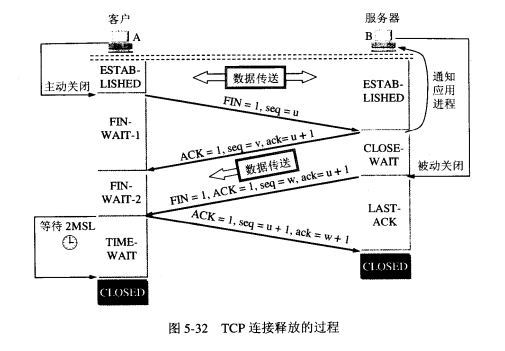

# 腾讯面试面经
### 进程和线程的区别
1. 进程是资源的分配和调度的一个独立单元，而线程是CPU调度的基本单元
2. 同一个进程中可以包括多个线程，并且线程共享整个进程的资源（寄存器，堆栈，上下文），一个进程至少包括一个线程
3. 进程的创建调用fork或则vfork，而线程的创建调用pthread_create,进程结束后他所拥有的所有线程都将销毁，而线程结束不会影响同个进程能其他线程的结束
4. 线程是轻量级的进程，它的创建和销毁所需要的时间比进程小的多，所有操作系统中的执行功能都是创建线程去完成的
5. 线程中执行时一般要进行同步和互斥，因为他们共享同一进程的所有资源
6. 线程有自己的私有属性TCB，线程id，寄存器，硬件上下文，而进程也有自己的私有属性进程控制块PCB，这些私有属性是不被共享的，用来标示一个进程或一个线程的标志。

### fork()函数详解

一个进程，包括代码，数据和分配给进程的资源。fork()函数通过系统调用创建一个与原来进程几乎完全相同的进程，也就是两个进程进程可以做完全相同的事，但是如果初始参数或传入的变量不同，两个进程也可以做不同的时。

一个进程调用fork()函数后，系统先给新的进程分配资源，例如存储数据和代码空间。然后把原来的进程的所有值都复制到新的进程中，只有少数值与原来的进程的值不同。相当于克隆一个自己。

在fork函数执行完毕后，如果创建新进程成功，则出现两个进程，一个是子进程，一个是父进程。在子进程中，fork函数返回0，在父进程中
fork返回新创建子进程的进程ID。我们可以通过fork返回的值来判断当前进程是子进程还是父进程。

创建新进程成功后，系统中出现两个基本完全相同的进程，这两个进程执行没有固定的先后顺序，哪个进程先执行要看系统的进程调度策略。
  每个进程都有一个独特（互不相同）的进程标识符（process ID），可以通过getpid（）函数获得，还有一个记录父进程pid的变量，可以通过getppid（）函数获得变量的值。

### vfork()

vfork()会产生一个新的子进程，但是vfork创建的子进程与父进程共享数据段，而且由vfork()创建的子进程将优先于父进程运行

**vfork()与fork()的相似和区别**
1.fork():子进程拷贝父进程的数据段，代码段  vfork():但是vfork创建的子进程与父进程共享数据段

2.fork():父子进程的执行次序不确定

        vfork():保证子进程先运行，在她调用exec或_exit之后父进程才可能被调度运行。如果在调用这两个函数之前子进程依赖于父进程的进一步动作，则会导致死锁。调用exec或_exit之前与父进程数据是共享的。

3.当需要改变共享数据段中的变量的值，则拷贝父进程。

###  clone()

可以将资源有选择的复制给子进程，没有复制的数据结构通过指针的复制共享。一般用来创建线程

###   孤儿进程和僵尸进程

子进程的结束和父进程的运行是一个异步过程，即父进程永远无法预测子进程到底什么时间结束。当一个进程完成它的工作终止之后，它的父进程需要调用wait()或则waitpid()系统地哦啊用取得子进程的终止状态

**孤儿进程：**

一个父进程退出，而它的一个或多个子进程还在运行，那些子进程将成为孤儿进程。孤儿进程将被init进程所收养，并有init进程对他们完成转态收集工作。

**僵尸进程：**

一个进程使用fork()创建子进程，如果子进程退出，而父进程没有调用wait或waitpid获取子进程的状态信息，name子进程的进程描述符仍然保存在系统中，这种进程称之为僵尸进程

**危害：**

如果进程不调用wait / waitpid的话， 那么保留的那段信息就不会释放，其进程号就会一直被占用，但是系统所能使用的进程号是有限的，如果大量的产生僵死进程，将因为没有可用的进程号而导致系统不能产生新的进程. 此即为僵尸进程的危害，应当避免。

孤儿进程是没有父进程的进程，孤儿进程这个重任就落到了init进程身上，init进程就好像是一个民政局，专门负责处理孤儿进程的善后工作。每当出现一个孤儿进程的时候，内核就把孤 儿进程的父进程设置为init，而init进程会循环地wait()它的已经退出的子进程。这样，当一个孤儿进程凄凉地结束了其生命周期的时候，init进程就会代表党和政府出面处理它的一切善后工作。因此孤儿进程并不会有什么危害。

###  多线程与多进程

**1.需要频繁创建销毁的优先用线程**

这种原则最常见的应用就是web服务器，来一个连接建立一线程，断了就销毁线程，要是用进程，创建和销毁的代价很大。

**2.需要进程大量运算的优先使用线程**

所谓大量计算，当然就是要耗费很多CPU，切换频繁了，这种情况下线程是最合适的。

**3.强相关处理用线程，若相关处理用进程**

什么叫强相关、弱相关？理论上很难定义，给个简单的例子就明白了。

一般的Server需要完成如下任务：消息收发、消息处理。“消息收发”和“消息处理”就是弱相关的任务，而“消息处理”里面可能又分为“消息解码”、“业务处理”，这两个任务相对来说相关性就要强多了。因此“消息收发”和“消息处理”可以分进程设计，“消息解码”、“业务处理”可以分线程设计。

**4.可能要扩展到多机分布的用进程，多核分布的用线程**

**消耗资源**

从内核的观点看，进程的目的就是担当分配系统资源（CPU时间、内存等）的基本单位。线程是进程的一个执行流，是CPU调度和分派的基本单位，它是比进程更小的能独立运行的基本单位。

线程，它们彼此之间使用相同的地址空间，共享大部分数据，启动一个线程所花费的空间远远小于启动一个进程所花费的空间，而且，线程间彼此切换所需的时间也远远小于进程间切换所需要的时间。据统计，总的说来，一个进程的开销大约是一个线程开销的30倍左右，当然，在具体的系统上，这个数据可能会有较大的区别。

**通讯方式**

进程之间传递数据只能是通过通讯的方式，即费时又不方便。线程时间数据大部分共享（线程函数内部不共享），快捷方便。但是数据同步需要锁对于static变量尤其注意

**线程的优势**

提高应用程序响应；使多CPU系统更加有效。操作系统会保证当线程数不大于CPU数目时，不同的线程运行于不同的CPU上；
改善程序结构。一个既长又复杂的进程可以考虑分为多个线程，成为几个独立或半独立的运行部分，这样的程序会利于理解和修改。

### OSI七层与TCP/IP五层网络架构详解

**TCP/IP五层模型的协议**

**TCP/UDP协议**

TCP和UDP协议属于传输层协议。其中TCP提供IP环境下的数据可靠传输，它提供的服务包括数据流传送，可靠性，有效流控，全双工操作和多路复用。。通过面向连接，端到端和可靠的数据包发送。通俗说，它是事先为所发送的数据开辟出连接好的通道，然后再进行数据发送；而UDP则不为IP提供可靠性，流量或差错恢复功能。一般来说，TCP对应的是可靠性要求高的应用，而UDP对应的则是可靠性要求低，传输经济的应用。TCP支持的应用协议主要有：Telnet，FTP，SMTP等，UDP支持的应用层协议主要有：NFS(网络文件系统)，SNMP简单网络管理协议，DNS（主域名系统），TFTP(通用文件传输协议)等

TCP/IP洗衣与底层的数据链路层和物理层无关。

**OSI七层参考模型的各个层次的划分遵循下列原则**

1.同一层中的个网络节点都有相同的层次结构，具有同样的功能

2.同一节点内相邻网络之间通过接口（可以是逻辑接口）进行通信

3.七层结构中每一层使用下一层提供的服务，并且向上层提供服务

4.不同节点的同一层按照协议实现对等层之间的通信

**第一层：物理层**

规定通信设备的机械的、电气的、功能的和过程的特性，用以建立、维护和拆除物理链路连接。在这一层，数据的单位称为比特（bit）。

**第二层：数据链路层**

在物理层提供比特流服务的基础上，建立相邻接点之间的数据链路，通过差错控制提供数据帧在信道上无差错的传输，并进行个电路上的动作系列。数据链路层在不可靠的物理介质上提供可靠的传输，该层的作用：物理地址寻址，数据的成帧，流量控制，数据的检错，重发等。在这一层，数据的单位称为帧。数据链路层协议的代表包括：SDLC，HDLC，PPP《STP，帧中继等

**网络层**

在 计算机网络中进行通信的两个计算机之间可能会经过很多个数据链路，也可能还要经过很多通信子网。网络层的任务就是选择合适的网间路由和交换结点， 确保数据及时传送。网络层将数据链路层提供的帧组成数据包，包中封装有网络层包头，其中含有逻辑地址信息- -源站点和目的站点地址的网络地址。如 果你在谈论一个IP地址，那么你是在处理第3层的问题，这是“数据包”问题，而不是第2层的“帧”。IP是第3层问题的一部分，此外还有一些路由协议和地 址解析协议（ARP）。有关路由的一切事情都在这第3层处理。地址解析和路由是3层的重要目的。网络层还可以实现拥塞控制、网际互连等功能。在这一层，数据的单位称为数据包（packet）。网络层协议的代表包括：IP、IPX、RIP、OSPF等。

**处理信息的传输层**

第4层的数据单元也称作数据包（packets）。但是，当你谈论TCP等具体的协议时又有特殊的叫法，TCP的数据单元称为段 （segments）而UDP协议的数据单元称为“数据报（datagrams）”。这个层负责获取全部信息，因此，它必须跟踪数据单元碎片、乱序到达的 数据包和其它在传输过程中可能发生的危险。第4层为上层提供端到端（最终用户到最终用户）的透明的、可靠的数据传输服务。所为透明的传输是指在通信过程中 传输层对上层屏蔽了通信传输系统的具体细节。传输层协议的代表包括：TCP、UDP、SPX等。

**会话层**

这一层也可以称为会晤层或对话层，在会话层及以上的高层次中，数据传送的单位不再另外命名，而是统称为报文。会话层不参与具体的传输，它提供包括访问验证和会话管理在内的建立和维护应用之间通信的机制。如服务器验证用户登录便是由会话层完成的。

**表示层**

这一层主要解决拥护信息的语法表示问题。它将欲交换的数据从适合于某一用户的抽象语法，转换为适合于OSI系统内部使用的传送语法。即提供格式化的表示和转换数据服务。数据的压缩和解压缩， 加密和解密等工作都由表示层负责。

**应用层**

应用层为操作系统或网络应用程序提供访问网络服务的接口。应用层协议的代表包括：Telnet、FTP、HTTP、SNMP等

### TCP三次握手

一开始 A和B都处于关闭状态，B首先建立传输控制模块TCB，准备接受连接请求，然后就进入LISTEN（收听）状态，等待客户端的连接请求。

A首先也建立传输控制块TCB，向B发送连接请求，这时首部中同部位SYN=1，同时要选择一个序列号seq=x。TCP规定，SYN同步报文段（即SYN=1）不携带任何数据，但是要消耗一个序号。这时客户端A进入SYN—SEND同步发送状态。

B收到连接请求后，如同意建立连接，需要发送一个确认报文，确认报文的SYN=1和ACK=1，确认号ack=x+1，同时也要为自己设置一个初始序列号seq=y,然后B进入同步收到状态，这个报文也不能携带任何数据，但是也要消耗一个序列号。

A收到B的确认报文段后，还要向B给出确认，确认报文段的ACK=1，确认号ack=y+1，而自己的序列号为seq=x+1，TCP规定ACK报文段可以携带数据，如果不携带数据则不消耗序列号，在这种情况下，下一个数据报文段的序号seq=x+1，TCP已建立连接A进入连接建立阶段，B收到确认报文段后也进入连接建立阶段。

**为什么A最后还要发送一次确认呢？**

主要是为了防止已失效的连接请求报文段突然到达B，从而产生错误。

已失效的连接请求是这样产生的，A发送了连接请求，但由于网络原因该请求在网络中的某些节点滞留了很长时间，导致A认为连接请求丢失，于是又发送了一次连接请求，这次请求建立正常的连接，并传送完数据后，正常关闭，但是第一个连接请求在连接关闭后到达B，导致B认为A又发送了一次连接请求，于是向A发出同意连接的确认报文，如果没有A的最后一次确认，此时B已经进入了连接已建立的阶段，而A收到确认后，由于没有发出连接请求，不予理会。导致B以为新的连接建立，并一直等待A发送的资源，导致很多资源白白浪费。

###  TCP四次挥手

此时A和B都处于连接建立状态

A首先向TCP发送连接释放报文，并停止发送数据，主动关闭TCP连接，A发出的连接释放报文首部的终止控制位置FIN置1，其序号seq=u，它等于前面已传送过的数据的最后一个字节的序号加1.这时A进入FIN-WAIT-1(终止等待1)状态，等待B的确认。FIN报文段不携带任何数据

B收到连接释放请求后发送确认报文，确认号ack=u+1，ACK=1，这个报文段自己的序号是V，然后B就进入CLOSE-WAIT（关闭等待）状态。TCP服务进程应通知高层应用进程，从A到B这个方向的连接已经释放了，这时TCP连接处于半关闭状态，A已经没有数据要发送给B，但B可能还有数据要发送给A，也就是说从B到A这个方向的连接还没有释放。
A收到B的确认后，进入FIN-WAIT-2（终止等待2）状态。

若B没有要想A发送后的报文段，其应用进程就通知TCP释放连接，这时B发出的连接释放报文必须是FIN=1，假定序号为W，B还必须发送上次已经发送过的确认号ack=u+1，这时B就进入最后确认状态，等待A的确认。

A收到B的释放；连接的请求后，必须对此发出确认，在确认报文段中把ACK=1，序列号seq=u+1,确认号ack=w+1,然后进入TIME—WAIT状态，必须经过时间等待计数器设置的时间2MSL后，才进入CLOSED状态。

B收到A的确认报文段后进入CLOSED

**为什么A的TIME-WAIT状态必须等待2MSL的时间呢**

第一.为了保证A发送的最后一个ACK报文段能够到达B，这个报文段有可能丢失，因为使处在LAST-ACK的B收不到对方对FIN+ACK的确认。B会超时重传这个FIN-ACK。而A就能在2MSL时间能收到这个重传的报文，接着A重传一次确认，重新启动2MSL计时器，最后A和吧都进入CLOSE状态，如果A不在TIME-WAIT等待一段时间，而是发送完ACK后立即进入CLOSED状态，就收不到A重传的FIN+ACK，因而不会发送确认，导致B无法正常关闭。

第二.防止“已经失效的连接请求报文段”出现在本连接中。A在发送完最后的确认报文段后，在经过2MSL，就可以在本连持续的时间内所产生的报文段都从网络中消失。这样就可以在下一个新的连接中不会出现这种旧的连接请求报文段。
