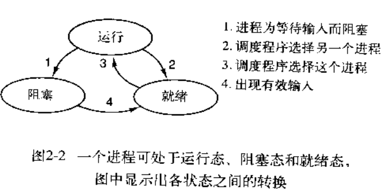
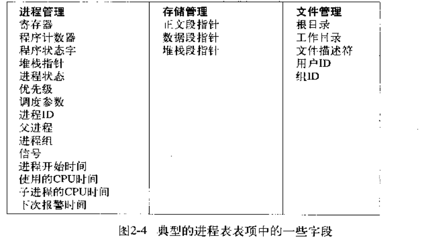
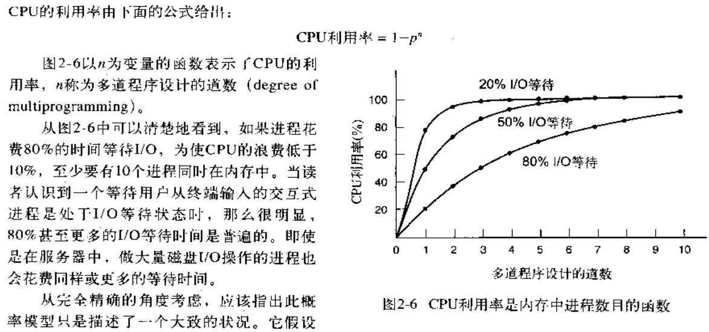
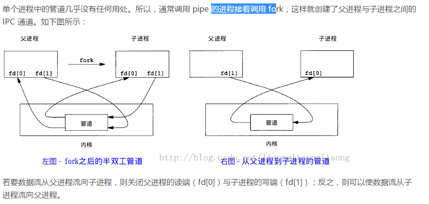

# 计算机操作系统
### 1.操作系统引论
**操作系统的目标：方便性，有效性，可扩充性和开放性**

**方便性：1.提高资源利用率 2.提高系统的吞吐量**

**操作系统的作用：**
1. 用户与计算机硬件系统之间的接口
2. 计算机系统资源的管理者：处理机，存储器，I/O设备以及文件
3. 实现对计算机资源的抽象

##  进程与线程
操作系统最核心的概念是进程：这时对正在运行程序的一个抽象，一个进程就是一个正在执行程序的实例，包括程序计数器，寄存器和变量的当前值。

**创建进程**

有4种主要事件导致进程的创建：
1. 系统初始化
2. 执行了正在运行的进程所调用的进程创建系统调用
3. 用户请求创建一个新进程
4. 一个批处理作业的初始化

在Unix系统中，只有一个系统可以用来创建进程：fork，这个系统调用会创建一个与调用进程相同的副本。在调用了fork后，这两个进程（父进程和子进程）拥有相同的存储映像，相同的环境字符串和同样的打开文件

在windows中情形正好相反，一个win32函数调用CreateProcess既处理进程的创建，㛑负责把正确的程序装入新的进程

在UNIX和Windows中，进程创建之后，父进程和子进程有各自不同的地址空间。如果其中某个进程在其他地址空间中修改了一个字，这个修改对其他进程而言是不可见的。在UNIX中子进程的初始地址空间时父进程的一个副本，但是这里涉及两个不同的地址空间，不可写的内存区是共享的。但是对于一个新创建的进程而言，确实有可能共享其创建者的其他资源。

在windows操作系统中，从一开始父进程的地址空间和子进程的地址空间就是不同的

**进程终止**

1. 正常退出（自愿的）

    当编译器完成所给程序的编译之后，编译器执行一个系统调用，通知操作系统它的工作已经完成，在UNIX中该调用是exit，在windows中相关调用是ExitProcess

2. 出错退出（自愿的）

   进程发现错误，如编译一个文件，但是文件不存在

3. 严重错误（非自愿的）

      进程引起的错误，通常是由于程序中的错误所致。在有些系统中（如UNXI），进程可以通知操作系统，它希望自行处理某些类型的错误，在这类错误中，进程会收到信号（被中断），而不是在这类错误出现时终止。

4. 被其他进程杀死（非自愿的）
      某个进程执行一个系统调用通知操作系统杀死某个进程，在UNIX中这个系统调用是kill，在win32中对应的函数式TerminateProcess。
      在有些系统中，当一个进程终止时，不论是自愿的还是其他原因，由该进程锁创建的所有进程一律被杀死。不过UNIX和Windows都不是这种工作方式。

  **进程的层次结构**

  在某些系统中，当一个进程创建了另一个进程后，父进程和子进程就以某种形式继续保持关联。子进程自身可以创建更多进程，组成一个进程的层次结构。
  在UNIX中，进程和它的所有子女进程以及后裔共同组成一个进程组

  在UNIX启动时初始化自己。一个称谓init的特殊进程出现在启动映像中。当他开始运行时，读入一个说明终端数量的文件。接着，为每个终端进程创建一个新进程。这些进程等待用户登录。如果一个用户登录成功，该登录进程就执行一个shell准备接受命令。所接受的这些命令会启动更多的进程，依次类推。这样，在整个系统中，所有的进程都属于以init为根的一颗树

  在windows中没有进程层次的概念，所有的进程都是低位相同的。

**进程的状态**
1. 运行态（该时刻进程实际占用CPU）
2. 就绪态（可运行，但因为其他进程正在运行而暂时停止）
3. 阻塞态（除非某种外部事件发生，否则进程不能运行）



**进程的实现**

为了实现进程的模型。操作系统维护着一张表，即进程表。每个进程占用一个进程表项。该表项包含了进程状态的重要信息，包括程序计数器，堆栈指针，内存分配状况等



**多道程序设计**



#####  进程同步

进程同步机制的主要任务，是对多个相关进程在执行次序上进行协调，使并发执行的诸进程之间能按照一定的规则规则共享系统资源，并能很好地相互合作，从而使程序的执行具有可再线性。

**两种形式的制约关系**

1. 间接制约关系（互斥）

当一个进程进入临界区使用临界资源时，另一个进程必须等待, 当占用临界资源的进程退出临界区后，另一进程才允许去访问此临界资源。

2. 直接制约关系

它是指为完成某种任务而建立的两个或多个进程，这些进程因为需要在某些位置上协调它们的工作次序而等待、传递信息所产生的制约关系。进程间的直接制约关系就是源于它们之间的相互合作。

**1.临界资源**

虽然多个进程可以共享系统中的各种资源，但其中许多资源一次只能为一个进程所使用，我们把一次仅允许一个进程使用的资源称为临界资源。许多物理设备都属于临界资源，如打印机等。此外，还有许多变量、数据等都可以被若干进程共享，也属于临界资源。

对于临界资源的访问，必须互斥地进行，在每个进程中，访问临界资源的那段代码称为临界区。为了保证临界资源的正确使用，可以把临界资源的访问过程分为四个部分：
1. 进入区：
为了进入临界区使用临界资源，在进入区要检查可否进入临界区，如果可以进入临界区，则应设置正在访问临界区的标志，以阻止其他进程同时进入临界区。
2. 临界区：进程中访问临界资源的那段代码，又称临界段
3. 退出区：将正在访问临界区的标志清除
4. 剩余区：代码中的其余部分。

**同步机制遵循的规则**
1. 空闲让进：临界区空闲时，可以允许一个请求进入临界区的进程立即进入临界区。
2. 忙则等待：当已有进程进入临界区时，其他试图进入临界区的进程必须等待
3. 有限等待：对请求访问的进程，应保证能在有限时间内进入临界区
4. 让权等待：当进程不能进入临界区时，应立即释放处理器，防止进程忙等待。

##### 硬件同步方法

**1.中断屏蔽方法**

当一个进程正在使用处理机执行它的临界区代码时，要防止其他进程再进入其临界区访问的最简单方法是禁止一切中断发生，或称之为屏蔽中断、关中断。因为CPU只在发生中断时引起进程切换，这样屏蔽中断就能保证当前运行进程将临界区代码顺利地执行完，从而保证了互斥的正确实现，然后再执行开中断。其典型模式为：…关中断;临界区;开中断;…这种方法限制了处理机交替执行程序的能力，因此执行的效率将会明显降低。对内核来说，当它执行更新变量或列表的几条指令期间关中断是很方便的，但将关中断的权力交给用户则很不明智，若一个进程关中断之后不再开中断，则系统可能会因此终止。

**2.利用Test-and-Set指令实现互斥**

这条指令是原子操作，即执行该代码时不允许被中断。其功能是读出指定标志后把该标志设置为真：
```
boolean TestAndSet(boolean *lock){
    boolean old;
    old = *lock;
    *lock=true;
    return old;
}
```
可以为每个临界资源设置一个共享布尔变量lock，表示资源的两种状态：true表示正被占用，初值为false。在进程访问临界资源之前，利用TestAndSet检查和修改标志lock；若有进程在临界区，则重复检查，直到进程退出。

**3.利用Swap指令实现互斥**

每个临界资源设置了一个共享布尔变量lock，初值为false；在每个进程中再设置一个局部布尔变量key，用于与lock交换信息。在进入临界区之前先利用Swap指令交换lock 与key的内容，然后检查key的状态；有进程在临界区时，重复交换和检查过程，直到进程退出。

**硬件方法的优点：**
适用于任意数目的进程，不管是单处理机还是多处理机；简单、容易验证其正确性。可以支持进程内有多个临界区，只需为每个临界区设立一个布尔变量。
**硬件方法的缺点：**
进程等待进入临界区时要耗费处理机时间，不能实现让权等待。从等待进程中随机选择一个进入临界区，有的进程可能一直选不上，从而导致“饥饿”现象。

#####  信号量机制同步方法

信号量机构是一种功能较强的机制，可用来解决互斥与同步的问题，它只能被两个标准的原语wait(S)和signal(S)来访问，也可以记为“P操作”（通过）和“V操作（释放）”。原语是指完成某种功能且不被分割不被中断执行的操作序列，通常可由硬件来实现完成不被分割执行特性的功能。如前述的“Test-and-Set”和“Swap”指令，就是由硬件实现的原子操作。原语功能的不被中断执行特性在单处理机时可由软件通过屏蔽中断方法实现。原语之所以不能被中断执行，是因为原语对变量的操作过程如果被打断，可能会去运行另一个对同一变量的操作过程，从而出现临界段问题。如果能够找到一种解决临界段问题的元方法，就可以实现对共享变量操作的原子性。

**整型信号量**

整型信号量被定义为一个用于表示资源数目的整型量S，wait和signal操作可描述为：

```
wait(S){
    while (S<=0);
    S=S-1;
}
signal(S){
    S=S+1;
}
```
wait操作中，只要信号量S<=0，就会不断地测试。因此，该机制并未遵循“让权等待” 的准则，而是使进程处于“忙等”的状态

**记录型信号量**

记录型信号量是不存在“忙等”现象的进程同步机制。除了需要一个用于代表资源数目的整型变量value外，再增加一个进程链表L，用于链接所有等待该资源的进程，记录型信号量是由于釆用了记录型的数据结构得名。记录型信号量可描述为：
```
typedef struct{
    int value;
    struct process *L;
} semaphore;

void wait (semaphore S) { //相当于申请资源
    S.value--;
    if(S.value<0) {
        add this process to S.L;
        block(S.L);
    }
}

void signal (semaphore S) {  //相当于释放资源
    S.value++;
    if(S.value<=0){
        remove a process P from S.L;
        wakeup(P);
    }
}
```
wait操作，S.value–，表示进程请求一个该类资源，当S.value<0时，表示该类资源已分配完毕，因此进程应调用block原语，进行自我阻塞，放弃处理机，并插入到该类资源的等待队列S.L中，可见该机制遵循了“让权等待”的准则。

signal操作，表示进程释放一个资源，使系统中可供分配的该类资源数增1，故S.value++。若加1后仍是S.value<=0，则表示在S.L中仍有等待该资源的进程被阻塞，故还应调用wakeup 原语，将S.L中的第一个等待进程唤醒。

**利用信号量实现进程互斥**

```
P1 ( ) {
    // …
    P(S);  // 准备开始访问临界资源，加锁
    // 进程P1的临界区
    V(S);  // 访问结束，解锁
    // …
}
P2() {
    // …
    P(S); //准备开始访问临界资源，加锁
    // 进程P2的临界区；
    V(S);  // 访问结束，解锁
    // …
}
```
互斥的实现是不同进程对同一信号量进行P、V操作，一个进程在成功地对信号量执行了P操作后进入临界区，并在退出临界区后，由该进程本身对该信号量执行V操作,表示当前没有进程进入临界区，可以让其他进程进入。
**利用信号量实现同步**

信号量机构能用于解决进程间各种同步问题。设S为实现进程P1、P2同步的公共信号量，初值为0。进程P2中的语句y要使用进程P1中语句x的运行结果，所以只有当语句x执行完成之后语句y才可以执行。其实现进程同步的算法如下：
```
semaphore S = 0;  //初始化信号量
P1 ( ) {
    // …
    x;  //语句x
    V(S);  //告诉进程P2,语句乂已经完成
}
P2()）{
    // …
    P(S) ;  //检查语句x是否运行完成
    y;  // 检查无误，运行y语句
    // …
}
```
**管程机制同步方法**

**管程的出现：**
每个访问临界资源的进程都需要自备同步操作wait(S)和signal(S)，会使大量的同步操作分散在各个进程中不利于管理，又因为是显示的使用wait(S)和signal(S)，会因为使用不当导致系统死锁。

**管程介绍：**
是一种进程同步工具。简单的说管程临界资源数据结构+一组对临界资源的操作。管程中的数据结构只能被定义于该管程中的操作所访问，管程中的操作只能访问定义于该管程中的数据结构。管程相当于围墙，所有进程访问临界资源时，都必须经过管程中的操作才能访问到，并且每次只允许一个进程进入管程，即是互斥的

####  进程通信

**常见的通信方式**

1. 管道pipe：管道是一种半双工的通信方式，数据只能单向流动，具有固定的读写端，而且只能在具有亲缘关系的进程间使用。进程的亲缘关系通常是指父子进程关系。它可以看成是一种特殊的文件，对于它的读写也可以使用普通的read、write 等函数。但是它不是普通的文件，并不属于其他任何文件系统，并且只存在于内存中。


2. 命名管道FIFO：有名管道也是半双工的通信方式，但是它允许无亲缘关系进程间的通信，它以一种特殊设备文件形式存在于文件系统中。
3. 消息队列：消息队列是消息的链表，存放在内核中。一个消息队列由一个标识符（即队列ID）来标识。

将通信的数据封装在消息中，并利用操作系统提供的一组通信命令，在进程间进行消息传递，完成进程间的数据交换。

消息队列是面向记录的，其中的消息具有特定的格式以及特定的优先级。

消息队列独立于发送和接收进程。进程终止时，消息队列及其内容并不会被删除

消息队列可以实现信息的随机查询，消息不一定要以先进先出的次序读取，也可以按消息的类型读取

4. 共享存储

共享内存就是映射一段能被其他进程所访问的内存，这段共享内存由一个进程创建，但多个进程都可以访问。共享内存是最快的 IPC 方式，它是针对其他进程间通信方式运行效率低而专门设计的。它往往与其他通信机制，如信号两，配合使用，来实现进程间的同步和通信。

5. 信号量

信号量是一个计数器，可以用来控制多个进程对共享资源的访问。它常作为一种锁机制，防止某进程正在访问共享资源时，其他进程也访问该资源。因此，主要作为进程间以及同一进程内不同线程之间的同步手段。

6. 套接字（Socket）

套解口也是一种进程间通信机制，与其他通信机制不同的是，它可用于不同及其间的进程通信。是一个通信标识类型的数据结构

7. 信号（signal）

信号是一种比较复杂的通信方式，用于通知接收进程某个事件已经发生。

####  线程
**线程与进程的比较**
1. 调度的基本单位：线程是调度和分派的基本单位，是能独立运行的基本单位。线程切换时仅保存和设置少量寄存器的内容，切换代价远低于进程

2. 并发性：引入线程后，不仅进程之间可以并发，一个进程中的多个先后才能之间也可以并发执行，不同进程之间的线程也可以并发执行。

3. 拥有资源：进程可以拥有资源，并作为系统中拥有资源的一个基本单位。线程本身并不拥有系统资源，而是仅有一点必不可少的，能保证独立运行的资源

4. 独立性：同一进程中不同线程之间彼此独立要比不同进程之间的独立性低的多

5. 系统开销：在创建或撤销进程时，系统都要为之分配和回收进程控制块，分配或回收其他资源，线程上下文切换要比线程上下文切换快很多

6. 支持多处理机系统：多线程进程可以将多个线程分配到不同的处理机上

线程的三种状态之间的转换和进程三种状态之间的转换是一样的
